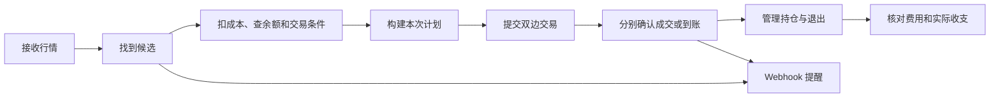

# CROSSLINE Omni

[](./LICENSE)

**把找价差、检查成本、双边执行、持仓管理和复盘放在一起的自托管套利工作台。**

基于 Rust + Leptos，提供中文界面。既可以只看行情和接收提醒，也可以在配置完成后使用模拟交易或实盘执行。

> 当前版本：`v2.2.0-rc.2`，开源开发预览版。
> 已有本地模拟闭环和隔离浏览器验证，但不代表所有交易所、真实资金路径及长期运行都已验收。
> **看到价差不等于能成交，能成交也不等于保证盈利。**

[快速开始](#快速开始) · [功能模块](#功能模块) · [套利策略](#套利策略) ·
[链上与股票](#链上与股票) · [自动化与提醒](#自动化与提醒) · [文档](#文档)

## 先了解它怎么工作



- **先看机会，再检查能不能做。** 价格接近、费率有差异或出现价差，只是进入下一步的理由。
- **按本次金额重新检查。** 构建和提交前检查盘口、余额、权限、费用、行情时效和资产身份。
- **两边分别确认。** 交易所收到请求，不等于订单成交；源链发出交易，不等于目标链到账。
- **不把缺失数据当作零。** 缺费用、缺余额或报价过期时直接说明原因，不拼出一个看似正常的收益。
- **结果不明先查原单。** 超时后保留原订单或交易编号，不靠重复提交碰运气。

更详细的大白话说明见 [产品逻辑](./docs/PRODUCT_LOGIC.md)。具体接口、状态和配置以 [实现说明](./docs/CROSSLINE_IMPLEMENTATION_GUIDE.md) 为准。

## 功能模块

| 模块 | 用来做什么 |
|---|---|
| 持仓 / 风控 | 看账户余额、当前持仓、双边风险；设置退出保护，查看平仓结果 |
| 期货套利 | 比较五类策略的双边价格、资金费率、成本和执行限制 |
| 机会扫描 | 筛选候选，展开证据，把选中的机会交给执行页 |
| CrossEx | 单独管理 Gate CrossEx 路由，观察不同路由的行情和毛价差 |
| 链上套利 | 比较 DEX 与交易所、DEX 与 DEX；检查库存、费用、充提和到账 |
| 股票套利 / BP | 批量监控链上股票，比较 Backpack / Kraken，进入单股询价和执行流程 |
| 自动化 | 保存入场规则、启动或暂停新入场、设置退出保护、查看每次决策 |
| 对冲执行 | 构建和核对本次交易计划，查看双边订单及异常处理 |
| 复盘 | 按原运行记录查看开平仓、费用、资产变化和未核清事项 |
| 设置 | 配置连接、凭证、交易环境、风控、行情订阅和 Webhook |

模块共用导航、状态、表格和操作反馈。输入中的草稿、后台已保存配置和实际运行状态分开显示。

## 套利策略

| 策略 | 大白话说明 | 需要特别注意 |
|---|---|---|
| 永续跨所 | 同一标的，一边做多、一边做空，比较下一次共同结算能收付多少资金费 | 结算时间必须对齐；1 小时费率不直接乘 8，也不当作未来费率保证 |
| 永续价差 | 买相对便宜的永续、卖相对贵的永续，等待价差收窄 | 价差不一定收窄；现在的价差不是已经赚到的钱 |
| 现货-永续 | 同一交易所买现货、卖永续 | 当前只做正向；需计算持有期间资金费和退出成本 |
| 跨所期现 | 一家买现货、另一家卖永续 | 两边账户、资金和产品规则要分别满足，不能只看合计余额 |
| 现货跨所 | 一家买便宜现货，另一家卖已有的同币库存 | 没有库存也能监控，但不能假装可以同时卖出；后续补回库存也有成本 |

系统不靠一个综合分数决定下单。价格、数量、成本、时效和执行条件要分别通过检查。

对于涉及转币的路线，**能交易不等于能充提**：同名网络、到账时间、手续费、最低提币量和当前开关都可能影响这笔交易。
系统按机会或操作需要读取相关条件，不对全市场所有币持续做深度和充提检查。

## 链上与股票

### 链上套利

- 支持 Solana、Ethereum、Arbitrum、Base、OP Mainnet、Polygon、BNB Smart Chain、Avalanche。
- 报价来源包括 Jupiter、0x、OKX DEX 和 CoW；可配置自己的 RPC。
- 输入代币合约后读取身份与精度，交易所交易对可以自行选择。
- 支持单个市场与批量监控；交易所价格复用 WS 缓存，链上报价遵循 Provider 额度。
- 先看两边各有什么币，再决定是直接交易，还是需要兑换、补库或跨链。
- CoW 当前只读；其他来源也必须经过各自预检，不能因为有报价就直接提交。

**链上转账、跨链和交易所交易不是一笔原子操作。** 一边成功、另一边失败时，需要按原记录核对资产去向和后续处理；不能把页面超时当作失败后重新发送。

### 股票套利 / Backpack

先选一组股票，看整组报价，再进入单股处理，合约资料不必每次重新填写。

- 批量最多 32 只；共用 Backpack 行情连接和受控链上询价队列。
- 列表分别显示链上买卖观察价、BP 买卖价、报价年龄、充提状态和具体限制。
- 单股中查看身份、库存、费用、RFQ、执行计划及历史；也可与 Kraken 比较。
- Token 数量、股票份额、盘口价与可成交 RFQ 分开，不能按同名代码或相近价格直接认定相同。
- 保存计划不等于下单；本地预留只防止本产品重复使用资金，不会冻结交易所或钱包。
- 成交后继续核对费用、剩余股票和 SOL 支出。完成收尾不等于已经盈利或库存已补齐。

32 只股票不是同时每秒刷新。实际速度取决于每轮耗时、配置间隔、上游额度与失败退避。
详细技术边界见 [股票模块说明](./docs/BACKPACK_STOCK_ARBITRAGE.md)。

## 自动化与提醒

自动化就是把手动的“找机会 → 预检 → 提交 → 查结果”交给后台按已保存规则运行，**不是另一条绕过检查的下单通道**。

- 默认关闭。页面是否运行，要看后台确认结果，不能只看开关外观。
- 未保存的参数不会生效；保存失败保留输入，结果不明先核对原请求。
- 暂停新入场不等于撤销已有订单或平掉已有持仓。
- 止盈、止损和强平距离保护单独配置；触发保护不等于平仓已完成。
- Live 自动化在进程重启后以暂停状态恢复。
- 行情、账户或任务状态无法确认时，页面会说明原因；不能把旧数据当作当前可执行条件。

Webhook 可用于机会、价差、自动化、执行、风险和系统状态提醒，支持通用 HTTPS Webhook 与 Bark。
提醒中的执行信息用于定位和重新检查机会，**收到消息不是已经下单**；排队、发送成功和手机实际显示也分开看。

## 快速开始

要求：Rust `1.95.0`、Wasm target、Trunk `0.21.14`、Node.js `20`。
完整要求、凭证字段和部署说明见 [技术与运维说明](./docs/TECHNICAL_REFERENCE.md)。

```bash
git clone --branch codex/product-plan-execution \
  https://github.com/hui121315/crypto-arb.git
cd crypto-arb

rustup target add wasm32-unknown-unknown
cargo install --locked trunk --version 0.21.14
npm ci
npm run dev:restart
```

- 工作台：<http://127.0.0.1:8080>
- API：<http://127.0.0.1:8000>
- 就绪检查：<http://127.0.0.1:8000/health/ready>
- 停止本地前后端：`npm run dev:down`

公共行情和 Paper 模式不要求交易所凭证，不必一次配置所有交易所。
默认只在本机监听；不要直接把没有鉴权的开发服务暴露到公网。

### 第一次使用

1. 先用 Paper 走通选机会、构建、模拟执行、持仓和平仓。
2. 再配置需要的交易所，只读核对余额、持仓和订单状态。
3. 用 Shadow 检查真实行情和账户条件，但不发送订单。
4. 准备使用 Live 时，再检查当次金额、账户、权限、费用及风险限制。

| 环境 | 是否发送真实订单 |
|---|---|
| Paper | 否，使用模拟账户完成流程 |
| Shadow | 否，读取真实行情和账户条件 |
| Live | 会，实际提交仍需通过本次交易检查 |

## 如何读页面状态

| 页面提示 | 实际含义 |
|---|---|
| 未配置 | 缺少所需连接或凭证，不等于交易所故障 |
| 等待数据 | 连接可能已建立，但还没收到所需样本 |
| 仅观察 | 可以看价差，执行条件还没满足 |
| 陈旧 / 降级 | 存在旧数据或部分缺失；查看具体受影响内容 |
| 已受理 | 后台或交易所收到了请求，仍需等最终结果 |
| 结果待核验 | 暂时不知道原操作结果，先查询，不重复提交 |
| 已完成 | 对应步骤完成；是否整体结束、费用是否核清、是否盈利还要分别看 |

## 开发与验证

复用项目现有工具，按改动范围选择检查，不默认每次跑全仓测试。

```bash
npm run finish:plan    # 查看本次建议检查
npm run cache:report   # 查看项目缓存占用
npm run cache:preview  # 查看清理计划，不删除文件
```

前端改动优先使用少量相关 E2E，资金流程使用隔离模拟后端。
已有验证、复现入口和未验证范围记录在 [产品验收记录](./docs/PRODUCT_ACCEPTANCE.md)；
构建、测试、诊断和缓存命令见 [技术与运维说明](./docs/TECHNICAL_REFERENCE.md)。

测试截图和合成行情只证明对应场景，不能证明真实市场盈利、交易所长期稳定或资金安全。

## 文档

| 我想了解 | 去哪里看 |
|---|---|
| 产品先做什么、后做什么，出错怎么办 | [产品逻辑：大白话版](./docs/PRODUCT_LOGIC.md) |
| 安装、运行、凭证、接口与验证命令 | [技术与运维说明](./docs/TECHNICAL_REFERENCE.md) |
| 当前设计与代码的技术约束 | [产品与实现说明](./docs/CROSSLINE_IMPLEMENTATION_GUIDE.md) |
| 哪些接口用 WS，哪些保留 REST | [交易所传输矩阵](./docs/EXCHANGE_TRANSPORT_MATRIX.md) |
| Backpack / Kraken 股票具体能力 | [股票套利说明](./docs/BACKPACK_STOCK_ARBITRAGE.md) |
| 各模块验证过什么、还缺什么 | [产品验收记录](./docs/PRODUCT_ACCEPTANCE.md) |
| 界面和交互约定 | [设计规范](./DESIGN.md) |
| 界面文字怎么说才容易懂 | [界面用语约定](./docs/INTERFACE_LANGUAGE.md) |
| 版本变化 | [CHANGELOG](./CHANGELOG.md) |

## 隐私与风险

公开仓库不应包含可用密钥、私人账户配置、交易日志、数据库或带账户信息的截图。
请把这些数据留在本地，提交 Issue 前也先脱敏。当前公开历史与原私人仓库历史分开维护。

这是一套自托管工具，不是资金托管或收益承诺。网络故障、单边成交、费用变化、流动性不足、资金费变化和强平都可能造成损失。
对结果未知的订单、提币或链上交易，应核对原记录，不要因等待时间长就重新提交。

原创代码采用 [MIT 许可证](./LICENSE)；`third_party/` 中的上游代码继续遵循各自许可证。
