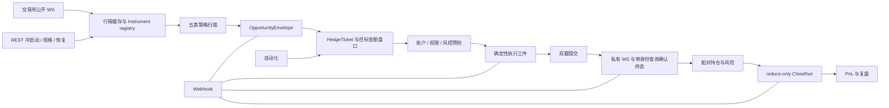

# CROSSLINE Omni

[](./LICENSE)

面向专业单用户的中文低延迟套利工作台。CROSSLINE Omni 把多交易所行情、套利发现、
双腿预检、订单执行、持仓风控、自动退出、链上 / CEX 双边套利、Webhook 和复盘证据放进一套
Rust + Leptos 应用。

它不会把“收到订单 ACK”写成“已经成交”，也不会用零值掩盖缺失数据。任何没有来源、
已经陈旧或尚未核验的事实，都会明确显示为 `Unknown`、`Degraded` 或 `Blocked`。

**当前开发主线：[`codex/product-plan-execution`](https://github.com/hui121315/crypto-arb/tree/codex/product-plan-execution)**

**当前包版本：`v2.2.0-rc.2` · 开源源码预览，不是已完成全部实盘验收的发行版。**

[快速开始](#快速开始) · [产品模块](#产品模块) · [套利策略](#套利策略) ·
[执行流程](#执行流程) · [交易所接入](#交易所接入) · [ws--rest-边界](#ws--rest-边界) ·
[自动化](#自动化与退出保护) · [链上套利](#链上--cex-套利) · [配置](#凭证配置) ·
[运行诊断](#运行诊断) · [开发验证](#开发与验证)

> 公开源码不携带原作者的账户配置、历史交易、运行截图或 Git 历史。使用自己的测试环境和凭证；
> 视觉测试基线需在受控环境重新生成。编译通过和模拟测试不代表真实资金路径已经验收。

## 产品定位

CROSSLINE Omni 服务于一个明确场景：操作员在一个工作台内寻找、验证、执行并复盘双腿套利，
同时保留每一步的真实数据来源和失败原因。

当前产品包含：

- **8 家交易所 + Gate CrossEx 路由**的公开行情、账户、订单和执行适配。
- **5 类套利策略**的统一机会模型、完整成本口径和可执行性门禁。
- **Paper、Shadow、Live** 三种环境，共用同一套票据、风险和订单状态机。
- **按需盘口**：扫描阶段不读取全市场深度，构建或提交前才核验目标金额的双腿盘口。
- **自动化闭环**：候选选择、执行工件、双腿提交、终态确认、自动退出与复盘。
- **链上 / CEX 闭环**：8 条链、4 类聚合报价来源、8 家 CEX 现货比较，以及严格门禁后的双边提交与补偿。
- **Webhook**：通用 HMAC Webhook 与 Bark 应用级确认。

当前不提供托管资金、收益承诺、LLM 自动交易或期权交易界面。链上签名只使用本机后端凭证库中
与所选钱包地址完全一致的密钥；普通监控不会触发签名或广播。

## 当前能力

| 能力层 | 当前实现 | 真实边界 |
|---|---|---|
| 公开行情 | 交易所 WS 热路径、Instrument registry、Funding、Ticker 与按需盘口 | REST 仅用于冷启动、静态规格、历史和断流恢复 |
| 机会发现 | 五类策略、分页索引、完整成本和证据状态 | 行情可见不等于可提交 |
| Paper | 双腿订单、终态、持仓、CloseRun 与复盘闭环 | 不向交易所广播订单 |
| Shadow | 真实主网行情和账户读取，使用实际规格、费用和深度 | 不广播订单，适合 Live 前验收 |
| Live | 逐票据核验凭证、余额、规格、盘口、权限、风险和私有终态 | 任一事实缺失即阻断，不做全局乐观放行 |
| 自动化 | 默认关闭，复用手动执行的完整状态机 | 重启后 Live 自动化以暂停状态恢复 |
| 链上 / CEX | Jupiter、0x、OKX DEX、CoW 与 CEX 盘口比较；Jupiter/0x/OKX 可构建执行 | CoW 仍只读；余额、Gas、授权、规格、深度或净收益缺一即阻断 |
| 股票套利 | Backpack 官方证券目录、交易日历、股票现货 WS；MU/SNDK 链上双向询价；RFQ、库存、充提与费用预检；价差 Webhook；计划预留、确认后双腿提交、回执恢复、订单簿差额补偿与 SOL 补回；Kraken 股票比较和预检 | 本地预留不是交易所冻结，两腿不是原子成交；Backpack RFQ 请求方实际费用、部分提现扣账口径及 Kraken 最终收尾仍有缺口；没有真实账户资金验收，不将单腿成交或模拟收益视为套利完成 |
| Webhook | 确定性机会、价差/充提监控、自动化、执行、补偿、风险、降级、链上价差和股票价差观察 | 公网 HTTPS、SSRF 防护、有界重试与幂等 |

链上 / CEX 执行可明确选择已完成补库和已核清 ERC-20 授权记录，整笔费用归入本次执行。
授权费来自实际交易回执，以原生币记录，构建时按新鲜 WS 汇率扣除，执行后纳入实际收支；
失败授权已花掉的链费不会丢失。费用归属与执行准备状态共同写入恢复日志，同一记录不能重复归集。
未选择或未核清的费用不默认为零，界面单独标注核算范围；美元数值是收支折算，不是已实现美元收益。
链上跨链四步路径也可选择独立授权费与已完成的 CEX→链上补库费；构建和逐步重报价均扣除这些费用。
四步钱包变化与独立费用分开展示，美元合计包含所选费用；未选择的费用不包含，不能把该合计当作完整交易利润。
两类执行共用费用归属日志，提交前持久化占位，同一费用只能归入一次执行，重启后仍有效。
跨链日志损坏时保留已核实记录并阻止新增资金动作，不跳过坏行，也不自动重新广播。
LI.FI 部分完成、退款与失败保留独立的异常到账报告；包括 `FAILED / REFUNDED`，不会把桥报告直接当作钱包余额。
按原桥编号、源交易和接收链/钱包/合约读取真实回执及代币精度，异常到账和链费写入收支账本，不替换原计划币种或数量。
退款不假定回到源链；缺少接收链或哈希时明确待核。已记录交易不重复计款，已确认异常收支重启后仍保留。
暂停后的处置建议按“原投入 + 已核实收支”展示本次剩余资金，扣除后续花费，区别于净盈亏及钱包当前余额。
原钱包原报价币可保留；其他币种、链或钱包分别提示重新询价兑换、跨链返回或核对钱包。未明交易、在途桥款或费用缺失时不生成可处置金额。
处置预检可输入本次数量，上限为本次剩余而非整个钱包余额；按需读取当前余额，并用 LI.FI `/quote` 重新核对同链兑换或跨链返回的最低到账、Gas 和授权余额。
预检期间原记录或钱包配置改变时丢弃报价；费用字段未齐不按零计算，费用估值不从最低到账重复扣减。
预检不签名、不广播；通过后将金额、报价、最低到账和未签名交易保存为独立处置计划，刷新与重启后可恢复。
原运行账户可单独确认计划，短时预留“链 + 钱包”；与链上 / CEX 执行、跨链执行、链上补库和代币授权共用占用检查。
检查和原资金日志落盘作为一个不可插入的步骤执行，不另建资金账本；重启从原日志恢复，同一运行目录不允许第二个后端持有资金执行锁。
尚未提交的处置预留可取消或到期释放，重复确认不延长有效期；已提交或提交结果未明的占用不因暂停、超时或重启释放。旧交易仍可只读核验。
股票计划可单独“保存并预留”，记录两腿与 SOL 周转数量，60 秒内占用同一 Solana 钱包及当前配置的 Backpack 股票通道；重复请求不续期，未提交计划可取消。股票通道暂时串行，同一账户换 API Key 不能绕过已保存计划的占用。
计划同时保存精确的限价 FOK 或原始 RFQ 接受参数，但不发送；成交事件缺少实际金额时自动核对原成交明细，最多 6 次、间隔至少 30 秒，重启保留次数。页面区分锁资待结算、金额待核、核验暂停与数量已核，未知费用不会当零。
订单簿回执另记录实际成交和原币手续费，按成交编号去重，显示这条腿扣费后的资产变化；“核对原订单”只读，不重复下单。内部发送器已用本地 HTTP/WS 交易所验证，尚无对外单腿提交入口；即使交易所腿完成，也会保留钱包占用，等待链上腿和整体协调。
RFQ 接受也已接入内部发送器：接受意图和资金预留先写入同一计划日志，超时或重启只查原 RFQ，不重新接受。页面区分“接受待确认”“锁资待结算”和实际成交，支持核对原 RFQ；成交股数/金额可核对，但原币费用与净到账仍显示待核实，不据此释放整笔计划的占用。
股票 SOL 费用预算会实际构建并模拟补仓交易，把补仓自身原生支出计入，不把 WSOL 当可用 Gas。链买预留买币与补仓的 USDC，链卖另外检查补仓 USDC；两笔交易的临时周转 SOL 按顺序保守预留。试算仍不签名或广播，不能视为已实现利润。
股票主交易现已随计划保存；内部链上传输先落盘意图、再单次提交。JupiterZ 做市商补签和提交失联后，通过原消息与钱包签名恢复原交易；Provider 回复不当成最终成交。
股票双腿内部协调器会先在同一条日志记录交易所和链上意图，再各发送一次；超时或重启仅核对原记录，不重发。订单簿手续费与备款共用计划预算，RFQ 含费价不再重复加费。
页面可核对两腿回执并展示实际 USDC、股票份额及 SOL 净变化；缺手续费、单腿失败或份额不足不冒充套利成功。成交后按实际净扣 SOL 重新试算补回，独立保存新交易；内部补回发送、原回执恢复和失败费用累加已接通。
账务、股票和 SOL 均核齐后，可以“结束并释放预留”：先持久化结算记录再释放占用，写入失败不释放，重启不复活已结束计划，下一笔不沿用成交前余额。页面区分已补回、待核对、需处置及已收尾；已收尾不等于盈利或已完成库存再平衡。
股票计划已有“提交两腿”“提交补偿”和“提交 SOL 补回”入口，要求逐次确认原计划版本、全局实盘且未急停；过期报价需重新构建。预检提前准备订单回执 WS，页面断开不取消已开始的有界提交任务，重复请求只返回原状态。订单簿单边失败时按实际股票差额重新报价补买或卖回，并检查用户设定的整笔损失上限，原始费用和每次补偿都单独保留；补偿未明不重发，不自动扩资或调拨两边库存。四种单边失败与补偿/SOL 收尾已通过本地协议测试，尚未完成真实账户验收，RFQ 实际费用仍待核实。
保护范围是产品内部的整钱包与股票通道，不是按币种/金额并行分配，也不冻结交易所资金或限制产品外部操作。报价有效期独立且更短，余额/费率变化会拒绝沿用旧预检；保存成功不表示已经下单。
该预留不是链上冻结，尚未接入自动补偿执行。后续资金动作仍需重查余额、占用、最低到账、费用并另行获得实盘授权。
原路径停止，页面区分桥报告数量、钱包净到账和资产位置；这不代表套利完成，也不会自动发送新的补偿交易。
跨链四步执行的源链回执自动核验最多 10 分钟，桥目标到账最多自该步原提交起 2 小时；这不是桥的到账承诺。
超时仅暂停核验，保留已确认资产和链费。手动“重新核验到账”每次最多 12 轮、间隔至少一分钟，按原交易查询，重启不重置次数。
手动核验不受原等待窗口影响，源链已核清时直接续查目标；接口报错也计入次数，未齐回执不再仅因读了 12 次就提前结束自动窗口。
补库暂停后可“重新核验原转账”：按原客户端提币号、交易所回执编号或交易哈希查询，每轮最多 12 次、间隔至少一分钟，
重启后保留次数与只读限制。到账后不会自动续做剩余资金步骤，需按当前库存重新规划并授权。
自动核验设有等待窗口：链上转账源端确认 10 分钟，交易所提币处理中及目标到账/提币解锁最多自原提交起 2 小时。
这些是产品的自动核验上限，不是交易所到账承诺；到期保留原转账并暂停，不判定资产丢失，也不重新发送。
人工重新核验使用独立的有界只读轮次，不会被旧转账时间立即打断；已确认源端完成或已到账待解锁时，直接继续核验目标，不倒退重查。
补库流程内部按资金来源防重复：同一交易所现货账户的同一币种、或同一条链的同一钱包存在未核清转账时，换计划也不能再次发送。
校验期间若同一来源发生其他补库动作，旧余额或交易序号检查作废，必须重新核验；重启后从原日志恢复未决保护。
明确在发送前被拒绝的请求不会继续占用来源；超时、回执丢失或尚未确认到账仍保留保护。不影响其他独立来源，且不增加行情轮询。
已确认提币费保留原币实扣数量，并按新鲜 WS 的 USD 买入侧汇率留存一次美元折算；USDT、USDC 不默认为 1 美元。
多步补库继续前用已核费用替换原预估，不重复扣费；汇率缺失时等待核算，已确认零费用无需订阅汇率。
页面与补库 Webhook 同步展示原币费用和美元折算状态。该数值是带时间的成本估值，不代表实际美元扣款或已实现利润。
Bybit 主网 UTA 补库已接入地址簿、可提余额、一次性链上提币与按回执编号查询；不混用资金/理财钱包余额。
提币采用到账数量口径，手续费另计；地址待验证、24 小时限制、税款口径不明或合规补件均不能视为完成。
若提交应答丢失且没有交易所提币编号，Bybit 不支持按自定义编号查询，系统保留原记录并暂停，不猜测匹配、不重复提币。
Kraken 链上转入使用 Funding API 核对资产、合约、充值方式、金额上下限及已领取地址，读取仅需 Spot Key 的 Funds Query 权限。
到账核验按原交易哈希查旧充值历史，再按原记录编号与新 Funding 记录交叉核对；审核中、退回、多笔归集、费用或净到账未明时不记为完成。
不会自动领取可能收费的充值地址。目前自动转入仅接受已核实零充值费的方式；需 Tag/Memo 的充值到账证明仍未接入。
Kraken → 链上补库使用已验证地址、Spot 可提余额及该方式的剩余额度/次数；先取得官方净到账与总扣款报价，再用费用凭证锁定同一金额的费率。
实时报价超过已确认手续费上限时不发送提币；发送后不自动重试，按交易所原回执编号、保存地址与链上哈希追踪终态。
回执金额异常时保留已知编号并暂停；完全丢失回执编号时不能按本地编号反查，需人工核对，不按金额猜测或自动重发。
读取使用 Spot Key 的 Funds Query 权限，实际提币还需 Withdraw 权限及产品实盘授权；Futures 账户余额不会替代 Spot 可提余额。

## 产品模块

| 模块 | 用途 |
|---|---|
| **持仓/风控** | 查看余额、持仓、挂单、NAV、Delta、保证金和强平距离；执行单腿或配对平仓 |
| **期货套利** | 浏览五类策略候选，比较双腿价格、Funding、成本和执行资格 |
| **机会扫描** | 查看扫描范围、可执行数量、费后净利下限和实时证据 |
| **链上套利** | 配置链、Provider、Token、CEX 市场和批量监控；对通过门禁的方向构建并执行双腿 |
| **股票套利** | 独立 `#stocks` 入口；设置 Backpack 凭证、股数与询价方向，核对或取消原 RFQ；输入 Solana 钱包公开地址，检查双边库存与账户费率，按方向试算链上费用与付款方；持续比较最低到账与有效报价，查看股数余量、交易时段和充提状态；未知费用不补零 |
| **自动化** | 配置入场范围、资金、冷却、退出保护，查看实时决策与工件状态 |
| **对冲执行** | 构建 HedgeTicket，重新验证执行工件并提交双腿订单 |
| **复盘** | 核对成交终态、CloseRun、真实费用、PnL、错过机会和场所质量 |
| **设置** | 管理凭证、Paper/Live、风险、Webhook、链上 Provider 和运行诊断 |

桌面端采用高密度交易表格和固定操作列；窄屏只允许导航或表格容器内部滚动，页面本身不应产生
横向溢出。

股票模块的已实现范围、官方来源和后续接入顺序见 [Backpack 股票套利接入](./docs/BACKPACK_STOCK_ARBITRAGE.md)。

### 持仓与风控工作台

- 持仓、资产、风险、平仓历史、账户接入和保护控制分区显示；长列表保留可见的平仓动作。
- 账户资产切换和诊断展开不因实时快照丢失。读取失败保留旧数据并标明过期，未知余额、PnL、Funding 不当作零。
- 平仓历史来自后端 CloseRun；较旧的快照不能覆盖新回执。受理与成交分开，补偿和人工处理保留确认与陈旧数据保护。
- 保护参数按后端保存回执同步，保留金额小数；保存失败不丢输入，保存中的旧读取不能回滚新配置。
- NAV 历史提供独立刷新入口，区分账户权益不完整、读取失败和存储故障；故障期间保留历史样本及可展开诊断。

这些路径通过隔离浏览器夹具和局部 Rust 检查验证，不代表已经完成真实账户、真实成交或资金安全验收。
定向浏览器用例为 `test/e2e/positions-workbench.spec.ts`，使用项目已有 Playwright 配置，不需要私人凭证。

### 期货套利工作台

- 五类策略沿用统一表格与双腿证据；WS 更新价格时保留行、按钮焦点和展开状态，窄屏固定操作列不透出底下的数字。
- 品种搜索显示独立的加载、失败和恢复状态；旧查询不能回填新币种。搜索翻页不混入首页候选，Kraken、Backpack 和 Gate CrossEx 可作为场所筛选。
- 过期或读取失败时保留旧报价供查看，暂不可构建；单个场所的部分降级不阻断其他已核验候选。构建入口读取当前选中行，再交给对冲执行重新预检，不直接下单。
- 界面与状态验证使用隔离数据，未改变五类策略的收益公式，也不代表完成真实行情长期运行或实盘盈利验收。

定向验证：`npx playwright test test/e2e/futures-workbench.spec.ts --workers=1`。
该用例只访问本地夹具，拦截资金写入和外部请求；沿用项目 Playwright 配置与已安装的浏览器。

### 机会扫描工作台

- 行情更新保留当前行、键盘焦点、证据展开和完整流程展开；窄屏优先展示标的、路由摘要、费后边际与动作，桌面分页栏固定在可视区。
- 搜索词、策略与游标共同隔离请求，旧响应不会覆盖新搜索；搜索失败可直接重试，翻页不混入首页实时候选。
- 构建读取当前行和当前快照状态。过期、加载或读取失败时只保留观察；局部降级仍允许证据齐全的候选进入执行页重新预检，不直接下单。筛选为空不清除已有执行草稿。
- 详情提供独立刷新，失败保留旧证据；慢响应不能回滚已经更新的费后边际。Funding、订单簿、历史与来源证据各自展开。
- Webhook 区分未配置、未订阅、读取失败、排队与实际投递回执；测试请求防重复，已受理不冒充已送达。共享状态也用于自动化页面。
- 本轮通过局部 Rust 检查、隔离浏览器核心流程和受影响模块回归；没有真实交易、外部通知或盈利验收。

定向验证：`npx playwright test test/e2e/opportunities-workbench.spec.ts test/e2e/futures-workbench.spec.ts --workers=1`。
夹具只允许本地模拟数据，Webhook 测试请求由浏览器拦截，不会向真实地址投递。

### CrossEx 监控工作台

- 独立显示运行状态、路由选择、跨路由毛价差和已选路由报价；窄屏保留买卖报价和价差，不需要横向拖动。
- 配置保存有在途保护；旧的前端读取和后台行情任务不能覆盖新配置，包括关闭再开启的情况。阈值支持小数，刷新或保存失败保留草稿；只调整阈值不清空已有报价或刷新证据时间。
- 路由搜索隔离延迟回包，读取失败可重试，停用路由不可新选。保存失败恢复后端确认的勾选状态；缺报价的已选路由仍可见，不被当成零价格。
- 明确区分关闭、待选路由、等待行情、部分行情未就绪及读取失败。旧快照可查看，但不继续标为实时。
- 本页仍是毛价差监控，不提供直接下单，也不将毛价差宣称为净利润。交易所行情沿用专用 WS，页面仍通过本地状态 API 读取快照；本轮增加单次在途与错误退避，没有新增交易所订阅。

定向验证：`cargo test -p api services::gate_crossex_mode::tests`、
`cargo test --manifest-path frontend/Cargo.toml --lib panels::modules::gate_crossex`、
`npx playwright test test/e2e/crossex-workbench.spec.ts --workers=1`。
浏览器夹具只允许本地数据并拦截真实写入；这些检查不代表真实行情长期运行或实盘套利验收。

## 套利策略

| 策略 | 方向 | 当前执行语义 |
|---|---|---|
| **永续跨所** `PerpCross` | 一家做多永续、另一家做空永续 | 只计算两腿下一次共同结算事件的原生 Funding，不做 8 小时标准化 |
| **永续价差** `PerpPriceSpread` | 低价永续做多、高价永续做空 | 开仓价差是收敛假设；历史样本不能保证本次收益，因此 Live 保持谨慎阻断 |
| **现货-永续** `SpotPerp` | 同场所买现货、卖永续 | 只做正向 cash-and-carry；退出现金流未绑定前属于投影收益 |
| **跨所期现** `CrossSpotPerp` | 一家买现货、另一家卖永续 | 两家交易所必须分别通过 Spot/Perp 产品、余额和终态门禁 |
| **现货跨所** `SpotCross` | 一家买现货、另一家卖预置库存 | 不假设借币或执行中转币，成本包含后续库存再平衡 |

### 什么才算可执行机会

CROSSLINE 不使用主观分数授权交易。候选必须先证明：

1. 两腿是同一可交易经济标的，产品、quote、settle 和价格单位一致或有显式转换证据。
2. 两腿行情来自新鲜 WS 事件，InstrumentSpec 已核验，目标金额盘口足够。
3. 一次完整交易的开仓费、平仓费、滑点、Funding、转换与安全缓冲已经计入。
4. 策略存在严格为正的单周期净收益下限，而不是把历史胜率、未来 Funding 或评分当作利润。
5. 当前票据涉及的两家交易所均通过账户、权限、余额、风控和私有终态检查。

相同 ticker 不等于相同资产。股票、指数、金属、原油、外汇和加密资产同名时，只有交易所官方
instrument 元数据能够建立身份；缺少证据的行只能观察。

永续跨所允许 `1h / 2h / 4h / 6h / 8h` 等不同原生周期配对，但两腿当前返回的
`next_funding_time` 必须指向同一时刻。系统只计算这一次共同事件，不把 1 小时费率乘以 8，
也不累计共同结算前的单腿现金流。完整策略合同见
[CROSSLINE Implementation Guide](./docs/CROSSLINE_IMPLEMENTATION_GUIDE.md)。

## 执行流程



`HedgeTicket` 绑定双腿产品、目标金额、价格、费用、Funding、时效和风险。预检通过后生成短时效
`DeterministicExecutionArtifact`，其中包含快照 ID、票据 ID、幂等键、Checksum、失效条件和
只读验证命令。复制或验证工件不会下单；真正提交前服务端会再次核验全部事实。

对冲执行将关键金额、提交后强平距离与确认动作放在主区，费用拆项、预检证据和只读命令按需展开。
修改金额或执行参数会立即撤销旧票据的提交资格，停顿 250ms 后才申请新预检；空值或超出已有范围的
本金、杠杆、名义金额及保护偏移会明确报错，不替换成默认值或静默截断。迟到的预检和校验响应不能授权新票据。
确认勾选绑定当前票据、快照、幂等键与校验码，校验失败、参数变化或双腿行情证据/票据过期即失效。
倒计时复用本地时钟，不新增交易所订阅；只读重验核对后端已保存证据，不声称重新抓取全部交易所数据。
这些交互已做隔离流程验证，不代表真实资金闭环或盈利验收。

提交前先保存当前后端对应的原请求身份；超时、页面刷新或切换候选后仍保留待核验状态。
“查询提交结果”只读取原执行与操作记录，不重新下单；空列表、错票据和无关请求不能解除保护。
只有匹配的执行回执或明确的下单前拒绝才结束待核验；浏览器无法保存恢复记录时不发送请求。
成交 WS 不被同毫秒或更旧的 HTTP 回执覆盖。撤单逐笔保留成功回执与失败原因，ACK 不显示为已撤销，
切换页面不会丢失在途结果；已知成交才交接到持仓平仓，未知失败仍需核对，不能直接当作没有仓位。

自动化回执、执行记录和关联持仓之间的跳转携带运行、票据与机会编号，查询保留全部身份约束。
历史运行按只读记录打开，不生成新票据；原提交或撤单尚未核清时，继续保留原执行的恢复上下文。
关联持仓只筛选列表，全账户风险统计不变；没有明确配对证据不代表已经平仓，也不以其他同币持仓替代。
读取指定运行失败时保留错误，不回退展示其他运行的订单；可明确返回全部持仓。
这些跨页路径已通过隔离浏览器验证，不代表真实交易闭环验收。

订单列表按原订单身份保留行、焦点和展开详情，不因成交进度更新反复跳行；已载入的订单可分批展开，
不等同于已读取后台全部历史。委托数量、已成交数量与交易所订单号分别显示，缺失保持待确认。
撤单超时后仍跟踪原订单终态；全部原订单核清才结束等待，已撤销但部分成交仍提示核对持仓，
不会把撤单当作平仓。迟到撤单回包不能覆盖较新的成交，换票据后旧撤单结果明确标为上次回执。
订单首读、手动刷新和断流恢复共用在途约束，兜底在首次读取结束后启用；离页旧回包不污染重进后的队列。
详情、长错误与回执可展开查看；这些界面和状态流程已做隔离验证，真实资金及长期运行仍需单独验收。

交易所返回的写入 ACK 只表示请求已被接收。成交、撤单、费用和最终持仓必须由私有 WS、
订单查询或 reconciliation 证据确认。结果不明确时，系统按同一订单身份查询，不会换一条传输路径
盲目重发非幂等请求。

## 复盘工作台

执行记录、错失机会、策略绩效和场所质量分别查看，沿用后台账本与运行态证据。
实时更新保留选中的记录、证据展开和按钮焦点；窄屏优先显示标的、净 PnL 和查看入口，
费用、Funding 与账本事件可在详情中核对。记录时间按浏览器本地日期时间显示，缺失保持未知。

自动化回执、执行结果和平仓记录可直达关联复盘。服务端按运行/票据/机会或平仓编号匹配账本，
再进行分页；不按币种猜测，不只搜索当前首页。关联范围为最近 365 天，展示完整关联执行的原收益与成本，
不会把其中一次平仓成本当成整笔策略利润。关联视图按需读取，失败保留同一范围的旧记录并标记陈旧；
切换范围立即移除旧结果，迟到回包及全局 WS 首页不会替换当前关联列表。空结果不代表未成交或已平仓。
可明确返回全部执行记录；全局复盘与策略统计仍使用原 30 天共享运行态，不因单笔筛选改写全局汇总。

已确认收益与估算收益分开；没有已确认样本时，不把策略表现显示成零收益、零回撤或无亏损。
执行合计及错失归因标明当前页范围，不冒充全部历史。可手动刷新，读取失败保留旧数据及错误；
从历史页返回首页也不会抹掉当前降级原因。迟到 HTTP 不覆盖已接纳的 WS 更新，离页旧读取不污染重进结果。
这些界面与恢复流程已做隔离验证，不代表真实账户账本完整、策略盈利或全产品实盘验收。

## 交易所接入

Gate CrossEx 是带底层场所身份的执行路由，不是独立流动性来源，因此不能与它所指向的同一家
直连交易所组成套利双腿。

| 接入 | 公开行情 | 私有状态 | 生产写入 |
|---|---|---|---|
| Binance | USD-M / Spot WS | 账户与订单 WS | Spot 与 USD-M WS API |
| OKX | V5 Public WS | V5 Private WS | Private WS |
| Bybit | V5 Public WS | V5 Private WS | V5 Trade WS |
| Bitget | UTA V3 Public WS | UTA V3 Private WS | UTA V3 Trade WS |
| Gate | Spot / Futures WS | Spot / Futures Private WS | Spot / Futures WS API |
| Gate CrossEx | Dedicated CrossEx WS | Dedicated CrossEx Private WS | CrossEx Private WS |
| Kraken | Spot v2 + Derivatives WS | Spot v2 + Derivatives Private WS | Spot v2 WS；Derivatives REST v3 |
| KuCoin | Spot / Futures WS | Classic / Pro Private WS | Spot Pro WS；Futures Classic REST |
| Hyperliquid | `l2Book` / `activeAssetCtx` / WS info | 账户、订单与成交 WS | WS `post` |

逐 venue、逐 operation 的当前 API 家族、保留 REST 原因和官方文档见
[交易所传输矩阵](./docs/EXCHANGE_TRANSPORT_MATRIX.md)。Kraken 与 Gate CrossEx 的独立凭证、
流量和运行证据见 [专项接入说明](./docs/KRAKEN_GATE_CROSSEX_WS_INTEGRATION.md)。

## WS / REST 边界

浏览器 AppWS 与交易所 WS 是两层连接：交易所事件先进入后端缓存和账本，后端再把紧凑增量推送给
Leptos 前端。AppWS 大帧使用 `zlib-json` 压缩，小型 ACK、心跳和低延迟事件保持文本帧。

| 数据 | 热路径 | REST 保留职责 |
|---|---|---|
| Ticker、Funding、mark/index | 公共 WS | 冷启动、首帧等待、断档恢复和周期校准 |
| 执行盘口 | 被选候选与构建/提交前按需 WS | 首帧或序列缺口时有界恢复 |
| InstrumentSpec | WS 更新或官方 HTTP registry | 精度、最小数量、挂牌、费率与慢变元数据 |
| 余额、持仓、挂单 | 私有 WS 热缓存 | 初始快照、分页和 scoped reconciliation |
| 订单与成交终态 | 私有 WS | 身份点查、历史、费用补齐和结果不明恢复 |
| Funding payment 与历史 | 本地账本 + signed REST | 历史事实不从实时流反推 |

REST 不是实时行情的轮询替代品。WS 没有首帧、断线或出现序列缺口时，恢复请求会单飞并有界退避；
存在旧快照时明确标为 stale，没有旧快照时保留原始错误。

Funding 的全市场 REST 轮次只负责发现候选；周期历史、REST API、AppWS 重放和策略读取都从
同一个行情缓存投影。候选 WS 行会覆盖发现基线，聚合状态不会因为一个未配置的可选场所而把
已有新鲜行整体标记为不可用，具体来源与问题保留在逐行证据和场所明细中。

## 性能与流量

性能优化的目标是删除无价值的连接和重复请求，而不是降低有效行情的实时性：

- 扫描器只为初筛费后净收益为正的候选维护有界 ticker/Funding 订阅，不为每个币建立独立 WS。
- 机会扫描不订阅全市场盘口；选中候选可预热两腿，构建与提交前才严格读取深度。
- 相同市场的选择、预览和提交共享单飞缓存，避免连续操作重复请求。
- Binance 深度订阅控制帧按 500ms 批处理，行情事件仍保持官方 100ms 节奏。
- AppWS 以不低于 100ms 的批次发送市场、持仓和系统增量；订单与风险事件立即发送。
- 私有账户 REST 恢复按 venue 单飞退避，前端刷新不会放大成请求风暴。
- Portfolio REST、AppWS、自动退出和系统健康读取同一份生命周期快照；HTTP 请求不会重新拉取
  账户、历史或风险。生命周期停摆时返回带新鲜度的 `Stale` 快照，冷启动则返回明确的
  `Unavailable`，不会按客户端数量重复计算。
- SystemHealth REST 同样只读 5 秒生命周期快照；首帧前返回 `Warming`，状态栏请求不会即时
  重建诊断、读取账户或查询 PnL 历史。

Kraken Derivatives Funding 扫描必须使用包含 Funding、mark 和 index 的完整 ticker；当前专项样本中，
274 个可执行永续约产生 `3.5 MB / 10s` 接收流量，但只使用一个 Futures WS，且不订阅全市场盘口。

## 自动化与退出保护

自动化默认关闭，并且没有独立下单器。它从机会索引选择通过证据门槛的候选，然后复用手动执行的
HedgeTicket、预检、工件、双腿提交、终态、补偿和 CloseRun。

- 候选排序依据新鲜的单周期净收益下限、最差腿行情年龄、可执行容量和稳定 ID，不使用评分授权。
- Paper、Shadow 和 Live 自动化都走同一状态机；Live 在提交前重新检查当前票据全部门槛。
- Live 自动化配置可以持久化，但进程重启后强制以暂停状态恢复。
- 自动化决策由新机会快照、自动化控制和执行状态变化直接唤醒；冷却结束使用精确截止时间，30 秒
  定时器只负责漏事件恢复，不再每 2 秒扫描一次相同状态。
- 已有人工仓位可登记为 `protectedPositions`，命中后普通下单、平仓、unwind 与补偿都会阻断。
- 自动退出只处理有双腿 `ExecutionRun` 配对证据的仓位，并以幂等 `reduce-only CloseRun` 执行。
- 自动退出直接消费持仓/AppWS 共用的快照发布事件；私有账户事件可立即触发评估，2 秒持仓周期只负责
  对账，30 秒定时器只负责漏事件恢复，不再另起一套轮询事实。

自动化工作台把入场规则、当前运行、决策历史和执行证据分开显示：

- 输入先校验再保存，资金和退出阈值支持小数，入场冷却最低 1 秒。未保存草稿不会被行情刷新覆盖，
  保存失败保留输入；保存与控制请求在途时禁止重复操作。
- 启动、暂停、恢复及急停以后台回执为准，迟到的旧读取不能回滚新操作。状态读取失败或超过 15 秒
  没有确认时保留上次快照并明确标注，不允许依据陈旧状态启动；已运行策略仍可暂停或急停。
- 退出保护复用共享交易配置；决策历史只合并重复系统心跳，保留不同标的和运行单，详情展开不随 WS 刷新丢失。
- 提交受理不冒充双腿成交，保护已配置不冒充平仓完成；Webhook 测试受理不冒充实际送达。
  页面状态与交互可通过本地隔离用例验证，不代表真实资金、实际盈利或通知送达已验收。
- 决策可直接打开对应运行回执，逐腿展示目标/成交数量、终态来源和净敞口；平仓记录同时核对运行、票据与机会编号，
  不按币种猜测关联。读取后端本地执行账本并复用执行 WS，断流时有界重读，不增加交易所订阅。
- 迟到的回执不能覆盖较新的成交，切换记录后旧请求不能串单；读取失败保留旧记录并标明待确认。
  部分平仓、补偿和人工终结不冒充双腿完整退出；缺失费用显示待核对，已平仓不等于已经盈利。

自动退出利润口径：

```text
双腿未实现盈亏
+ 已确认 Funding 净额
- 实际开仓成本
- 预计平仓费用
- 预计滑点
- 安全缓冲
```

止盈、止损、单腿强平保护、连续确认样本和冷却时间都必须显式配置。接近强平线时仍执行连续确认；
新鲜且真实的强平距离已经小于等于零时，表示标记价格已越线，系统立即退出。冷却只约束同一个配对
运行，不会拖延其他独立仓位。部分提交、结果不明、补偿失败、人工终结或已有成功 CloseRun 时，系统
不会重复发起平仓。

## 链上 / CEX 套利

“链上套利”是独立模块。普通行情和批量项目始终只读；只有操作员选中的方向同时通过余额、Gas、
Allowance、官方 Spot 规格、新鲜盘口、CEX 远程预检和严格正净收益后，才会生成五秒内有效的执行计划。

| 范围 | 当前支持 |
|---|---|
| 链 | Solana、Ethereum、Arbitrum、Base、OP Mainnet、Polygon、BNB Smart Chain、Avalanche |
| 报价 Provider | Jupiter Keyless / API Key、0x、OKX DEX Aggregator V6、CoW Fast Quote |
| CEX | Binance、OKX、Bybit、Bitget、Gate、KuCoin、Kraken Spot |
| Token 身份 | Solana Mint；EVM 合约 `symbol/decimals/name` 只读识别 |
| 批量监控 | 最多 12 项，共享 Provider 额度并公平轮询 |
| RPC | 自定义公网 HTTPS Solana / EVM RPC，核验网络、余额并承担签名交易提交和终态查询 |

CEX 价格从持久 WS 盘口缓存投影，不为每个监控项重新调用 REST。DEX 报价遵守 Provider 官方额度，
页面分别显示 DEX quote 年龄、CEX 事件年龄和完整成本。CoW Fast Quote 固定为只读；Jupiter、0x
与 OKX DEX 使用各自 firm build 返回的原始交易。浏览器提交时只发送一次性 `buildId`，后端重新核验、
签名，并先确认 CEX IOC 全额成交再广播链上交易。链上明确失败会反向补偿 CEX；网络结果不明时保留
CEX 对冲并按同一交易 ID 追踪约两分钟，避免反向过度对冲。

监控配置区保留独立草稿，保存期间锁定输入并防止重复请求；保存失败不丢失草稿。
首屏读取、WS、手动刷新和批量回执按配置请求代次与快照时间接纳，迟到数据不能回滚较新的状态；
离开页面后不再接纳旧页面回包。读取失败明确显示上次快照和待确认时效，提供重试入口，
且不再用该旧快照开放 DEX/CEX 双腿构建入口。配置和状态流程使用隔离浏览器验证，不能替代真实资金闭环验收。

当前监控的后台读取也绑定配置版本：切换链、钱包、交易对或自定义 RPC，以及暂停后恢复，
旧轮次的报价、余额、RPC 和 CEX 读取错误不能回填新配置；主报价、余额与 RPC 缓存拒绝采样时间倒退。
配置变更与缓存发布使用同一个短锁，网络等待不占用该锁；报价的原始采样时间不因配置保存而变新。
这些保护已有本地并发回归检查，不代表真实 Provider 的长期稳定性或实盘资金路径已验收。

DEX/CEX 执行控件不随每帧报价或计划倒计时重建，保留键盘焦点和费用展开状态；点击构建时读取
当前方向与最新证据时间。配置改变、暂停或离开页面后，迟到的构建结果不能恢复旧计划；提交前再次
检查当前计划编号、配置代次及到期时间。普通报价更新不会清除已构建计划，实际成交仍以后台回执为准。
报价区采用紧凑双腿布局，构建结果在其下方展开，不浮层遮挡报价；断流时收益核验与构建入口一起进入待确认。
补库与跨链预览同样绑定配置版本；切换配置、暂停或离开页面后不接纳旧计划。授权输入不会因报价、
倒计时或补库运行记录更新而被清空。补库计划到期后禁用授权，未核算的收益显示待核算，不补零。
补库授权或提交响应丢失时保留原记录，分别按原幂等编号或运行编号只读核对，不自动再次发送资金请求。
重复读到旧的待提交记录不解除未决保护；读取失败保留状态并退避，迟到读取不能回滚较新的操作结果。
跨链提交的旧快照也不能清除未决标记；只读恢复记录不显示补库提交按钮。
上述交互和超时恢复用隔离浏览器夹具验证，没有触发真实订单、签名、转账或通知；
完整跨链路径、长期运行及真实资金闭环仍未验收。

跨链报价更新保留费用展开和预览按钮焦点，点击时读取最新四腿报价；断流保留旧数据供查看，
暂停新的预览，恢复新帧后再放行。完整但暂时没有净收益的路径仍可只读预览，不等于获准提交。
处置数量在原资产未改变时不被回执时间更新清空，预检使用当前运行版本；切换配置后丢弃迟到的预检显示。
已保存处置计划独立按有效期更新，预留与取消同时核对读取状态、当前记录和在途动作，旧快照不能回滚新回执。
窄屏处置报价按两列排列，字段与金额分行显示。以上通过本地夹具验证，预留/取消没有访问真实账户或发送链上交易。

批量市场按后台队列顺序显示，报价变化不再让行跳位，也不打断按钮焦点和技术证据展开。
载入市场时按当前市场编号取最新配置，保存期间锁定其他载入与移除操作；失败保留草稿，不把旧监控标成已切换。
断流时保留旧报价，但列表、机会计数及跨链/DEX 状态统一显示待确认，恢复新快照后再恢复判断。
跨链目标被移除或变成同链时保留原选择并明确标记不可用，可以关闭或重新选择，不能自动换成另一资产。
暂停当前比较不等于停止独立批量市场的调度；本次调整不增加行情请求，也不改变后台资金执行规则。

双腿/三腿执行记录与构建计划分开保留：重新构建不会清掉上一笔回执，可选择历史记录并只读刷新。
提交超时后按原 `buildId` 查找，不用其他运行或空列表解除未决保护；同一标签页刷新后仍保留待核验编号，
不保存交易签名或凭证。初次记录读取失败时不开放提交，旧读取不能覆盖较新的提交结果。
同一计划已提交后不能再次点击执行；后端明确在发送前拒绝时废弃旧计划，要求重新构建。
请求受理、双腿终态和实际收支核算分开显示；本地隔离测试不代表真实账户或资金闭环验收。

跨链执行把当前可做的操作放在四步路径前方，每步直接展示链、状态和实际到账，交易哈希与收支按需展开。
回执更新保留展开状态；源链确认不代表目标链到账，路径完成也不代表费用或净收益已核清。
未决提交绑定原运行和具体步骤，并保留到当前标签页会话；前一步后补费用不能解除后一步的未决保护。
只有对应步骤的后台结果才能恢复操作。明确的发送前拒绝需先刷新原步骤，网络超时或丢回包不自动重发。

## Webhook

设置页可以分别订阅确定性机会、价差/充提监控、自动化状态、执行终态、补偿、风险、系统降级
和链上价差、股票价差观察。观察消息与可执行机会不会混用：

- **确定性机会**：只来自已经通过预检并生成短时效执行工件的机会。
- **价差/充提监控**：只在现货相关策略先取得新鲜双腿 WS、完整费用和正费后价差后按候选读取
  充提状态。现货跨所可标记为 `locked_spread`；现货-永续与跨所期现只能标记为
  `projected_basis`，不会冒充已经锁定退出收益。涉及现货腿的确定性机会消息始终携带当前
  充提结论；通道关闭或待核验时只发监控消息，不生成可执行机会消息。
- **股票价差观察**：在股票页单独启用，设置百分比阈值和最短提醒间隔；还需在设置订阅
  `stock_spread`。比较最低链上到账和当前有效 Backpack 订单簿/RFQ 报价，达到阈值后才刷新
  官方充提状态；未核验的库存和完整成本明确标为未知，不发送“已锁定利润”。开启后关闭页面
  仍监控当前股票，停止或切股停止旧规则；后端重启默认暂停。不会自动发起私有 RFQ 或账户读取。
  复用持久化出站队列和去重，页面区分入队、服务确认和投递失败。

- **通用 Webhook**：公网 HTTPS，正文使用 `HMAC-SHA256` 签名。
- **Bark**：保存 device key 后动态生成消息；必须收到 JSON `code=200` 才算应用确认。
- 稳定事件 ID、队列、超时、重试、冷却和去重全部有界。
- 机会索引、自动化、执行、CloseRun、ActionRun 和系统状态变化通过内部版本或无载荷脉冲唤醒
  桥接器；桥接器随后读取各自权威快照。内部监听不算 AppWS 订阅，也不会为了 Webhook 启动
  Portfolio 载荷发布；30 秒扫描只作为漏事件恢复。
- 禁止 localhost、私网、回环、链路本地、重定向和 DNS 重绑定目标。
- URL、device key 与签名密钥不会通过状态 API 回显。

高频的“无候选”与普通预检阻断只进入页面决策日志，不发送手机通知。

### 设置页的状态与保存

- Webhook 复用 AppWS 运行态，新鲜推送期间不重复轮询；停更或断线时有界读取恢复，失败保留旧快照并提供重试。
- 保存、测试、启停和清除操作共用在途锁。保存失败保留输入，成功后才清空敏感字段；非法数字直接报错，不悄悄保留旧配置。
- 测试请求“已受理”不等于消息已送达；投递历史保留应用级回执，实时更新不收起详情或覆盖草稿。
- “停用并清除”需明确勾选，移除投递地址和签名密钥，包括 Bark URL 内的 device key；普通停用保留配置。
- 行情开关以保存回执为准，失败不假装切换成功；已保存配置和连接运行证据分开，迟到读取不能回滚新设置。窄屏直接显示现货、永续及 Funding 开关。
- 交易所凭证刷新保留输入与焦点，保存或维护期间锁定相关字段；失败保留草稿，当前保存成功才清空。旧的同类动作记录不会冒充本次保存成功，离页后的回包不再访问已卸载界面。
- 执行环境使用后端返回的适配器编号；切换成功直接同步设置页和顶部环境，旧读取不能改回原状态。切换失败保留当前环境，实盘仍需明确确认；详细能力表按需展开。
- API 连接检查期间锁定目标地址，修改地址后清除旧结果；离开诊断页后，迟到结果不写入新页面。
- 链上 Provider 状态刷新保留输入与焦点，失败保留旧状态并标记陈旧；保存成功只清空对应 Provider 草稿，不影响另一组钱包输入。清除需要再次确认，离页回包安全退出，Backpack 和 LI.FI 选项可恢复。
- 动作账本保持当前页、行焦点和已展开回执；普通配置回执不再误报对冲结果解码失败。下单或撤单请求成功不等于订单终态，未核清的平仓继续显示待确认；窄屏直接显示目标、时间和详情入口。
- 诊断搜索不因更新丢字或失焦，各诊断页均可刷新；行情查询期间锁定输入，改标的后清除旧结果。Kill Switch 失败保留后端状态，确认成功才同步界面。

定向检查：`cargo test --manifest-path frontend/Cargo.toml --lib panels::modules::settings`、
`npx playwright test test/e2e/settings-workbench.spec.ts test/e2e/settings-account.spec.ts test/e2e/settings-evidence.spec.ts --workers=1`。
浏览器用例只使用隔离夹具，不保存真实凭证、切换真实环境或对外投递；已核验范围为 Webhook、行情订阅、
交易所凭证保存/维护、环境切换、API 检查、动作账本、诊断、链上 Provider 与风险开关的相关交互和状态边界。
这些局部检查不代表真实交易所长期运行、实盘资金闭环或全产品已经完成验收。

## 快速开始

### 环境要求

| 工具 | 要求 |
|---|---|
| Rust | `1.95.0`，由 `rust-toolchain.toml` 固定 |
| Wasm target | `wasm32-unknown-unknown` |
| Trunk | `0.21.14` |
| Node.js | `20` |
| 常用工具 | `curl`、`jq`、`python3`、`rg` |

### 安装与启动

```bash
git clone --branch codex/product-plan-execution \
  https://github.com/hui121315/crypto-arb.git
cd crypto-arb

rustup target add wasm32-unknown-unknown
cargo install --locked trunk --version 0.21.14
npm ci

npm run dev:restart
```

启动完成后打开：

- 工作台：<http://127.0.0.1:8080>
- API：<http://127.0.0.1:8000>
- Readiness：<http://127.0.0.1:8000/health/ready>

公共行情和 Paper 不要求交易所凭证。首次使用不需要一次配置所有交易所。

### 本地进程

```bash
npm run dev:up       # 端口空闲时启动
npm run dev:restart  # 清理项目拥有的旧 listener 后重启
npm run dev:down     # 停止已记录的本地进程
bash scripts/verify_runtime.sh
```

运行快照与日志位于：

```text
.crossline-runtime/dev/runtime_snapshot.json
.crossline-runtime/dev/logs/api.log
.crossline-runtime/dev/logs/frontend.log
```

遇到白屏、数据不刷新或端口冲突时，先检查这里的 PID、日志和 runtime snapshot，不要把残留进程
误判为产品数据故障。

### 推荐验收顺序

1. **Paper**：不配置凭证，完成候选、预览、双腿终态、持仓和 CloseRun 闭环。
2. **账户只读**：逐家配置最小权限凭证，确认余额、持仓、挂单和私有 WS。
3. **Shadow**：使用真实主网行情和账户证据检查规格、费用、Funding、深度与延迟。
4. **Live 预检**：保护既有人工仓位，确认 Kill Switch、限额、余额和撤单/终态能力。
5. **小额 Live**：只对当前票据执行，确认双腿成交、残仓归零和真实净收益后再扩大范围。

## 凭证配置

凭证可以在“设置 → API 凭证”中保存，也可以从 [`.env.example`](./.env.example) 创建本地 `.env`。
桌面长期运行推荐使用 macOS Keychain：

```bash
APP_CREDENTIALS__SECRET_BACKEND=keychain
```

| 接入 | 必填字段 |
|---|---|
| Binance | `BINANCE_API_KEY`, `BINANCE_API_SECRET` |
| OKX | `OKX_API_KEY`, `OKX_API_SECRET`, `OKX_PASSPHRASE` |
| Bybit | `BYBIT_API_KEY`, `BYBIT_API_SECRET` |
| Bitget | `BITGET_API_KEY`, `BITGET_API_SECRET`, `BITGET_PASSPHRASE` |
| Gate | `GATE_API_KEY`, `GATE_API_SECRET` |
| Gate CrossEx | `GATE_CROSSEX_API_KEY`, `GATE_CROSSEX_API_SECRET` |
| Kraken Spot | `KRAKEN_SPOT_API_KEY`, `KRAKEN_SPOT_API_SECRET` |
| Kraken Futures | `KRAKEN_FUTURES_API_KEY`, `KRAKEN_FUTURES_API_SECRET` |
| KuCoin | `KUCOIN_API_KEY`, `KUCOIN_API_SECRET`, `KUCOIN_PASSPHRASE` |
| Hyperliquid | `HYPERLIQUID_ACCOUNT_ADDRESS`, `HYPERLIQUID_PRIVATE_KEY` |

Hyperliquid 的 Account Address 是真实交易账户地址，Private Key 是 API/Agent wallet 私钥；
不要把 Agent wallet 地址填成 Account Address。

链上 Provider 可选配置：

| Provider | 字段 |
|---|---|
| Jupiter API Key | `JUPITER_API_KEY` |
| 0x | `ZEROX_API_KEY` |
| OKX DEX | `OKX_DEX_API_KEY`, `OKX_DEX_SECRET_KEY`, `OKX_DEX_PASSPHRASE` |
| CoW | 公共 Fast Quote 无必填 Key |
| Solana 钱包签名器 | `ONCHAIN_SOLANA_PRIVATE_KEY`（Base58 或 32/64 字节 JSON keypair） |
| EVM 钱包签名器 | `ONCHAIN_EVM_PRIVATE_KEY`（32 字节 hex 私钥） |

钱包私钥在保存时会推导地址并与当前钱包严格比对，状态接口不会回显密钥。Solana 可使用 Jupiter
API Key 托管发送或已核验的自定义 RPC；EVM 提交必须使用与所选链 ID 一致的自定义 RPC。

不要给交易 API key 开启提现权限。优先使用独立子账户、最小读取/交易权限和 IP 白名单。

## 运行诊断

```bash
# 服务和依赖任务
curl -fsS http://127.0.0.1:8000/health/ready | jq

# 当前环境、adapter、Kill Switch 与限额
curl -fsS http://127.0.0.1:8000/api/trading/status | jq

# 账户、持仓与风险快照
curl -fsS http://127.0.0.1:8000/api/trading/portfolio/snapshot | jq

# 当前分页机会
curl -fsS \
  'http://127.0.0.1:8000/api/v3/arbitrage/opportunities/list?pageSize=20&fast=true' | jq

# 实际 REST / WS operation 注册表
curl -fsS http://127.0.0.1:8000/api/trading/transport/registry | jq
```

顶部状态栏中的字段表示不同层级：

| 字段 | 含义 |
|---|---|
| `MarketData N/M` | 核心公开行情 operation 的实时可用数 |
| `TradingAPI` | 已配置场所的私有读取与写入 operation 状态 |
| `PrivateWS` | 交易所账户/订单私有流，不是浏览器 AppWS |
| `AppWS` | 浏览器是否完成后端频道订阅 |
| `订单终态` | 订单创建到确认终态的耗时，不是网络 RTT |
| `Risk / Delta / Funding` | 账户与结算证据；未配置或缺样本时保持未知 |
| `Mode` | 当前 Paper 或 Live 环境 |

`Degraded` 不表示整个系统不可用。应展开问题并按 `venue + operation + source + requestId + retry`
定位。常见状态包括：

- **构建时读取深度**：扫描阶段没有批量读取盘口，点击构建后才核验双腿。
- **缺交易所挂牌证据或可执行规格**：InstrumentSpec 尚未确认挂牌、精度或最小数量。
- **账户数据待配置**：缺少 API key 或读取权限，不是公共行情故障。
- **私有 WS 等待事件**：连接和订阅可能已就绪，但尚未出现真实账户或订单事件。

## 安全与部署

默认只绑定 `127.0.0.1`。绑定到 `0.0.0.0` 或其他非 loopback 地址时，后端要求 Bearer、
显式 CORS 和审计日志，否则拒绝启动：

```bash
APP_HOST=0.0.0.0
APP_SECURITY__AUTH_TOKEN=change-me
APP_SECURITY__ALLOWED_ORIGINS='["http://127.0.0.1:8080"]'
APP_SECURITY__AUDIT_LOG_PATH=/var/lib/crossline/security_audit.jsonl
```

Docker Compose：

```bash
APP_SECURITY__AUTH_TOKEN=change-me \
APP_SECURITY__ALLOWED_ORIGINS='["http://127.0.0.1:8080"]' \
docker compose -f deploy/docker-compose.yml up -d --build

docker compose -f deploy/docker-compose.yml ps
docker compose -f deploy/docker-compose.yml down
```

高风险动作、凭证变更和交易提交都会保留脱敏审计与 request ID。运行数据默认写入系统应用数据目录；
API key 不写入执行账本、AppWS 或前端状态。

## 开发与验证

```bash
# 查看本批次将运行哪些检查
npm run finish:plan

# 日常变更：按受影响后端、前端、UI 或文档执行一次检查
npm run finish

# push 或 release 前：工作区级强验收、前端 release build 与 Wasm 预算
npm run finish:release
```

真实小额 place/cancel/finality 和私有流样本依赖操作员凭证。Fixture 与 parser 测试证明协议处理，
不能替代真实账户授权或实盘终态。

### 仓库结构

```text
crates/
  exchange/          交易所 adapter、REST/WS、规格与私有读写
  arbitrage/         五类策略、成本和收益证明
  trading/           订单状态机与执行账本
  portfolio/         持仓配对、风险与退出原语
  automation/        自动机会选择、门禁、冷却和状态
  onchain-monitor/   链上 / CEX 只读比较
  webhook/           目标校验、签名、队列与投递
  realtime/          AppWS hub、节流和历史
  review/            已执行、错过机会与策略复盘
  api/               Axum 边缘层和 orchestration service
shared-types/        前后端 DTO 单一事实源
frontend/            Leptos / Wasm 工作台
docs/                产品合同、传输矩阵与验收手册
scripts/             启停、诊断、发布和仓库门禁
third_party/         固定版本上游补丁与许可证
```

## 关键文档

- [产品与实现合同](./docs/CROSSLINE_IMPLEMENTATION_GUIDE.md)
- [交易所 REST / WS 传输矩阵](./docs/EXCHANGE_TRANSPORT_MATRIX.md)
- [Kraken 与 Gate CrossEx 接入说明](./docs/KRAKEN_GATE_CROSSEX_WS_INTEGRATION.md)
- [API 路由机器清单](./docs/API_ROUTE_INVENTORY.tsv)
- [小额实盘验收手册](./docs/PR_M_LIVE_ORDER_ACCEPTANCE_RUNBOOK.md)
- [视觉与交互合同](./DESIGN.md)
- [版本记录](./CHANGELOG.md)

## 风险声明

CROSSLINE Omni 是自托管交易工作台，不是托管服务或收益承诺。交易所故障、网络延迟、流动性、
Funding 变化、滑点、强平、报价币风险和 API 权限都可能造成损失。首次接入应从 Paper 开始，
切换 Live 前逐项核验当前票据的双腿凭证、余额、规格、盘口、权限、撤单和终态能力。

本项目原创代码采用 [MIT 许可证](./LICENSE)。`third_party/` 中的上游源码与补丁继续遵循
各自随附许可证，不因本项目采用 MIT 而更改；依赖分发时也须保留其许可和版权声明。

公开源码不包含任何可用账户或资金配置。请使用自己的凭证，并将 `.env`、钱包密钥、账户数据库、
交易日志、带账户信息的截图以及未经脱敏的错误报告留在本机，不要提交到 Git 或附在 Issue 中。
