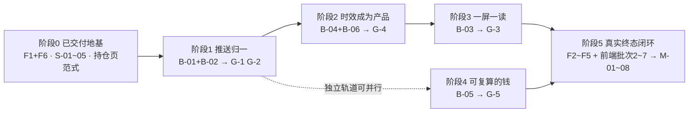

# CROSSLINE 产品目标：以 Hyperliquid 产品理念优化前端设计与后端逻辑

## 当前执行口径（2026-09-26）

本轮目标是统一全部 10 个模块的产品体验与前后端状态，不沿用历史审计百分比。
以下为当前队列，本文后续章节保留为历史设计背景，不代表本轮已验收。

| 顺序 | 模块 | 本轮状态 |
|---|---|---|
| 1 | 股票套利 / Backpack | 本轮界面、32 股有限队列/取消、报价时效、草稿/回执恢复与同版本并发保护已阶段验收；真实长期行情、多进程、物理重启恢复及资金闭环未验收 |
| 2 | 持仓 / 风控 | 本轮界面、状态契约和隔离核心流程已阶段验收；真实账户与实盘资金闭环未验收 |
| 3 | 期货套利 | 本轮界面、搜索/分页状态与进入预检流程已阶段验收；策略盈利及真实资金闭环未验收 |
| 4 | 机会扫描 | 本轮界面、搜索/详情状态、Webhook 反馈及隔离核心流程已阶段验收；真实运行与资金闭环未验收 |
| 5 | CrossEx | 本轮监控、路由管理、配置跨页/同标签页刷新恢复已阶段验收；真实长期行情、跨客户端冲突与执行闭环未验收 |
| 6 | 链上套利 | 本轮界面、输入、配置/批量同标签页刷新恢复与隔离核心流程已阶段验收；真实 Provider 长期运行、跨客户端及资金闭环未验收 |
| 7 | 自动化 | 本轮配置/控制、同标签页重载恢复、共享退出保护与回执关联已阶段验收；跨客户端、真实账户长期运行、资金闭环和盈利未验收 |
| 8 | 对冲执行 | 本轮预检账户绑定、订单归属/重启、私有 WS 来源、历史证明、混合撤单及隔离开平仓已阶段验收；同账户物理重连乱序、跨客户端与真实资金闭环未验收 |
| 9 | 复盘 | 本轮五视图、连接/分页恢复、收支来源切换、精确交接、实盘/模拟分组及窄屏统计已阶段验收；服务端多租户隔离、真实账本完整性与盈利未验收 |
| 10 | 设置 | 本轮连接、配置、回执和默认文件凭证的核心保存/恢复流程已阶段收尾；坏 dotenv 拒绝启动、失败保留旧 Key 与重启精确读回已核验；真实 Keychain 故障、跨文件中断及跨进程冲突未验收 |

统一规则：沿用既有字体、颜色和控件；金额、百分比、精度与时区一致；
表格数字对齐、关键动作可见；未配置、加载、暂停、陈旧、失败和仅观察分开。
页面显示的开关、保存结果、余额、报价时效、资金占用及订单终态必须以实际后端为准。
不同模块按各自任务组织，不强制套成同一张表，也不复制彼此的数据源和订阅。

每次完成一个模块的关键路径、失败反例和真实渲染后再进入下一个。
只跑影响范围内的检查，记录未验证边界，不以编译通过或截图代替全流程验收。
验证约定（2026-09-25 最新要求）：每批默认只选 1–2 条受影响的 E2E 用户路径，合并验证核心闭环与必要失败反例；
已通过且无相关改动的不重跑，不以 36 项等成批单元检查或全仓 gate 收尾。复用构建缓存，仅在 E2E 无法覆盖的明确风险处补针对性检查。
保持原有产品服务关闭；隔离测试不得使用私人凭证或触发真实资金、通知操作。

GitHub 交付边界（以当前 active Goal 为准）：整理完整模块或大更新，但不自动提交/push。
既有发布约定与当前 Goal 不一致的确认已提出，答复前不上传、不重复提问。
不把脏工作区的无关改动混入交付；密钥、个人账户数据、运行快照和测试输出不纳入公开源码。
本地修改、暂存和 GitHub 上传分别报告，不改变服务启动及真实资金操作边界。

### 跨模块交接本轮进展（2026-09-26）

最新批次：

- BP 单股询价与启停接入原请求恢复及配置版本保护；停止不被无效草稿挡住，旧开启回执不能覆盖后来停止。手动询价核对请求参数、股票、选择代次和连接；切换后的旧回包不回填。生产行情协议与配额不变，实际配置状态与历史回执分开。
- 两条定向 E2E 已完成：实际隔离 Rust/浏览器询价、持续监控、丢回包恢复、并发保护与取消挂起任务 11.8 秒；修正夹具字段后受控错配/迟到/登录切换路径 1.8 秒。桌面/窄屏截图已查看，详细结果与边界见 PRODUCT_ACCEPTANCE.md；所有服务关闭，无真实资金、通知或 Git 操作。BP 真实长期行情、服务重启恢复和资金闭环未验收，完整 Goal 保持 active。

上一批 BP 界面对齐：

- 按最新反馈重新对齐 BP 设计：全宽监控表、按需展开选股、紧凑单股工作区，复用其他模块已有视觉与控件；资料与业务入口保留，不更改交易规则。选股收起返回焦点，桌面与手机关键动作可见。
- 仅两条受控 Chrome/WASM E2E，最终整次 4.5 秒通过，1440/1024/390px 截图已复核；服务均关闭，无 Git、真实账户、资金或通知操作。详细证据见 PRODUCT_ACCEPTANCE.md，真实长期行情与资金闭环仍未验收，Goal 保持 active。

上一批 BP 批量到单股参数交接：

- BP 批量到单股交接已核验：继承后台最新保存的金额/报价源，不携带未应用草稿；同股重选保留编辑。修复下拉选项显示错位及较新 WS 先到造成的误冲突，错误/迟到回复不覆盖另一只股票。查看不会自动询价、启动监控或交易。
- 仅两条受控 Chrome/WASM E2E，先复现问题后修复，最终合计 3.6 秒通过；1440px/390px 截图已查看。原服务及隔离服务均关闭，无 Git、真实账户、资金或通知操作；缓存清理后仅恢复同一个 frontend/target。详细证据见 PRODUCT_ACCEPTANCE.md，真实长期行情、RFQ 和资金闭环仍未验收，Goal 保持 active。

上一批 BP 满额批量选择与队列：

- BP 增加本页批量加入和已选筛选，32 项名额内去重；选择只修改草稿。目录改为稳定资产键保留已有行，移除一项不重建其他行。
- 44 项合成目录中跨页选满 32，真实隔离 worker 按原限流完成 64 次询价，单轮约 132 秒；批量 RPC 与一条 BP WS 保持共用，下一轮暂停后剩余请求被取消。完整路径最终约 2.3 分钟通过，另一次 1.3 秒布局检查验证桌面/手机控件可见且选股不自动写后台；先前断言修正和具体证据见 PRODUCT_ACCEPTANCE.md。
- 原服务与隔离端口全部关闭，未操作真实账户、资金、通知或 Git。此为 32 股有限轮次验收，不称为真实市场长期或资金闭环验收；Goal 保持 active，继续按 BP 剩余用户流程收尾后再进入下一模块。

上一批 BP 报价时效：

- BP 批量报价从配额放行后开始计龄；收到双向响应仍需同时有效，过期一向不冒充成功。页面显示当前“双向新鲜 X/N”，与轮数、运行/暂停状态独立，不放宽报价有效期或限流。
- 仅一条实际隔离 Rust worker + Chrome/WASM E2E 首次通过 35.5 秒，验证排队计时、过期、有效期错开、暂停取消及切页恢复；1440px/390px 截图已查看。官方文档与一次无密钥公开询价已核对，详细证据见 PRODUCT_ACCEPTANCE.md。原服务与隔离端口全部关闭，无 Git、真实账户、资金及通知操作。
- 本批为两只股票的有限运行验证，不等于 32 股长期稳定性或资金闭环；后续仍按 BP 剩余缺口推进，不重复无变化路径，Goal 保持 active。

上一批 BP 配置并发：

- BP 批量保存增加版本核对与冲突处理：同一版本只允许一笔修改生效，过时请求明确拒绝；保留草稿与载入后台参数分别操作，不重复提交。后台新实例初始时间与配置版本有效，空配置显示未开始；配置比对不随每帧报价重复写存储。
- 两条相关 E2E 首次通过（实际隔离 Rust 并发/回执 1.7 秒，受控前端 2.1 秒）；1440px/390px 截图已查看，重复提示合并后仅复核前端。详细结果与边界见 PRODUCT_ACCEPTANCE.md；没有真实账户、资金、通知或 Git 操作，Goal 保持 active。
- 下一步继续核对 BP 批量行情的时效与订阅暂停/恢复；物理进程重启、32 股长期运行、真实 RFQ 与资金闭环不能由本批配置测试推断完成。

上一批 BP 刷新恢复：

- BP 批量配置接入原请求恢复与幂等回执：刷新保留草稿，丢响应不重新提交，核验后重读当前配置，旧回执不覆盖后台较新参数；损坏草稿明确处置，暂停和未应用改动分开。历史回执不等于后台重启自动恢复轮询。
- 只跑两条相关 E2E：受控浏览器最终 2.1 秒、实际隔离 Rust 后端 1.6 秒通过；1440px/390px 截图已查看，详细结果和首次夹具修正见 PRODUCT_ACCEPTANCE.md。原服务与隔离端口均关闭，缓存唯一 frontend/target 7.48 GiB，密钥及锁文件未变，没有 Git、真实资金或通知操作。
- 下一步继续按 BP 剩余缺口核对，跨客户端写入冲突、进程重启/回执过期、32 股长期运行与真实 RFQ/资金闭环仍未验收；不重复已通过且未改动的路径，不把这两条验收等同于完整 Goal 已完成。

上一批复盘环境与统计展示：

- 复盘环境分组与展示收尾：实盘、模拟、环境待核验不混算，详情绑定策略及环境，旧接口不冒认当前模式；缺证据、估算和已确认收益分别表达。手机直接看净收益与操作，次要统计在详情完整查看；修正缺少最差单笔时误写无亏损的提示。
- 只复核一条 Chrome/WASM 受控路径，最后 1.4 秒通过；1280px/390px 截图与手机净收益命中检测已核验。当前后端分组沿用此前定向验证，本轮未改、不重跑；详细证据和首次截图后的补齐见 PRODUCT_ACCEPTANCE.md。
- 本批只收尾复盘的统计与交互，不等于真实盈亏、服务端多租户或全产品实盘验收。完整 Goal 保持 active；后续按十模块剩余缺口顺序推进，不重复已通过且未改动的路径。

上一批执行与复盘历史交接：

- 执行与复盘交接的历史状态显示已收尾：原记录使用四阶段流程，缺记录保持待确认，ACK 不当成交，补偿收口不冒充双腿已平仓；新票据与上次回执明确区分，重复提交保护不变。修复刷新时旧视图回调读取已销毁状态的前端异常。
- 两条受控 Chrome/WASM 路径最终通过 3.8 秒，1280px/390px 截图已查看，详细过程见 PRODUCT_ACCEPTANCE.md。唯一 frontend/target 为 5.32 GiB，产品/隔离端口均关闭，密钥和锁文件未变，无 Git 或真实资金、通知操作。
- 本批完成历史展示与精确跳转，不重复已验收路径；真实交易所终态、跨客户端与全局资金闭环继续单列，完整 Goal 保持 active，不以两条受控 E2E 代替全产品验收。

上一批执行订单明细覆盖：

- 执行订单区补齐最近 50 笔之外的当前/历史运行明细：已知订单数与已读取明细数分开，按原编号查询本地账本，最多两路并发、整轮 15 秒；缺记录、超时和编号错配不冒充无订单或失败成交。保留 WS 优先、切页取消和手动缺项重试，不重发交易动作。
- 两条 Chrome/WASM 受控路径首次通过 4.5 秒，1280px/390px 截图已查看，详见 PRODUCT_ACCEPTANCE.md。原产品及隔离服务均关闭；构建仅使用 frontend/target（4.13 GiB），没有 Git、真实账户或通知操作。
- 下一步仍收尾执行与复盘交接：核对指定历史运行在流程摘要、订单和后续动作中的身份与状态表达；不重跑本批明细覆盖路径。真实交易所、跨客户端与完整资金验收仍单列，完整 Goal 保持 active。

上一批执行恢复读取：

- 执行恢复查询增加统一 15 秒上限，超时取消读取但不丢原提交、不重新下单；运行/账本错误明确可见。流程摘要、订单区和详细状态区分“尚未提交”与“原提交待核验”，刷新后的明确拒单结论保留显示。
- 修复桌面固定三行网格错分新增栏目导致的大块空白。两条 Chrome/WASM 恢复路径最终通过 5.3 秒，1280px/390px 截图已查看；修改前实际复现挂起问题，详细证据与边界见 PRODUCT_ACCEPTANCE.md。原产品服务保持关闭，没有 Git、真实账户或通知操作。
- 下一步核对已确认运行与订单明细缺失的显示是否一致，不重复本批恢复路径；真实交易所与跨客户端验收仍独立列明，完整 Goal 保持 active。

上一批执行预检上下文：

- 执行交接补齐环境与风控变化：旧预检、票据校验和勾选失效，保留金额；切回原模式也不接受旧回包。模式错配、状态未确认、急停或实盘写入关闭时禁止构建/提交新单，不影响已有订单恢复。
- 两条受控 Chrome/WASM 路径首次通过 5.1 秒；截图发现重复错误浮层后仅复核第二条，通过 1.9 秒。1280px/390px 页面已查看，无真实写入、通知或 Git 操作，产品服务仍关闭；详细证据见 PRODUCT_ACCEPTANCE.md。
- 后续核对提交到运行单恢复的衔接，不重复本批已通过路径；多客户端、真实上游及资金闭环仍有独立验收边界，完整 Goal 保持 active。

上一批候选来源隔离：

- 候选缓存来源隔离完成本轮核验：期货和扫描共享报价、搜索、分页和详情绑定当前 API/Token；换来源保留筛选但清掉旧值，过时 GET 取消且迟到回包不回填。首次等待与真实无机会分开，独立有效搜索快照保留预检入口，不改变策略收益公式。
- 两条 Chrome/WASM E2E 最终通过 5.2 秒，涵盖旧分页、Token A→B→A、旧搜索/详情、API 切换与恢复。截图复核后去除两页重复浮动报错，手机详情不再被遮挡；只重跑原两条，实际过程和限定见 PRODUCT_ACCEPTANCE.md。
- 原服务继续关闭，未进行真实写入、通知或 Git 操作。下一步核对机会交给执行时的数据来源和账户上下文一致性，不重复本批缓存路径；跨浏览器并发和真实资金流程仍不能以受控验收替代，完整 Goal 保持 active。

上一批候选共享 WS：

- 共享 WS 来源与物理重连已阶段核验：换 API/Token 清掉旧频道元数据，连接/票据绑定来源，每条物理连接独立代次；同源错误历史保留，新订阅等待新帧。坏消息不冒充断线，服务端鉴权拒绝不被弱化。
- 两条受控浏览器路径通过 3.9 秒，最终鉴权反例只复核受影响第二条，通过 1.1 秒；桌面与窄屏截图已查看。原服务继续关闭，无真实写入、通知、Git 操作；详细证据见 PRODUCT_ACCEPTANCE.md。
- 下一步核对共享候选缓存与搜索/分页回包的来源隔离，不重复状态栏已通过路径。频道元数据修复不等于业务缓存、真实上游或完整资金流程全部验收，完整 Goal 保持 active。

上一批共享摘要与明细：

- 共享摘要与状态明细统一：缺样本不报正常，模拟未配置不误报故障，主动停用不计为连接失败；待配置、未知、过期、降级及失败分别显示。后台任务、私有传输和 AppWS 断线纳入摘要，原详情区直接展示原因，风险警告/阻断仍优先。
- 两条受控 Chrome/WASM E2E 首次通过 4.9 秒；最终区分过期与失败后只补跑第二条，通过 2.7 秒。桌面/窄屏截图已查看，没有真实写入、通知或 Git 操作，原服务继续关闭；具体记录与未验证范围见 PRODUCT_ACCEPTANCE.md。
- 下一步继续核对连接切换/重连时 WS 历史元数据的归属，不重跑已通过且未改动的路径。本批不代表后台覆盖了所有预期交易所，完整 Goal 保持 active。

上一批共享快照来源与时效：

- 共享快照来源与时效已阶段核验：后端/Token 切换清空旧值和退避，A→B→A 拒绝旧回包；每类读取单飞、切换取消及 15 秒超时，修复挂起旧请求阻塞新连接。系统/后台快照重复或倒退不续期，静默与时钟回拨显示待确认，新证据恢复；交易模式未知不再汇总为正常。
- 两条受控 Chrome/WASM E2E 最终通过 1.9/1.7 秒，合计 4.5 秒，桌面及窄屏截图已查看。曾定位到测试选择器问题和真实请求挂起问题，未扩跑全仓。原服务继续关闭，无真实账户、写入、通知或 Git 操作；证据和边界见 PRODUCT_ACCEPTANCE.md。
- 下一步仅收敛剩余共享摘要/明细完整性及重连恢复边界，不重复本批路径。完整 Goal 保持 active，受控验收不等于所有真实交易所或资金流程已完成。

上一批设置共享状态：

- 设置七页签共享状态接通：不再固定正常，当前凭证/诊断子页单独汇总；读取失败、旧数据、未配置、保存待核验及明确失败分别表达，不让隐藏子页干扰当前页。复用原 journal、请求和样式，无新增轮询。
- 两条 Chrome/WASM E2E 首次通过 3.0/1.1 秒，合计 5.1 秒；涵盖七页签恢复、子页隔离、丢回包切页及只读核验，1440/390px 截图已查看。前端只构建一次；原产品与隔离服务均关闭，无真实账户/通知/Git 操作，证据及限定见 PRODUCT_ACCEPTANCE.md。
- 下一步留在共享状态链路，核对换连接/静默 WS 后的系统快照有效性，不重复本批已通过路径。完整 Goal 保持 active，不能把局部浏览器验收当作全产品或真实资金验收。

上一批共享系统摘要：

- 共享系统状态：保留快照不再丢失读取失败标记，风险警告/阻断不会因失败降成正常；错误及未确认数值在原详情区显示。慢 HTTP 回包不能覆盖请求发出后收到的 WS 状态，不改行情订阅或轮询频率。
- 两条受影响 Chrome/WASM E2E 分别通过 1.2/1.5 秒，覆盖首读失败、保留数值、风险优先级、恢复、迟到回包与 partial envelope。第二条测试重载设置修正后仅重跑本条；1440/390px 截图已查看，完整记录和限制见 PRODUCT_ACCEPTANCE.md。
- 仅前端构建一次，原服务与临时服务关闭，无资金/通知/Git 上传。下一步核对设置活动页签硬编码 Ready，以及共享快照换连接/静默 WS 的有效性；不重复已通过路径，完整 Goal 仍 active。

上一批跨模块交接：

- 跨模块双向交接：修复旧 URL 查询条件混入新页面、查看全部仍受旧编号筛选的问题，保留旧链接首次打开；复盘增加从真实账本身份返回原执行/关联持仓，多运行分别列出，缺失/冲突不猜测。
- 本轮仅两条 E2E：旧链接/重复和冲突身份/解除筛选 1.4 秒；实际隔离 Rust 开仓→复盘→关联持仓→双腿平仓→复盘→原执行 5.6 秒，确认只开仓一次，返回后显示已收口且无新提交入口。1440/390px 已查看；无需新 CSS 或 API 编译。
- 原产品及隔离服务关闭，唯一 frontend/target 6.84 GiB，无私人数据改动、资金操作、通知或 Git 上传。下一步按全目标核对仍缺证据的共享状态和模块衔接，只补真实缺口；本轮不代替真实账户、长期运行或盈利验收，完整 Goal 保持 active。

上一批设置凭证收尾：

- 设置凭证存储收尾：保存、清除、迁移统一为先完成存储再更新运行态；重复字段、export、多行值与字面量美元符号可完整读回。坏 dotenv 在导入前整体拒绝，不显示敏感内容；存储失败不再误报凭证已清除。
- 两条实际 Rust/Chrome 路径已通过：凭证保存/清除失败、修复重试、并发 Provider 写入与重启读回最终 13.6 秒；坏配置拒绝启动、原文件保留与修复 5.1 秒。另一次内存 Keychain 补偿检查通过，1440/390px 已查看；首次测试工具退出滞留及限定见 PRODUCT_ACCEPTANCE.md。
- 原产品及隔离服务关闭，唯一 frontend/target 6.82 GiB，无真实凭证、资金、通知或 Git 操作。设置核心流程阶段收尾；下一步集中核对十模块间的关键交接和剩余差异，不重复已通过且未变动的局部路径。真实 Keychain、跨进程及真实资金边界单列，完整 Goal 仍 active。

上一批设置恢复失败：

- 设置恢复失败闭环：坏订阅快照不恢复默认全开，暂停受订阅控制的行情；无效 Webhook 字段阻止配置覆盖、测试和消费待发队列。修复原配置重启后恢复，错误不带敏感值，页面不把默认参数当已保存配置。
- 实际 Rust/Chrome 两条路径分别通过：订阅三类坏快照/门控/修复 14.3 秒，Webhook 四类坏字段/队列保留/修复/跨模块提示最终 18.2 秒。设置、机会扫描、自动化和链上提醒一致；1440/390px 截图及手机错误区遮挡检查已核验。定位错误与真实自动化提示覆盖均已修正，运行证据和限定见 PRODUCT_ACCEPTANCE.md。
- 原产品与隔离服务关闭，唯一 frontend/target 6.81 GiB，没有资金、通知或 Git 上传。下一步仍在设置核对凭证保存/清除失败及整份 dotenv 语法损坏；Keychain、跨文件与跨进程完整性未验收，完整 Goal 保持 active。

上一批设置 Webhook/订阅保存：

- 设置 Webhook/订阅保存闭环：Webhook 先保存后切换，默认文件后端将清除/更新一次写入；行情订阅复用串行保护。两类配置脱敏回执支持真实重启恢复，旧请求不覆盖新配置；恢复后读当前状态，不借历史回执声称当前连接或投递成功。
- 实际 Rust/Chrome 两条 E2E 最终通过 7.3 秒/4.8 秒，总计 13.1 秒，覆盖保存/清除失败、并发 PATCH、丢响应、重启、只读恢复与敏感数据保护。1440/390px 截图已查看；修复 Funding 随永续停用的展示和计数、持久“正在读取”提示，技术回执默认折叠。
- 原产品与隔离服务均关闭，唯一 frontend/target 7.31 GiB，没有真实通知、资金操作或 Git 上传。下一步仍在设置核对凭证其他存储路径、坏配置恢复和来源提示；不把默认文件存储测试等同 Keychain、跨文件事务或全产品完成。

上一批设置风控持久化：

- 设置后台配置一致性：风控和环境先验证/保存后生效；解除总闸失败保持阻断，开启总闸保存失败明确当前已急停但重启不保证。重启先核对完整风控，再启用适配器，坏快照不先切实盘。
- 只持久化经过类型与身份核对的风控/环境/总闸回执，不含凭证；真正重启后找回原结果，旧幂等请求不覆盖后来配置。两条实际 Rust/Chrome E2E 最终通过 4.9 秒/9.5 秒，一项无法由浏览器确认调用顺序的原生检查通过；1440/390px 已查看。测试工具退出时机与空白页初始化问题已纠正，失败证据保留，详见 PRODUCT_ACCEPTANCE.md。
- 原前后端与隔离服务均关闭，无资金、通知或 Git 上传。下一步仍在设置，核对 Webhook、订阅和凭证的实际保存与恢复；未把跨文件崩溃、物理断电或跨进程并发宣称完成。完整十模块 Goal 保持 active。

上一批设置连接：

- 设置连接保存与读取隔离：浏览器写入、清除与读回成功后才切换地址/Token；异常保留原连接与草稿，不泄露敏感值。通用账户/环境/账本/诊断请求固定来源，换连接清旧值，代次拒绝 A→B→A 的旧回包；环境未读取前禁用切换，手动 Spot 查询不跨连接保留或重发。
- 共享自选提醒同步按连接重新探测与订阅，旧快照、最近提醒与迟到回包失效；新连接 WS/页面内通知正常，关闭功能后再切回可用连接能恢复。两条 Chrome/WASM E2E 最终通过，1.9 秒 / 2.0 秒；桌面/390px 截图与按钮命中已核对。补齐测试帧必填时间戳后仅重跑第二条，失败证据保留，详见 PRODUCT_ACCEPTANCE.md。
- 本批仅前端冷构建一次与增量构建一次，无全仓 gate、真实资金/外部通知或 Git 上传。下一步仍在设置核对后台配置写入失败、动作账本与重启恢复；浏览器受控场景不能代替后端实际持久性与跨客户端验证，完整十模块 Goal 保持 active。

上一批复盘连接与收支范围：

- 复盘来源与恢复专项阶段收尾：五类读取与保留记录绑定原连接，切换地址/Token 隐藏旧值，A→B→A 不复活，刷新读取当前连接。收支来源切换不再等待旧请求；迟到回包不覆盖新选择，缺失记录/金额不当未交易或零收益。明确历史账本不是当前持仓，不改写后端账本。
- 最终两条 Chrome/WASM E2E 通过，2.3 秒 / 1.1 秒，整轮 4.4 秒；1440px/390px 关键数字、刷新按钮和布局已查看。仅前端编译，沿用单个 target，没有真实交易、外部通知、提交或上传；运行证据、首轮测试定位修正与限制见 PRODUCT_ACCEPTANCE.md。
- 下一步按顺序进入设置，核对连接、配置草稿、保存回执与当前运行态的一致性。此批只证明浏览器端来源与恢复，不证明服务端多租户隔离、真实账本完整性或盈利；完整十模块 Goal 保持 active。

上一批对冲私有 WS 与历史归属：

- 对冲执行来源与恢复专项阶段收尾：私有 WS 账户来源贯穿缓存、订单、健康与清理；换 Key 即失效，切回不复活，未改场所不重连。历史 ACK 与完整撤单证明按原账户/产品核验；配置锁不跨 SQL 等待，旧事实落盘后不更新新账户健康。
- 真实本地 WS 链路通过 0.25 秒；补充六项相关后端边界/消费者检查均通过，不扩跑全仓。前端未改，不重建或重复 UI 验证。原前后端及隔离服务关闭，唯一 target 1.90 GiB，无 Git 提交/上传或真实资金操作。完整证据与限定见 PRODUCT_ACCEPTANCE.md。
- 下一步按顺序进入复盘，核对历史回执、当前账户和服务重启后的展示边界；同账户物理重连的全部乱序、跨客户端及真实账户长期运行未宣称完成。完整十模块 Goal 保持 active。

上一批对冲账户归属：

- 对冲订单归属补齐：新订单持久化不含明文密钥的凭证绑定，重启后原凭证可恢复，不同账户和新模拟会话不可接管查询/撤单。旧版记录不静默认领；第二腿账户拒绝不再让已撤第一腿陷入无尽核验，部分成交和恢复账户提示直接展示在动作区。
- 6 个相关后端检查通过；最终两条 E2E 通过，分别为受控混合撤单 2.0 秒、实际隔离 Rust 开仓→双腿平仓→精确复盘 5.8 秒。1440px/390px 截图已查看，无页面异常或重复撤销已完成腿；夹具修正、运行证据和限制见 PRODUCT_ACCEPTANCE.md。
- 原产品及隔离服务关闭，唯一 frontend/target 7.14 GiB，无暂存/提交/push或真实资金/通知操作。下一步仍在对冲执行核对私有 WS 全消息的连接代次、历史证明重放和旧订单归属处理；不将本批绑定验证等同于整个模块或全产品完成，完整 Goal 保持 active。

上一批对冲登录隔离：

- 对冲连接隔离已阶段闭环：预检/校验/提交/撤单固定使用发起时的 API 地址和 Token，开仓恢复/运行/票据/草稿按登录隔离。A→B→A 必须刷新，不接纳迟到回执或续发未发送撤单；旧版记录只在手动只读核验匹配原运行后迁移，不静默删除。
- 两条 Chrome/WASM E2E 最终通过（3.8 秒、2.1 秒，整轮 6.9 秒），1440px/390px 已查看；修复切换连接误报读取失败、原提交发送中暂时无运行记录误报，以及恢复按钮过宽。存储拒绝不发送、错票据不迁移均有反例；未改变交易所协议或编译/运行真实 Rust API。
- 原产品及隔离服务关闭，唯一 frontend/target 5.13 GiB，未暂存/提交/push。下一步仍在对冲执行，核对后台预检/提交/撤单在适配器及账户代次切换时的绑定；前端 Token 隔离不代表后端账户或实盘安全已证明。完整 Goal 保持 active。

上一批对冲撤单恢复：

- 对冲撤单恢复闭环：发送前保存原批次；超时、切页和同标签页刷新只查询原订单，不重复撤单。存储失败阻止发送，结果按原订单/场所/标的及成交量核验，部分成交仍交接持仓。中断后未发送的腿不会自动续发，登录上下文分开保存。
- 两条受控 Chrome/WASM E2E 最终通过（2.2 秒、1.8 秒，整轮 5 秒），1440px/390px 已查看；浏览器实测修复刷新导致旧页面继续发第二笔撤单的竞态。未编译/运行真实 Rust API，不以该验证代替实盘或后台重启证明。
- 原产品及隔离服务关闭；清缓存后仅重建唯一 frontend/target（5.26 GiB），未暂存/提交/push，本批修改仅在项目工作区。下一步仍在对冲执行：核对开仓恢复的登录隔离、预检/撤单的执行环境绑定和原运行状态一致性，收尾后再进入复盘；完整 Goal 保持 active。

上一批自动化恢复：

- 自动化恢复阶段闭环：规则与启停保存原请求，超时/刷新只读核验，不重复提交；回执确认后读当前配置。退出保护与设置共用记录，未确认状态不误称后台暂停，保留独立风控总闸入口；桌面/窄屏核验区不遮挡操作。
- 两条 E2E 最终通过：受控恢复及设置消费者 2.8 秒，实际隔离 Rust 保存/控制/账本 2.4 秒；1440px/390px 已查看。实测修复新增复杂视图的 WASM 初次渲染问题、按钮重叠和错误状态误报，详见 PRODUCT_ACCEPTANCE.md。
- 原产品及隔离服务关闭，唯一前端 target 7.14 GiB，未暂存/提交/push。自动化本轮配置恢复收尾，下一步按顺序进入对冲执行，核对预检/提交/原订单恢复的一致性；真实长期运行、跨客户端和资金闭环仍未验收，完整 Goal 保持 active。

上一批链上配置恢复：

- 链上配置恢复阶段闭环：保存/暂停/恢复和批量加入/移除共用原请求与后台幂等账本；断网/超时/错回执锁定修改和构建。成功回执后重读当前配置，不用历史结果覆盖现在；同标签页整页刷新可恢复请求身份，不保存密钥或输入内容。
- 两条 E2E 最终通过：真实隔离 Rust 配置/账本及设置消费者 2.8 秒，受控失败恢复 2.6 秒；1440px/390px 已查看。实测修复暂停状态被草稿标记遮蔽，以及待核验误称加载中，完整证据和中途问题见 PRODUCT_ACCEPTANCE.md。
- 原产品及隔离服务关闭，唯一前端 target 约 6.99 GiB，无暂存/提交/push。本轮链上配置恢复收尾，下一步按顺序进入自动化，核对规则/启停与原运行回执；第三方长期运行、跨客户端冲突、真实资金仍单列未验收，完整 Goal 保持 active。

上一批链上市场输入：

- 链上市场输入本轮已闭环：合约识别保留金额，迟到结果按输入修订/链/地址/RPC 隔离；CEX 目录切页恢复、错配拒绝、退避恢复，输入焦点/选区保持。截图发现的金额校验卡住也已修复，桌面完整小数可见；不改真实执行边界。
- 两条定向 E2E 的目录路径通过 1.3 秒；金额与 RPC 路径补验后通过 2.4 秒，实际保存核对原始金额单位；1440px/390px 已查看，无页面异常或执行写入。细节与中间失败见 PRODUCT_ACCEPTANCE.md。
- 原产品与隔离服务均关闭，缓存清理后只重建唯一前端 target，无暂存/提交/push。下一步仍在链上套利，核对配置写入未知结果、整页刷新恢复和批量市场切换；真实 Provider 长期运行、跨客户端及资金闭环仍未验收。完整 Goal 保持 active。

上一批 CrossEx：

- CrossEx 配置恢复与路由管理已阶段收尾：复用原 action-run 和无密钥操作记录，未知结果不重复写入，刷新后只读核验原请求；正确回执后重读当前配置，不回滚到历史结果。完整已选路由可移除/清空，不受目录前 80 条限制，后台挂牌校验保持。
- 两条定向 Chrome E2E 通过：切页/迟到 GET 1.9 秒，恢复/未知结果/路由管理最终 2.4 秒；1440px/390px 真实报价和恢复提示已查看，Bid/Ask 窄屏合列、移除动作可见，无横向溢出、页面异常或重复写入。夹具序列化修正、构建及未验证边界见 PRODUCT_ACCEPTANCE.md。
- 原产品及隔离服务均关闭；缓存清理后仅为验证重建唯一前端 target（5.36 GiB），未编译真实 API、未暂存/提交/push。下一步按顺序进入链上套利，继续核对市场配置/报价/预检和原运行的恢复契约，不扩跑已通过且无变动的 CrossEx 路径；完整 Goal 保持 active。

上一批机会扫描分段证据：

- 机会扫描展开证据已阶段收口：逐段独立计时，失败保留旧值时绑定原来源/时钟，正常空结果/延后读取/不支持不恢复旧值，同所两腿不串用。实时净利变化保持展开和焦点，盘口买一/卖一明确，历史使用本地日期时间；没有新增轮询。
- 两条受影响 Chrome E2E 最终通过（1.8 秒、986ms，整轮 3.9 秒），1440px/390px 已查看，无页面异常、非预期写入或横向溢出；中间测试定位修正及完整边界见 PRODUCT_ACCEPTANCE.md。仅重建唯一前端缓存 5.35 GiB，未编译真实 API；服务全部关闭，未暂存/提交/push。
- 本轮机会扫描的列表来源、精确选择与详情失败恢复阶段收尾。下一步进入 CrossEx，核对配置保存/实际订阅、报价时效与执行边界；不重复已通过且未变化的扫描路径。真实行情长期运行、真实资金/通知仍单列未验收，完整 Goal 保持 active。

上一批机会扫描来源与选择：

- 机会扫描来源/选择闭环已阶段验收：复用期货页同一快照合并规则，逐行核验报价，详情/按钮/筛选/可预检计数一致；搜索候选数按实际查询范围。行情移除原选择不偷偷换路线，主动改筛选/翻页和缺失提醒定位分别处理，迟到详情不会复活旧候选。
- 两条选定 E2E 中共享期货路径通过 1.9 秒，扫描路径最终通过 3.4 秒（单轮 4.3 秒）；实际截图修正 KPI 标题拥挤，1440px/390px 已查看，标签单行、操作可见，无页面异常或非预期写入。编译/测试定位/移动断点中间修正如实记录在 PRODUCT_ACCEPTANCE.md，不扩跑全仓或已通过且未变化的路径。
- 继续使用同一前端 target，原产品及隔离服务均关闭；未暂存/提交/push。下一步仍在机会扫描，核对展开证据自身的来源、时效及缺失值展示，完成后再按顺序进入 CrossEx。此次不代表真实市场稳定性或实盘盈利，完整 Goal 保持 active。

上一批期货搜索来源：

- 期货搜索来源闭环已阶段验收：搜索与 WS 按实际时间和窗口完整性合并，失效行不能借其他来源继续构建；后续页不混入首页，迟到响应不复活已删除候选。逐行可用性同步按钮、计数、筛选和收益摘要。
- 修复 E2E 实际发现的候选移除后读取已销毁状态异常；搜索状态压缩为短摘要。最终两条 Chrome E2E 通过，2.0 秒 / 1.5 秒，整轮 4.6 秒；包含共享机会扫描筛选消费者，1440px/390px 已查看，无页面异常、非预期写入或新增轮询。详见 PRODUCT_ACCEPTANCE.md 当前批次。
- 清缓存后仅重建唯一前端 target（1 分 53 秒，4.04 GiB），未编译真实 API；原产品和隔离服务均关闭，未暂存/提交/push。期货这轮来源/失效流程收口，下一步进入机会扫描的列表、独立详情与提醒定位一致性；不扩跑本轮已通过且未改变的路径。真实行情长期运行、账户及资金边界仍未验收，完整 Goal 保持 active。

上一批期货候选空窗与旧报价：

- 期货候选空窗与旧报价状态已修复：正常零候选立即生效；降级空响应保留旧报价但不续期、不放行构建，行内/展开证据/收益摘要同步待更新。共用读取状态的机会扫描已核验，无新增轮询或交易所数据逻辑改动。
- 最终两条 Chrome E2E 通过（1.9 秒、1.4 秒，整轮 4.3 秒），覆盖五策略失去/恢复机会并进入匹配票据、焦点保留、两消费者旧价约 18 秒持续老化，以及 390px 关键价格完整可见。详见 PRODUCT_ACCEPTANCE.md 当前批次。
- 原产品及隔离服务均关闭；未暂存/提交/push，前端唯一缓存 5.34 GiB，未编译 API。下一步仍在期货套利，核对搜索快照与首页 WS 合并的来源/时效一致性；真实市场长期运行和资金闭环不由隔离测试替代，完整 Goal 保持 active。

上一批持仓平仓环境与来源：

- 持仓平仓后端绑定环境与来源：确认版本包含适配器、实盘开关及账户代次；先验证全部选中腿，再用同一捕获的适配器提交和查询，共享原风控和订单账本。前端同步检查双腿来源与互相配对记录，缺腿/不一致不放行。
- 数量、来源、配对和环境变化重新确认；普通价格刷新保持确认并更新数字。两条定向 E2E 最终通过：受控页面 6.0 秒、实际 Rust 自动化开仓到平仓/复盘 7.8 秒，另两项直接风险检查各 0.01 秒；没有运行全仓 gate。桌面/390px 关键动作已查看，详见 PRODUCT_ACCEPTANCE.md 当前批次。
- 当前原产品与隔离服务均关闭，未暂存/提交/push；本次清缓存后只为必要验证重建单一 frontend/target（5.92 GiB）。后台未决订单跨凭证切换的长期恢复、跨客户端竞争与真实账户仍单列未验收；持仓本轮平仓环境专项收口，继续既定模块顺序，不以局部通过标记全目标完成。

上一批持仓平仓环境：

- 持仓平仓使用当前执行环境：未知/过期不沿用旧 Live 或默认模拟；账本来源与模拟/实盘标签分开。执行环境、适配器和实盘开关变化后重新确认，同状态刷新不打断操作；全部平仓同时检查持仓新鲜度，并在提交回调复核。
- 两条 Chrome E2E 一次通过（总计 6.7 秒）：环境变化和失效反例，以及单仓/配对/全部平仓的原请求恢复消费者。1440/390px 已查看，动作及提示可见，无非预期写入和页面异常；未跑全仓 gate，没有新增 CSS 补丁。结果见 PRODUCT_ACCEPTANCE.md 当前批次。
- 原产品与隔离服务均关闭，未暂存/提交/push；缓存清理后只为必要验证重建共享 frontend/target（4.97 GiB），未编译 API。完整 Goal 仍 active；下一步核对持仓配对来源与提交环境的后台一致性，不能用本批前端反例替代后台并发或真实账户证明。

上一批补偿部分成交闭环：

- 持仓补偿部分成交闭环已阶段验收：可撤未成交部分、保留成交量，只有明确零成交才提供独立尝试的重试；已有成交或数量未知不允许按原数量重发。事故记录链接精确复盘，不冒用其他开仓记录。
- 实际 Rust 浏览器流程修复 NAV 缺证据误锁平仓记录、同步补偿成交缺确认时间、失败尝试被计入成功数量。补读原订单本地账本且数量完整一致才补证，实盘 ACK 不冒充成交，不重复累计数量或费用。完成状态与前端核验一致。
- 两条受影响 E2E 最终通过（实际 Rust 路径 5.9 秒、受控刷新/草稿/布局 1.4 秒），4 项账本针对性检查通过，未跑全仓。1440/390px 已复核；人工终结按钮在原样式中调整为桌面确认行同行、窄屏单列，真实刷新失败仍锁提交。过程中的测试夹具与视口错误、实际布局缺口及修复均记录于 PRODUCT_ACCEPTANCE.md。
- 原产品与隔离服务全部关闭，未暂存/提交/push，未使用私人凭证或真实资金/通知；缓存仅使用 frontend/target（7.21 GiB）。完整 Goal 仍 active；部分成交后的差额自动处理、真实账户竞态、跨客户端并发及长期运行不在本批证明范围。下一步继续持仓模块剩余契约审查后按原顺序推进，不重跑已通过且未改变的路径。

上一批补偿操作恢复：

- 持仓补偿、补偿撤单和人工终结已接入独立原请求记录与只读核验；切页/同标签页刷新不重复写入，补偿等待成交不锁死有效撤单。严格核对动作与嵌套回执，撤单 ACK 不等于已取消，人工终结不等于系统成交；账户读取失败仍可查询原结果。
- 3 条影响范围内 Chrome E2E 通过（6.5 秒，含一个共享风控消费者），补偿→取消→人工记录恢复闭环及错请求/错订单/错人工记录/不一致成交证据均有反例。前两条共 4 次合成写入，无重复操作、页面异常或真实资金调用；1440/390px 已复核，长编号收进详情，无新增 CSS 补丁。
- 原产品与隔离服务均关闭，未暂存/提交/push。此前按要求清空缓存，本批必要验证只重建并复用单一 frontend/target（5.21 GiB）。完整范围、未提交草稿、关闭标签页、回执过期、跨客户端和实盘边界见 PRODUCT_ACCEPTANCE.md 当前批次；全目标保持 active。

上一批单仓/配对/全部平仓恢复：

- 持仓平仓恢复：单仓/配对/全部共享在途状态、原请求 sessionStorage 和只读核验；跨页/刷新不解锁，ACK 不冒充成交，WS 终态不会被迟到 HTTP 回滚。账户失败不隐藏核验，恢复后补回原回执；双腿任一未知不能因另一腿拒绝而允许重试，明确提交前拒绝单列。
- 最终 3 条受影响 E2E 通过（含一个共享风控消费者），合计 7.8 秒；6 次合成平仓均为明确点击，没有重复写入、页面异常或真实资金操作。桌面/390px 截图已查看，实测修复账户失败误报待配置、核验栏桌面被排到表格底部两项问题，无新增 CSS 补丁。结果及完整边界见 PRODUCT_ACCEPTANCE.md 当前批次。
- 原产品与隔离服务均已关闭；复用单一前端 target，当前 5.08 GiB。无暂存、提交或 push。下一步继续持仓模块补偿/撤单/人工终结的恢复流程，不用本批单仓/配对/全部平仓通过替代整个模块或十模块完成。

上一批：

- 共享启动恢复：直接修复前轮实际资源中断白屏暴露的启动缺口，保留 Trunk 哈希资源与预加载；样式未生效、模块下载失败、WASM 初始化失败均有可读提示和手动恢复。12 秒只提示较慢，迟到成功正常移除启动层；不自动刷新、不清浏览器记录、不重发业务操作，明确页面未打开不代表后台停止。
- 最终两条真实浏览器路径通过，合计 4.1 秒：样式挂起/三类资源失败恢复，以及保存中慢加载与失败重载。风控原请求只写入一次，重载保留待核验身份与锁，只读核验原结果后重新读取当前值。最终桌面/390px 截图已查看，重试按钮无遮挡，无横向溢出和未捕获页面异常。
- 实测修复 CSS 失败仍有空 sheet 对象导致裸页、CSS 挂起阻塞恢复按钮绘制两项问题；恢复控件先初始化，样式非阻塞下载、就绪后才挂载业务页面。首条测试同 hash 导航未重载的问题也已修正。最终 `startup-recovery-verified/.last-run.json` 为 passed；中间失败保留，启动时序变化才重验两个消费者，未扩跑全仓。
- 当前只证明本地受控资源故障和风控恢复，不证明网络不再中断、HTML 不可达恢复、运行中 panic 或所有真实订单刷新安全。未改后台/交易所协议，未启动产品服务、实盘或通知；未暂存/提交/push。清理后前端冷构建 1 分 52 秒，最后 Rust 增量 0.16 秒；共用缓存 4.02 GiB，无新增 target。
- 完整十模块 Goal 保持 active。共享白屏缺口已收口，继续既定持仓/风控完成审查后按顺序推进期货套利，不借本批通过宣称全产品完成。

上一批持仓共享控制：

- 持仓/风控共享控制收口：持仓页总闸不再单独发请求，直接复用工作台风控 journal；与设置共用保存锁、恢复记录和原操作核验，切页/整页刷新不允许未知结果下重复切换。风险摘要、详情和控制读取同一当前交易状态，旧 portfolio 快照不覆盖新总闸；未知状态明确待确认。
- 账户快照失败时保留总闸恢复入口，未知持仓不显示为零；原操作详情按需展开。截图发现重复读取错误 toast 遮挡窄屏动作，已仅对持仓后台读取错误移除重复浮层，保留导航/顶部与页内错误；不改其他模块提示、资金告警或后台权限。
- 最终两条 E2E 通过（2.9 / 1.8 秒，总计 5.9 秒），覆盖切页/重载、丢回包、仅受理/错配/失败、当前值与历史回执分离、0.125 小数止盈，两个入口各路径只 3 次预期写入。1440px / 390px 截图已查看，核验按钮无遮挡，总闸按钮通过 trial 可点击性检查；无页面异常或非预期写入。
- 更新了过时的保护保存夹具，改为真实类型化回执规则；修正测试复选框定位和嵌套字段遮蔽。一轮静态 WASM 资源连接中断导致测试重载白屏，重新运行相同消费者通过，保留失败证据，不把它算成恢复逻辑已修复的产品缺陷。
- 最终结果为 `output/playwright/positions-risk-controls-accepted/`；只重建共享 frontend/target，最终增量 14.80 秒，未编译 API。源码与交付副本同步，README/验收记录更新；未暂存、提交、push，不使用私人凭证或真实资金/通知。当前真实账户、跨客户端并发和原回执丢失恢复仍未验收；完整 Goal 保持 active，继续当前模块的剩余完成审查，再按顺序进入期货套利。

上一批 BP 批量交互：

- BP 批量交互收口：选股、金额、Provider、间隔、在途锁及失败回执归入工作台生命周期；离页回来不丢草稿、不断开保存状态，不重复提交原操作。保存失败继续显示旧监控状态和新草稿，错误使用实际后端 envelope；不新增后台轮询，不改询价或交易协议。
- 两条受影响 E2E 通过（2.9 / 1.5 秒，总计 5.2 秒），实测发现并修复间隔/Provider 下拉框重挂载后显示第一项的错位。截图复核后按后端契约修正夹具错误正文，仅重跑恢复路径，通过 1.6 秒（总计 2.5 秒）；1440px / 390px 数字和动作可见，无横向溢出、页面异常或非预期写入。
- 上一批 BP 失败调度的最终结果和截图本次已核对：完整双向报价才计行成功；部分失败不额外拖慢正常股票，全失败退避并自动恢复。保留的最终结果 passed，四轮 12 次本地报价、4 次批量 RPC、单条 BP WS；未重复这条未变化的实际后端测试。
- 缓存清理后只重建受影响的前端：Rust 冷编译 1 分 47 秒，发现离线 Trunk 未找到现有工具后显式复用本机 wasm-bindgen/Tailwind，未下载或新增依赖；下拉框修正增量 35.27 秒。根 target 仍为 0，frontend/target 5.30 GiB，低于 16 GiB 软限。产品及隔离服务均已关闭，无暂存、提交或 push。
- README 和验收记录同步；文档中的批量页面验证命令改用受控浏览器配置，不再为纯前端场景编译实际 API。BP 本轮阶段收尾，下一步按原顺序审查持仓/风控与退出复盘的剩余契约，不重跑已通过且未变路径。完整十模块 Goal 仍 active；整页重载/跨客户端批量配置恢复、32 股长跑、真实 Provider/资金验证继续明确为未验收。

前一批：

- 补齐强平距离保护隔离闭环：浏览器保存 7.5% 小数阈值，仅启用强平保护，真实模拟后台开仓后暂停新入场。缺强平价和 20% 安全距离经过足量新快照均不误平仓；单腿 5% 距离且另一腿缺强平价时，保护 worker 自动退出双腿。
- 最终一条 E2E 通过，场景 7.5 秒、总计 8.5 秒；核验唯一平仓回执、双腿 filled、原运行匹配、持仓归零、暂停保留、正确退出原因及精确复盘。浏览器禁止手动平仓请求，无页面异常或非预期写入；桌面与 390px 截图已查看。首轮只因复盘定位匹配两个区域失败，限定当前执行页签后仅重跑本条。
- 测试强平价明确是合成输入：显式环境开关下使用独立账户快照发布器，从实际纸面成交生成持仓，沿用距离计算；订单、保护、终态和复盘仍走实际服务。未改变产品模拟账户或任何交易所协议，不把本轮通过视为实盘强平证据或资金安全。
- 清缓存后复用根 target 冷构建一次：后端 6 分 29 秒，前端 2 分 14 秒。完成后缓存后端 1.89 GiB、前端 4.02 GiB，低于 16 GiB 软限，未另建 target。8000/8080/18000/18080 均关闭；无暂存、提交、push、私人账户、资金或外部通知操作。
- README 与 PRODUCT_ACCEPTANCE.md 同步记录实际结果和边界，相关实现/测试同步主目录与交付副本。Goal 保持 active；下一步按原目标逐项检查十模块验收与跨模块交接证据，继续补具体缺口，不重跑未受影响的历史测试。

前一批：

- Webhook 测试恢复上一批已收口：核对保留的两份最终通过结果及 35 个同步文件，未重复编译后端或重跑。实际隔离 Rust 队列验证丢回包、刷新、三个入口共享原事件和幂等重复只入队一次；投递成功/失败反例使用合成回执，没有发送外部通知。README 修正隐私措辞：动作账本与浏览器恢复记录不保存正文，出站队列为投递保留正文。
- 汇总十个模块的用户流程、契约、验证入口和明确限制到 [PRODUCT_ACCEPTANCE.md](PRODUCT_ACCEPTANCE.md)，README 补齐 CrossEx 模块及入口。既有阶段证据与本批新增验证分开，不把源码中的测试存在当作已运行，不沿用历史完成百分比。
- 一条跨页浏览器流程实际发现并修复：BP 嵌套两个主内容区、链上窄屏另改导航高度、页面读取失败却显示运行正常，以及 BP 目录失败冒充零/导航仍加载。移除链上旧导航覆盖而非追加 CSS 补丁；目录错误按页面生命周期汇入共享状态，不迁移异步读取或增加轮询。
- 最终同一条 E2E 通过，场景 4.0 秒、总计 5.0 秒：1440px / 390px 依次走十个入口，确认原工作台保留、当前入口唯一、无页面横向溢出和正文遮挡；覆盖目录失败/空结果/旧目录、模块错误、风险阻断优先及恢复。无 pageerror、整页重载或业务写入；查看桌面/窄屏截图。合成 HTTP/WS 不证明真实市场或账户就绪。
- 主目录与交付副本同步；仅重建根 frontend/target，冷编译 2 分 12 秒，相关增量 35.54 / 39.84 秒，后端 target 仍为 0，前端约 5.2 GiB，低于 16 GiB 软限。8000/8080/18000/18080 全部关闭；没有暂存、提交、push、私人账户、资金或通知操作。
- Goal 保持 active。下一项为强平距离保护触发到双腿退出及精确复盘的一条隔离 E2E，补齐既有止盈/止损不能证明的明确缺口。真实长期运行、跨客户端/后端回执丢失恢复及实盘验证继续单列；不因本批导航通过宣布全产品完成。

前一批：

- Webhook 配置、行情订阅、风控保存与 Kill Switch 共用无密钥操作恢复记录，发送前落盘并立即锁住新修改。整页刷新只 GET 原动作，匹配类型、目标、request ID、幂等键及类型化结果；缺失、仅受理、缺结果、错配均保留未知，不重发 PATCH/POST。删除已被替代的内存重试实现，未增加常驻轮询。
- 原动作核验完成后重新读当前后端；历史 Webhook 参数、行情开关、风控限额和总闸状态不覆盖后续修改。共享交易状态用读取版本拒绝迟到回包。截图发现刷新后默认提供方与空白风控输入误导用户，已改为显示读取到的当前值且保持只读；无全局 CSS 改动。
- 清缓存前最终两条 E2E 通过：Webhook/行情 1.9 秒、风控/总闸 1.7 秒，合计 4.5 秒。覆盖立即刷新、仅受理/缺失/错配/失败、当前值与历史结果分离；两条各只发生 3 次预期写入，核验不增写、无密钥持久化、无页面异常或非预期写入。桌面及 390px 截图已查看，恢复按钮可见、无页面横向溢出。
- 契约已与当前 Rust 配置、风控和总闸路由核对；运行验证使用隔离 HTTP/WS 夹具和真实 Chrome，未使用真实凭证、通知或交易。编译时发现的缺失导入/Effect 类型已修正，最终增量构建 13.97 秒。此轮收尾核对保留的通过记录和源码后，只同步 21 个基线无冲突文件及 README，不因随后清缓存重复编译或重跑已通过路径。
- 主目录与交付副本同步，既有未提交改动保留；按用户要求清缓存后 target 为 0，8000/8080/18000/18080 继续关闭。未暂存、提交或 push。Goal 保持 active，下一步收口设置、机会扫描、自动化共同使用的 Webhook 测试请求身份、排队回执及刷新防重复投递，再做跨模块整体验收。
- 明确剩余边界：当前测试投递接口无 action-run 恢复，配置保存成功不证明测试消息送达；关闭标签页、清除站点数据、后端回执丢失、跨客户端并发和真实长期运行仍未保证。本批局部验证不等于全产品完成。

前一批：

- 交易所凭证与执行环境重载闭环：保存、清除、迁移和环境切换均在发送前持久化无密钥的操作身份，刷新后立即恢复原目标与修改锁。恢复只 GET 原 action-run，匹配操作类型、目标、request ID、幂等键与类型化结果；受理/缺失/错配仍待核验，原运行编号已知后可直接读取详情。
- 移除凭证含明文的重试匹配资料；草稿离页/刷新/更换后端或 Token 清空。恢复记录以规范化后端与授权摘要隔离，存储拒绝、写满、损坏或无法清除时不静默解锁。凭证恢复结果不再矛盾地显示“未提交”；保存成功不等于已证明实盘能力。
- 历史环境回执只证明原动作终态，不将其历史 Live 状态覆盖当前 Paper；终态核验后重新读取当前环境并使旧读取失效。截图发现环境页把 request/run/idempotency 堆成长段文字，已复用现有证据折叠样式，主界面只显示状态与核验入口，无全局 CSS 改动。
- 本批两条 E2E：凭证保存/迁移/清除重载路径 2.4 秒，环境回执与授权隔离路径 2.1 秒，合计 5.7 秒通过；证据展示调整后只复测环境路径，2.4 秒通过（总计 3.5 秒）。断言写入次数不增加、浏览器存储无密钥、未知状态锁定、确认状态正确；无页面异常或非预期写入。已查看桌面及 390px 截图，核验按钮可见，无页面横向溢出。
- 前后端身份/回执契约与当前 Rust 路由及动作账本源码核对；运行验证为隔离 HTTP/WS 夹具与真实 Chrome，不使用真实凭证、不切真实环境、不通知或交易。此前暂停批次的最终展示修正此次实际验证完成；未重复其他已通过用例或全仓 gate。
- 清缓存后共用根 frontend/target 冷构建 1 分 38 秒，展示修正增量 31.95 秒；缓存前端 5.16 GiB、后端 0，未另建 target。21 个源码/测试文件经基线保护同步主目录与交付副本，README 分别更新；未暂存、提交或 push，产品与隔离服务均已关闭。
- Goal 保持 active。下一步集中收口 Webhook、行情订阅与风控配置的剩余重载/未知结果边界，再继续跨模块整体验收；不重复本批已通过路径。关闭标签页、清除站点数据、后端回执丢失、跨客户端并发及真实配置/资金长期运行仍未保证，不将本批结果当作全产品完成。

前一批：

- Provider 整页重载闭环：保存/清除发送前持久化无密钥的关联记录，立即刷新也能锁住重复写入并只读查询原回执；设置、链上接入、Backpack RFQ 共用恢复状态。以规范化后端地址及 Token 的 SHA-256 摘要隔离记录，切换上下文不带走密钥草稿或消费其他上下文回执。
- 使用当前标签页 sessionStorage，不保存凭证字段、请求正文或 Token 原文。存储读取/写入/删除失败以及损坏记录均不会静默解锁；已取得的 run ID 持久化，列表裁剪后仍查询原运行，不把缺记录当未执行。关闭标签页、清站点数据、后端回执丢失和跨客户端并发仍未保证。
- 本批仅两条 E2E：存储故障路径通过 1.7 秒；刷新/三入口/授权隔离/保存成功/清除失败路径修正测试中的既有页面标签和 Provider 名称后通过 2.5 秒（单条总计 3.3 秒）。未为测试改产品文案；最终无页面异常、非预期写入，断言一次保存/一次清除且恢复不重发。桌面及 390px 两种恢复提示截图已查看，按钮可见且无页面横向越界。
- 清缓存后复用根 frontend/target 冷编译一次 1 分 38 秒；未编译真实后端、未运行全仓检查。9 个源码/依赖/测试文件同步根目录与交付副本，README 分别更新；未暂存/提交/push。隔离 HTTP/WS 加真实浏览器不证明真实凭证库长期运行或资金闭环。
- Goal 保持 active。下一步核对交易所凭证与执行环境切换的整页重载边界，再继续跨模块流程；不重复 Provider 本批已通过且未修改的路径，不宣布全产品完成。

前一批：

- 机会首页 WS 冷启动闭环：5 秒未收到完整快照就退出加载并给出重试入口；ACK、连接变化和不完整帧不重置该期限。收到完整帧后以 10 秒静默保护保留旧报价、暂停构建，恢复仅依据完整数据，未改为 REST 轮询。
- 复用后端现有 `subscribe replay=true` 协议，仅重播 arbitrage；尚未订阅则重建原共享连接。重试等待期间锁住重复点击，保留原因和旧报价；全部候选窗口、五类策略窗口及其引用行必须齐全，不能把半帧当成零机会或恢复成功。
- 实际截图查出冷启动错误仍显示“全部 0 / 0 条”，补齐本页可执行性与分页的未知状态；完整空快照才显示 0。两个页面的桌面恢复和 390px 错误截图已查看，重试入口在视口内且无自身溢出，沿用现有样式，无全局 CSS 改动。
- 本批仅两条 E2E 用户路径：两个入口分别覆盖票据无响应、无 ACK/ACK 无首帧、不完整数据、恢复、再次静默、单通道重播、完整空结果及跨页。最初修正了夹具只挂起一次初始化票据的假设；最终各 1.5 秒、合计 4.0 秒通过，无浏览器异常、机会 REST 请求或非预期写入，已订阅重试不新增物理 WS。验证为本地合成 HTTP/WS 加真实浏览器；协议与当前后端源码核对，未启动真实账户服务。
- 依照清缓存后的继续授权，仅重建既有根 frontend/target：冷编译 1 分 38 秒、相关增量 31.60 秒；缓存现为前端 5.18 GiB、后端 0，低于 16 GiB 软限。11 个源码/测试文件同步根目录和交付副本，README 分别更新；未暂存/提交/push。8000/8080/18000/18080 均关闭，无真实凭证、资金或外部通知操作。
- Goal 保持 active。下一步核验 Provider 配置保存的整页重载/未知结果恢复，之后继续其余跨模块边界；真实行情长期稳定、跨客户端并发及真实资金闭环仍未验收，不据本批狭窄验证宣告全产品完成。

前一批：

- 提交恢复到退出闭环：实际 Rust 模拟服务完成双腿开仓后，浏览器故意丢掉成功回包并断开 WS；刷新后只读找回原运行，进入关联持仓、平配对和精确复盘。全程断言只有一次开仓提交，恢复不创建新票据、不重复下单。
- 历史执行补齐关联持仓/复盘入口，携带原 run/ticket/opp；仅本运行成交证据可开启平仓，无关成交不算，已收口记录不提供平仓入口，找不到指定运行不展示其他订单替代。
- 修复隔离浏览器实际捕获的执行状态条生命周期异常：共享状态唤醒了已释放页面的文字更新；文字改为视图内派生状态，撤销未奏效的页面级 memo 搬迁和临时 panic hook，不屏蔽异常。依据本地 Leptos/reactive_graph 源码及 [官方生命周期说明](https://book.leptos.dev/appendix_life_cycle.html)。
- 持仓在 WS 明确断开或平仓回执领先账户快照时，以原有 2 秒节奏读取后端账户快照，不再等待 8 秒 WS 接入宽限期；读取提示与实际开关共用判断。连接恢复且账户快照追上后回归正常 WS 优先，不依据回执猜测删除持仓。
- 截图发现并修正执行证据窄屏截断、持仓确认区被单元格横向滚动裁切的问题；展开行正常定位/换行，保留普通行固定平仓动作。桌面、390px 恢复和复盘截图已查看；窄屏费用、成交腿、确认金额及取消/提交按钮有实际边界断言。
- 本批仅两条 E2E 路径：历史反例通过 935ms（总计 1.9 秒），实际 Rust 恢复闭环最终通过 10.5 秒（总计 12.2 秒）。中间只复测该失败/改动路径，实际修复了快路径读到开仓前快照以及确认区 41px 横移；最终无浏览器异常、非预期写入。模拟订单/持仓/平仓/复盘走实际后端；历史反例使用合成 HTTP/WS，不证明真实账户或盈利。
- 清缓存后的后端冷编译 6 分 35 秒、前端 1 分 38 秒，后续 Rust 增量 22.16/18.10 秒，CSS 构建复用编译产物；仅复用根 target 与 frontend/target，报告 1.89/4.94 GiB，低于 16 GiB 软限。8 个源码/样式/测试文件同步主目录和交付副本，README 同步维护说明；无暂存/提交/push，8000/8080/18000/18080 均关闭，无真实凭证、资金或外部通知操作。
- Goal 保持 active。下一步处理首次打开、WS 始终未连通时机会页持续加载的已观察缺口，再继续其余跨模块恢复边界；Provider 整页重载恢复、跨客户端并发、真实服务长期稳定性和资金闭环仍未验收，不把本批通过等同于全产品完成。

前一批：

- Provider 有界恢复：普通状态读取与回执核验限制 10 秒，保存/清除沿用 20 秒等待；超时、网络/解析异常与不确定响应保留不含密钥的 Provider、操作类型、request ID、幂等键，当前工作台内跨页保留未知状态和修改锁。核验只读后端 action-runs，不重发凭证，不创建第二次写入。
- 复用后端接受/成功/失败账本，精确匹配原操作；账本缺失、回执错配、成功缺少结果都不冒充已执行或未执行。已受理继续等待，确认成功/失败后刷新实际配置并恢复编辑；迟到 HTTP 成功不越过核验。恢复提示使用警示色并分层显示，桌面/390px 均可直接操作。
- 验证：两条相关 E2E 路径，跨页保存/清除与三个共享入口通过 2.5 秒；恢复路径覆盖 10/20 秒真实前端计时器、跨页清空密钥、空账本、受理、核验超时、错误目标/结果、成功恢复及清除失败，修正末尾“配置完整”的文案断言后通过 1.9 秒（单条总计 3.0 秒）。断言仅一次保存、一次清除，无自动重发、无明文密钥进入浏览器存储/动作账本、无页面异常/非预期写入。只重跑受影响路径，未运行全仓或成批单元检查；旧拒绝后重填用例改为明确 HTTP 400，HTTP 503 则进入未知结果流程。
- 清缓存后的 WASM 冷构建 1 分 37 秒，提示排版及作用域警告修正后增量 29.52 秒；复用根 frontend/target，后端缓存 0、前端 5.09 GiB。10 个相关源码/样式/测试文件同步两个工作目录，README 更新。原服务与隔离端口 8000/8080/18000/18080 均关闭，无真实密钥、交易、签名、转账或外部通知，未暂存/提交/push。
- 设置按本轮界面和隔离流程阶段收尾，下一步按用户实际路径贯通机会发现、构建执行、持仓退出与复盘，不重复打磨已通过且未变化的设置点。Goal 仍 active：当前验证是合成 HTTP/WS 与真实浏览器，不是生产后端长期运行、真实资金闭环或全产品验收；浏览器重载、后端重启/账本裁剪以及跨客户端并发恢复仍须单列。

前一批：

- Provider/诊断跨页闭环：设置、链上接入与 Backpack RFQ 共用 Provider 操作锁、目标及回执；离页再回不能重复提交，旧读取不能覆盖新状态。密钥草稿仍归页面，离页清空且有提示，不写浏览器存储；成功只清对应 Provider，不清另一组钱包输入，清除确认不跨页保留。
- E2E 实际捕获并修复了两类渲染异常：卸载时通知旧控件、挂载新读取时唤醒旧页面；卸载清理不发渲染通知，读取延后到旧页卸载完成。密钥控件改为绑定现有草稿信号，避免临时双向绑定包装随 Provider 切换被销毁。没有改交易所接口或添加轮询。
- 诊断候选地址与探测状态跨页保留；探测绑定原地址/Token，修改当前连接后不采信旧回包，不自动应用候选地址。补齐实际浏览器超时码 MUTATION_TIMEOUT 的原请求重试分类，验证执行环境超时后重试仍使用原适配器和幂等键。
- 本批仅两条 E2E 路径：连接/超时最终通过 1.6 秒；共享 Provider 修复后仅重跑该条，通过 2.5 秒（单条总计 3.4 秒）。覆盖在途返回、迟到失败、保存/清除、三个入口、离页 25 秒无新增读取及本地 20 秒超时。前期失败还包含夹具 apiVersion 层级和定位/提示断言错误，已按实际契约修正，未放宽产品校验。桌面与 390px 截图已查看，关键动作可见、无横向溢出，页面异常和非预期写入断言为空。
- 清缓存后重新构建，首次有一处本地 API 名称错误，修正后构建 1 分 11 秒，后续相关增量 31.80 秒；共用原 target，后端 0、前端 5.23 GiB。13 个源码/测试文件已同步两个工作目录，README 同步；未暂存/提交/push，8000/8080/18000/18080 均停止。
- 验证边界：HTTP/WS 均为本地合成夹具，真实浏览器交互；后端幂等与回执契约经代码核对，没有真实凭证、签名、交易或外部通知。Provider 长期无响应仍可能保持在途，下一批在设置收口有界等待与未知结果恢复；浏览器重载、跨客户端并发、全产品长期运行及资金闭环尚未验证。Goal 保持 active，不将本批通过等同于全模块完成。

前一批：

- 设置凭证/环境跨页闭环：保存、清空、迁移及环境切换的在途锁与回执归入 SettingsRuntime，交易所选择保留在当前工作台；普通读取和动作账本仍按页面挂载，不新增常驻订阅或轮询。离页后的成功/失败可正确反馈，切回不能重复提交。
- 浏览器实际发现异步列表加载后下拉框显示 OKX、内部仍选择 Binance 的错位，已把选项与选中账户绑定。切换账户清掉上一账户回执和清空输入提示；维护不继续显示旧保存成功。密钥草稿及含明文的重试匹配资料离页清空，不写浏览器存储；已提交请求继续处理，离页后重填视为新请求，不声称跨页保留凭证原请求重试能力。
- 环境切换网络失败/超时保留原适配器与幂等键，结果未知前只核验上次切换，不发反向切换；沿用后端 TradingAdapterSelect 的幂等回执与配置串行锁，未修改后端或交易所协议。旧页面迟到读取不能覆盖新回执，离页 25 秒未新增环境读取。
- 本批仅两条 E2E：环境路径通过 1.4 秒；凭证首轮发现下拉框错位，修复后通过，再按截图修正过时提示并补离页收到成功回执，最终凭证路径通过 1.9 秒（单条总计 2.9 秒）。覆盖保存失败/成功、维护、目标账户、在途返回、密钥清空、旧成功不清新草稿、环境未知结果与原请求重试。桌面/390px 真实渲染已查看，关键按钮可见，无横向溢出/页面异常/非预期写入；HTTP/WS 均为本地合成夹具，不证明真实服务、账户或长期运行。
- 清缓存后前端冷构建 1 分 37 秒，两个相关增量构建 29.07/16.25 秒，共用原 target，无单元套件或全仓 gate。13 个源码/测试文件同步主目录与公开交付副本，README 同步；未暂存/提交/push，原服务和隔离服务均停止。Goal 继续 active，下一步仍在设置收口链上 Provider/诊断，不重复未变化路径；浏览器重载恢复、跨客户端并发、全产品长期运行与真实资金闭环尚未验证。

前一批：

- 设置 Webhook/行情订阅跨页闭环：实际复现 22000ms 草稿切页变回 15000ms、行情保存中返回丢失在途状态。现将配置草稿、保存/测试锁和回执放入统一 SettingsRuntime；风控运行态沿用前批实现，普通读取与 WS 仍按页面启停，不新增常驻连接或轮询。
- 读取按页面代次及写入版本隔离，迟到旧读取不覆盖新回执、不解除新读取锁；新鲜 WS 抑制重复读取，保存中返回后静默 WS 仍可有界恢复，离页 40 秒无新增设置读取。Webhook 普通草稿跨页保留，URL/签名密钥只留当前页面，离页清空有明确提示，保存成功清空，不进入持久存储；发送测试受理不冒充送达，也不自动重试通知。
- 两条 E2E 最终通过（2.1 秒、874 毫秒，总计 3.8 秒），覆盖失败/成功保存、在途返回、旧读取失败、开关回执、测试受理、WS 新鲜/静默/离页与桌面/390px 布局。截图发现跨页目标的复盘夹具缺少 runtime 路由，补齐隔离夹具后只重验原两条；页面异常和非预期写入为空。未改真实复盘接口、交易所协议或账户数据。
- 两次相关前端增量构建 59.40/21.14 秒，复用原 target，后端 0、前端 5.06 GiB；未跑单元套件或全仓 gate。11 个相关源码/测试文件已核对主目录与公开交付副本一致，README 同步，不暂存/提交/push；产品及隔离服务保持关闭。
- 验证边界：本地合成 HTTP/WS 和真实浏览器交互，不是真实配置后端、消息送达或长期网络验收。设置模块继续收口凭证及执行环境切换的同类在途状态，不重跑本批未变化路径；浏览器重载恢复、跨客户端并发、全产品长期运行及真实资金闭环仍未证明，Goal 保持 active。

前一批：

- 设置风控保存闭环：草稿、保存锁、原请求和回执移至工作台生命周期，切页签/模块不丢输入、不解锁在途操作；读取及动作账本仍按页面生命周期工作，没有新增常驻轮询。清洁草稿跟随后端，编辑草稿保留；成功采用后端回执，旧成功/未保存提示同步清除。
- 保存只发变更字段，已有同字段后台变更时拒绝覆盖并保留输入，提供主动载入最新配置；未改的百分比文本不因浮点单位往返产生额外写入。沿用既有后端可选字段更新、串行配置变更和请求幂等，不改交易协议或放宽保护。
- 总闸超时反例实际复现：后台已切换、前端回执丢失后错误释放新配置操作锁。现保留原总闸请求与幂等键，恢复时不反向切换；保存/总闸结果未核清前不交叉提交。
- 最终仅两条 E2E 通过（1.5 秒、850 毫秒，总计 3.4 秒），覆盖小数草稿、离页保存/总闸、超时原请求重试、保留其他页面退出保护、同字段冲突、无改动不重发，以及未编辑百分比保持原值。截图发现旧未保存提示及按钮留白问题后仅重验原两条；桌面与 390px 截图已查看，关键按钮可见，无横向溢出/页面异常/非预期写入。
- 本轮清缓存后前端冷编译 1 分 37 秒，两次相关增量编译 31.52/28.45 秒，复用原 target；当前后端 0、前端 5.01 GiB，低于维护阈值。10 个相关源码/测试/样式文件已核对主目录与公开交付副本一致，README 同步；不暂存/提交/push，8000/8080/18000/18080 与编译进程均已停止。
- 验证边界：浏览器使用隔离合成 HTTP/WS；后端契约经代码核对，本批未运行真实账户服务或资金动作。同字段保护仅识别已读取的后台变更，不是跨客户端原子锁；浏览器重载恢复、真实配置长期运行仍未验收。继续留在设置模块，下一步合并检查 Webhook/行情订阅切页时的在途锁与回执，不重复已通过且未变化路径；全产品 Goal 保持 active。

前一批：

- 复盘收益与费用闭环：修复平仓后重复扣滑点，按实际开平仓成交盈亏 + Funding 净收支 - 手续费 - 已核实人工处理费计算；复用分项事件去重，不把包含滑点/资金费的旧混合总额直接当现金支出。只改变复盘投影，不改原账本、订单、执行风控或账户数据。
- 手续费、滑点归因分别核验开平仓证据；缺滑点参考不再否定已核实现金收益，缺手续费/资金费/完整平仓终态仍不计确认净收益。策略统计沿用同一投影。列表精简为手续费，详情单列滑点并标注已含成交价，保持既有控件与样式。
- 4 个直接受影响的 Rust 定向测试通过，覆盖 -4.51 美元现金结果、滑点变化不重复扣款、混合事件去重、缺费用/不透明总额/无终态及策略统计；补混合事件反例后只重跑对应 1 条，通过。首次局部编译 16.51 秒、增量 0.89 秒，未构建完整 API 或运行全仓 gate。
- 仅 2 条 E2E 通过（1.1 秒、707 毫秒，总计 3.0 秒），覆盖费用展示、WS 更新保持焦点/展开、缺证据不显示假收益及补齐后策略汇总一致。桌面/390px 截图已查看，关键净收益与查看按钮可见，无页面异常、非预期横向溢出或写请求。
- 验证边界：Rust 测试运行真实复盘计算函数，浏览器 HTTP/WS 为本地合成夹具，不是实际交易所或实盘验收。前端仅冷构建一次（1 分 36 秒），复用原 target；后端缓存 0.17 GiB、前端 3.96 GiB，低于维护阈值。README、主目录与公开交付源码同步，本批不暂存/提交/push；8000/8080/18000/18080 全部关闭。
- 官方依据：[Bybit 盈亏计算](https://www.bybit.com/en/help-center/article/Profit-Loss-calculations-USDT-Contract) 与 [Hyperliquid 入场价及 PnL](https://hyperliquid.gitbook.io/hyperliquid-docs/trading/entry-price-and-pnl)。复盘本轮交接、分页、费用与展示阶段收尾；下一模块为设置，检查配置保存与后端实际生效的一致性，不重跑已通过且未变化路径。真实账本完整性、部分平仓/补偿的整笔损益及全产品长期运行仍须后续验收，Goal 保持 active。

前一批：

- 对冲执行时效闭环：后端每次新建票据的 `created_at_ms` 与请求起点绑定，使用墙钟/单调经过时间并保留时间上限，初始时差、回拨、迟到预检/校验、重复同票据均不能续期；无有效时间拒绝预检，提交点击重查。服务端仍负责最终预检和订单状态，没有修改交易协议或增加轮询。
- 倒计时、勾选、提交、风险与盘口使用同一过期状态；截图发现原“预检无阻断”与过期凭据矛盾，已同步为“上次预检/测算”。Webhook 提醒票据独立绑定服务端校验时间，不借当前草稿时间；无草稿可只读核验，不生成订单。
- 两条相关 E2E 最终分别通过：时钟/迟到/重复/无时间/恢复/只读提醒路径 3.8 秒（单条总计 4.7 秒），原提交超时/票据过期/切页/刷新/错回执/最终成交路径 3.0 秒。第一轮超时因推进时间后机会行情也过期，补新行情帧继续核验原提交保护；第二轮提醒用例误将同 URL 导航当刷新，改为实际 reload 后通过。只重跑受影响路径，没有扩跑单元套件或全仓 gate。
- 最终桌面及 390px 过期态截图已查看，关键数字/刷新按钮可见、无横向越界，页面异常与非预期写入断言通过。冷构建 1 分 36 秒，展示一致性与提醒消费方修正增量构建 35.08 秒，共用一个 target；前端缓存 5.18 GiB、后端 0。文档与 root/公开交付源码同步，本批未提交/push；8000/8080/18000/18080 全部关闭。
- 本批只验证本地合成 HTTP/WS 的实际浏览器交互，不证明真实休眠/唤醒、交易所长期运行、资金闭环或收益。对冲执行本轮时效、提交恢复阶段收尾；下一步按顺序检查复盘的账本时效/费用/PnL 与执行、平仓回执关联，不重复本批未变路径。Goal 保持 active，全产品跨模块和真实长期运行尚未完整验收。
- 时钟依据：[MDN Performance.now](https://developer.mozilla.org/en-US/docs/Web/API/Performance/now) 的单调时钟与休眠差异说明；验证使用 [Playwright Clock](https://playwright.dev/docs/clock) 的受控时间。

前一批：

- 自动化运行健康闭环：配置快照可读不再等于任务运行正常。工作台与状态栏复用原有健康读取，核对 `task_registry / background_task:automated-arbitrage`；缺项、异常、过期时保留配置但阻止启动/恢复，仍可暂停/急停。配置更新时间不是心跳，正常空闲不按配置时间误判；无新增轮询或交易所请求。
- 状态确认使用请求起点及本机经过时间；系统时间回拨、迟到读取、重复健康快照不续期，较新 WS 确认不被旧读取倒退。顶部摘要同步任务异常/健康待确认，保留明确风险警告优先级；按钮禁用原因不再一律提示缺退出保护。
- 只选两条相关 E2E，最终通过 1.4 秒、1.7 秒，总计 4.6 秒：缺任务、健康恢复、停止/慢任务、暂停/恢复/急停、时钟回拨、迟到读取、相同 WS 确认、冻结健康快照和状态栏联动。首轮两处断言误假设初始化仅一次读取、原因属于正文而非 tooltip，修正为稳态 5 秒一次及实际提示；中间通过后截图发现顶部误报正常，修正并仅复测这两条。最终桌面/390px 截图已查看，无横向溢出/页面异常，暂停和急停可见。
- 清缓存后冷编译 1 分 36 秒，三次必要增量编译 12.13/21.52/48.64 秒，复用唯一 target；当前前端缓存 4.98 GiB、后端 0。只用本地合成 HTTP/WS 与受控时钟，无真实资金、通知、账户或后端运行验收；未跑单元套件/全仓 gate。README 与交付源码同步，本地暂存但未提交/push；8000/8080/18000/18080 均无监听。自动化本轮配置、跨页回执、运行健康阶段收尾，下一步按顺序检查对冲执行的预检/工件时效与提交恢复，不重跑未变化路径；Goal 保持 active，全产品和真实长期运行仍未验收。

前一批：

- 自动化跨页闭环：旧页面两条 E2E 分别复现入场资金 12.75 切页后变回 10、退出保护 0.0625 变回 0.125。现将草稿、操作锁、保存版本和成功/失败回执保留在工作台层，保存/暂停途中切回不解锁、不发新读取；离页回执仍同步共享交易配置。普通读取/WS 仍属页面，卸载后旧读取不能覆盖新配置或清掉新读取锁；不增加常驻订阅。
- 控制串行且按后台回执更新；相同时间戳但配置冲突的普通快照不能把已暂停改回运行，当前控制直接回执仍可在同毫秒内改变配置。Webhook 测试的 pending、错误与受理反馈跨页保留，不把受理当送达，不因切页重启请求。未保存草稿不自动应用。
- 只验证两条相关 E2E，最终 1.9 秒与 1.6 秒、总计 4.5 秒：涵盖小数草稿、离页失败/成功、保存/暂停锁、同时间戳旧 WS/REST、退出保护保存及 Webhook 在途回执。第二条初次复测误期待退出保护存在“配置一致”文字，按既有界面修正为未保存提示清空；不为测试添加冗余文案。桌面和 390px 截图已查看，未发现横向溢出/页面异常；没有真实下单或外部通知。
- 两次前端增量构建 39.39 秒和 19.05 秒，复用唯一 target，前端缓存 4.93 GiB、后端 0；未跑单元套件或全仓 gate。README 与公开交付源码同步并本地暂存，未提交/push；8000/8080/18000/18080 均无监听。当前模块仍为自动化，下一步核对运行心跳和状态时效再进入对冲执行，不重跑本批未变化的配置路径；浏览器重载、真实账户运行和资金闭环仍未验收，Goal 保持 active。

前一批：

- 链上报价时效闭环：用后端观测时间加浏览器经过时间更新年龄，不以本机与服务器的绝对时间差判断。停更、重复旧帧、迟到读取、切页及系统时间回拨不让旧报价续期；缺少有效时间保持待确认。沿用各监控配置有效期，无新增交易所请求。
- 主路线分别核验 DEX、CEX、换汇与美元估值，批量行同样采用时间戳及后端报告年龄；独立 DEX/跨链按自身报价判断，含待补证据但可构建预览的路线，跨链采用两端较短门槛。过期显示“上次测算”，收益/可做规模占位，点击构建时再核验；不清空独立有效的已构建计划或已有回执。
- 只验证两条定向 E2E：冻结/重复帧/跨页/回拨/缺时间/恢复/暂停路径最终 1.3 秒（单条运行总计 2.3 秒）；迟到基线、路线独立、跨链两端时效、换汇和批量失效路径最终 979 毫秒（单条运行总计 2 秒）。首次第二条误限定初始化请求只有一次，修正为等待读取已发出；批量换汇年龄补齐后仅重跑第二条，缺时间戳提示改为“时效待确认”后仅重跑第一条。桌面和 390px 截图已查看，横向溢出、页面异常和非预期写入断言通过。
- 清缓存后首次前端编译 1 分 39 秒，补齐批量换汇与状态提示的增量编译分别 14.77 秒、14.30 秒；复用同一个 target，前端缓存 4.70 GiB、后端 0，未跑单元套件或全仓 gate。README 与公开交付源码同步，本地暂存但不提交/push。8000/8080/18000/18080 均无监听；HTTP/WS 为隔离夹具，不证明真实 Provider 长期运行、休眠恢复或资金闭环。链上本轮配置、方向、报价与预检关联已阶段收尾，下一步按顺序核对自动化模块，不重复这些已通过且未变更的路径；Goal 保持 active。

前一批：

- 链上交易、代币授权和补仓预检共用配置/方向上下文，在选择时递增版本，切走再切回也不接纳迟到结果；响应方向错配明确报错，提交前再次检查。只清除未提交预览和补仓确认输入，已有执行回执、资金记录及独立跨链流程不随方向选择清空。普通 WS 更新和重复点击同方向不失效有效计划。
- 两条定向 E2E 最终通过：交易路径 2.1 秒（单条运行总计 3.3 秒）、授权/补仓路径 2.2 秒。覆盖来回切换、迟到回包、交易/授权响应错配、重新构建、计划到期、回执保留与补仓确认重置。首次交易路径的展示断言发现链上腿仅显示技术路由，已改成输入币 → 输出币，仅重跑这一条。桌面与 390px 截图已查看，关键按钮可见且无横向溢出。
- 清理后前端冷构建 1 分 42 秒、展示修正增量构建 11.65 秒，复用同一 target；无后端重编译、全仓 gate、实盘、签名或通知。README 同步行为与两条命令，未提交/push。Goal 保持 active，下一步仍收尾链上套利的本地报价时效与预检关联；本批不证明真实 Provider 长期稳定性或资金闭环。

前一批：

- 链上套利配置跨页闭环：配置状态、保存锁、失败提示和输入草稿提升为工作台生命周期；保留草稿与已应用配置分离，不自动应用未保存输入。页面作用域单独校验普通读取及交易预检，离页后的配置回执可接纳，旧预检不能恢复为可提交计划。
- 只跑两条 E2E，通过（1.2 秒与 1.5 秒，总计 3.9 秒）：跨页保留小数输入、保存中不重复读取/提交、离页失败与成功、旧 WS 不回滚、旧预检丢弃和重新构建。390px 输入区截图已查看，横向溢出断言通过。全部为本地 HTTP/WS 夹具，无真实交易、签名或通知。
- 缓存清理后仅一轮前端冷构建（1 分 40 秒）；当前前端 target 3.95 GiB、后端 target 0。正式和隔离服务均关闭，README 同步两条命令；未提交/push。Goal 保持 active；下一步仍收尾链上套利，核对报价时效、方向与执行预检的关联，不扩跑本批已通过路径；整页刷新恢复及真实 Provider/资金闭环未验收。

前一批：

- CrossEx 行情时效闭环：旧版 E2E 复现请求卡住超过 30 秒仍显示实时、2/2 报价和一个候选。现与适配器共用原有 30 秒门槛，基于服务端时刻和浏览器经过时间累计年龄；卡住请求、相同快照、切页和阈值保存不会续期。过期价格保留参考但不计入当前候选，部分失效单独计数；正常报价恢复后恢复当前状态，关闭状态不被误报过期。
- 缓存清理前两条 E2E 通过（2.5 秒与 1.8 秒，总计 5.3 秒），覆盖冻结、迟到、同快照刷新、部分恢复、完全恢复、关闭、HTTP 失败/恢复及后端降级。一轮 WASM 构建 1 分 03 秒。390px 无横向溢出断言通过；截图尚未人工查看，随后按用户要求清理了测试产物，不将截图生成写成视觉验收。
- 此批没有交易所协议或 30 秒门槛行为变更，后端仅引用共享常量，未额外重建后端或跑全仓 gate。实际交易所长期运行仍未验收。源码保留，未提交/push；正式服务关闭，隔离服务已退出。CrossEx 本轮核心流程阶段收尾，下一步链上套利配置、报价与预检一致性。

前一批：

- CrossEx 配置跨页闭环：旧页面 E2E 实际复现保存未完成时切页回来控件已解锁。现将请求状态、保存锁、小数草稿和回执保留在工作台层；保存途中切页不重读旧配置或重复提交，离页返回的成功/失败回执仍可见，保存前发出的旧读取不能覆盖新配置。导航运行态同步显示操作进行中。
- 仅两条 E2E 通过（1.9 秒与 1.1 秒，总计 3.9 秒），覆盖跨页在途保护、离页完成、迟到旧读取、关闭监控、小数草稿、离页保存失败和恢复重试。一次增量 WASM 构建 26.65 秒；390px 失败重试截图已查看，无横向溢出，未跑全仓或单元套件。
- HTTP/行情均为本地受控夹具，无真实账户、交易所写入或外部通知。此批不证明浏览器整页刷新恢复、请求结果不明时的动作账本核验或真实行情长期稳定性。README 改为两条定向 E2E；未提交/push，8000/8080/18000/18080 均已停止监听。Goal 保持 active；下一步先完成 CrossEx 报价停更时的时效和界面状态核对，再进入链上套利，不重复本批未变化的路径。

前一批：

- 机会扫描时效与详情闭环：旧页面实测复现报价放置 31 秒后仍可构建，以及详情接受其他机会 ID。现复用本地经过时间与 30 秒预检上限，统一摘要、构建、流程状态和详情参考样式；支持原分页刷新，刷新详情/首页 WS 新帧均不替旧页续期。错配详情拒绝接纳并保留原证据，构建点击时再次检查时效。
- 仅两条 E2E 通过（1.7 秒与 939 毫秒，总计 3.5 秒），覆盖过期、迟到详情、原页刷新、搜索分页、身份错配、失败恢复与已更新收益不被回滚。截图发现过期长文挤压小屏 KPI，调整为数值占位/辅助状态并降低旧测算强调；只重跑受影响的一条，通过（1.7 秒，总计 2.6 秒）。390px 指标与详情截图已查看。两次必要增量构建 33.20 秒、27.65 秒，未运行全仓或单元套件。
- 验证使用隔离 HTTP/WS 与受控时钟，等待期间无新增分页/搜索请求；不证明真实交易所、账户、通知或盈利。README 同步行为和两条定向命令；未提交/push，原产品服务继续关闭。Goal 保持 active，下一步按顺序检查 CrossEx 的配置、订阅及报价状态，不重复本批未再变化的路径。

前一批：

- 期货套利分页/搜索时效闭环：旧版 E2E 复现停留 31 秒后，首页 WS 新帧仍让旧页可构建。当前页现按服务端返回年龄加浏览器经过时间计时，沿用 30 秒预检上限；旧报价保留但暂停构建/收益摘要，刷新保持游标，点击构建再次检查。复用同一快照不重置接收时钟，未增加后台搜索/分页轮询。
- 仅两条浏览器 E2E 通过：分页和搜索的过期/原页刷新/恢复首页 WS（1.5 秒），共享元数据与状态栏的机会扫描焦点/展开回归（1.2 秒），总计 3.7 秒。一次 WASM 构建通过（1 分 21 秒，包含 Performance 特性重编译）；390px 新过期态截图已查看，刷新按钮无遮挡，等待期间未新增列表请求。
- 使用本地合成 HTTP/WS 和 Playwright Clock，不代表真实交易所、账户或策略盈利验收。参考 https://playwright.dev/docs/clock 与 https://developer.mozilla.org/en-US/docs/Web/API/Performance/now 。README 同步行为与单条命令；本批未提交/push，原产品服务继续关闭。Goal 保持 active；下一步按顺序将机会扫描当前选中候选的时效、详情与构建状态一起核对，不扩跑旧场景。

前一批：

- 期货套利到执行的交接实际复现：原提交超时待核验时，点击另一策略的构建会把旧执行草案替换。现统一在接纳新草案前检查原提交、受理及撤单状态；未核清则保留原上下文并提示，不生成新预检。
- 仅同一条浏览器 E2E 最终通过（2.5 秒，总计 3.3 秒）：切换策略不替换原草案、刷新仍保留原请求、忽略其他票据回执、收到对应终态后恢复使用最新价格构建。先复现缺陷，修复后同步了无草案恢复界面的断言，未扩跑旧场景或单元套件；仅一次 WASM 增量编译（18.25 秒）。
- HTTP/WS 均为本地合成夹具，未触达真实账户或外部服务。README 同步本批行为与单条验证命令；尚未提交/push，原产品服务保持关闭。Goal 继续 active；下一步仍在期货套利，核对搜索及后续页快照是否会随本地时间正确失效，不重复已通过的交接场景。

前一批：

- BP 阶段闭环后按顺序检查持仓/风控，实际复现普通平仓 HTTP 回包未写入共享历史，切页回来丢失该记录。单腿、配对、全部平仓与补偿/人工处理现共用回执合并，保留较新的 WS 事实；页面动作收尾使用可失效更新，不延长已卸载页面寿命。账户快照的新鲜度与持仓数量不因回执被改写。按 Leptos 官方生命周期说明处理：https://book.leptos.dev/appendix_life_cycle.html 。
- 仅同一条 E2E 最终通过（1.3 秒，总计 2.2 秒）：切页后保存 HTTP 回执、第二笔请求区分、WS 先成交/HTTP 后受理、账户读取失败仍保留旧状态；390px 截图已查看。前置修正了测试导航名称与页签切换，没有扩跑旧场景或单元套件；一次 WASM 增量编译通过。全部为固定 HTTP/WS，不证明真实账户成交或服务端重启恢复。
- README 同步行为、单条命令与已安装 Chrome 的可选复用方式；本批不提交/push，原服务继续关闭，Goal 保持 active。下一步按顺序核对期货套利的数据更新与构建交接，不重复本批已通过且未改动的场景。

前一批：

- BP 单股金额/接入草稿与已保存报价分开：改参数、询价期间暂停展示当前差额与数量；旧数据标为上次报价，普通 BP 构建、Kraken 参数验证和双边计划入口使用一致的参数匹配判断。报价摘要区分双向、单向、过期与待更新，不改策略计算或真实交易协议。
- 仅一条 E2E 最终通过（2.0 秒，总计 3.1 秒）：金额和接入修改、迟到回包不覆盖新输入、过期阻止旧数量预留；BP 构建仍可请求刷新过期证据。首次仅定位器匹配多个元素，缩小范围后重跑同一场景，未重编译或扩跑。WASM 构建通过，1440/390px 截图已查看；HTTP/WS 使用固定夹具，不代表真实账户或上游验收。
- README 同步行为与单条命令；本批不提交/push，沿用待答复确认，不重复提问。保持原产品服务关闭，Goal 继续 active。

前一批：

- BP 批量监控返回页面时，即使尚未到下一轮询价，也会通过 WS 清除“无人查看”状态；不为了更新状态重新拉取整轮数据，不放宽报价/资金校验。
- 一条新增的真实 Rust HTTP/WS 浏览器 E2E 首次通过：20.0 秒；总计 2.4 分钟含首次 API 编译 1 分 36 秒。两只股票的正常轮次共用一次 Mint/USDC/链时钟 RPC，最多一条 BP WS；离页停止、返回恢复、暂停取消在途轮次、旧回包不回填、新金额恢复均通过。全流程 9 次本地询价、3 次批量 RPC（含取消中的一轮），无意外接口访问。
- 本地替身仅替代外部 BP、RPC、Jupiter 传输，生产调度、解析、限速、缓存、API 与应用 WS 不替换；入口仅 test 编译可用，拒绝私人凭证。没有重跑其他场景或单元套件，沿用已有前端构建；1440/390px 截图已查看。官网核对 BP 证券/盘口与 Solana getMultipleAccounts；不声称真实上游报价速度、长期稳定性或资金闭环已验收。
- README 补充单条运行命令与验证边界。本批未提交/push，沿用待答复发布确认；8000/8080/18000/18080 均无监听，Goal 保持 active。

前一批：

- BP 目录将静态资料标识改为“发行资料已收录 / 未收录”，不再声称已核实链上状态；批量接口已匹配合约的行显示“发行映射已匹配”，与仅有目录映射和报价过期分开。未放宽实际映射、询价或资金校验。
- 只更新受影响的同一条 BP 浏览器 E2E，首次通过：场景 2.9 秒、总计 4.6 秒；包含资料筛选、映射缺失禁止询价、保存/暂停/过期和 1440/1024/390px 关键列可见性。WASM 构建通过，390px 截图已查看；未运行单元套件或全仓 gate。HTTP/WS 为隔离夹具，不代表真实 Provider 或账户验收。
- 本批未提交/push，沿用待答复的发布确认，不重复提问。8000/8080/18000/18080 均无监听；Goal 继续 active。

前一批：

- 已补齐公开交付副本相对本地缺失的 BP 批量监控、结算归档、换币费用、下一笔库存检查及对应合成夹具，并纳入上批收支复盘；排除个人配置、运行文件、私人 Git 历史、无关截图与未脱敏上游夹具。不是重新实现这些旧代码，而是按依赖边界整合已有工作，修复上批公开副本缺模块/字段的问题。
- 直接从交付副本验证时发现前端误认外层 Cargo 工作区；前端显式声明独立 workspace，根工作区同步修复。交付构建复用原 target，测试配置可显式传入 CARGO_TARGET_DIR；没有创建新 target 或并行重型构建。收支只读 API 补齐路由清单与接口文档。
- 整理后的 WASM 构建通过；交付副本后端编译 3 分 03 秒。仅两条 E2E 通过：真实 Rust 收支接口/原记录跳转 1.3 秒，隔离 BP 批量草稿、保存、暂停与过期 2.5 秒；总计 3.2 分钟主要为首次编译，没有执行全仓或单元测试套件。
- 截图复核发现窄屏批量表仍隐藏链卖与 BP 列，已改为按行上下显示链上双向价格、BP 盘口/状态、充提和操作，桌面保留表格。仅重跑受影响的同一条批量 E2E，通过（2.9 秒，总计 4.6 秒）；1440/1024/390px 的表内宽度和关键列边界通过，最终 1024/390px 截图已查看，无页面异常与资金写入。
- 本轮核对 https://docs.backpack.exchange/ 的公开 bookTicker 和资产字段，以及 https://solana.com/docs/rpc/http/getmultipleaccounts 的批量顺序与上限。未调用真实账户/签名/资金接口，不把隔离渲染和官方文档核对当作真实 Provider 时延或盈利验证。
- 公开副本主线暂存 138 个相关源码、合成夹具与文档文件；14104 行新增内容敏感模式扫描无命中，无非白名单运行文件。没有提交或推送：当前 Goal 的“不自动提交/push”与此前“大更新上传”约定不一致，已发出一次发布确认，答复前不上传且不要重复提问。HEAD 仍为 e2742e3b57c4f8b657ac8475720698dae3cb640a；原产品与隔离端口 8000/8080/18000/18080 均无监听。
- Goal 保持 active；全产品实盘、真实账户恢复日志、非空跨链收支，以及真实 Provider 长期运行尚未由本批证明。下一步继续跨模块状态一致性，不重跑本批已通过且未再改动的场景。

前一批：

- 补齐链上/CEX、跨链、Backpack 股票及股票跨所的只读收支复盘，四类原执行入口按来源和原编号跳转。最多展示最新 100 条本地保留记录，精确编号在截断前查找；不重新询价，不混入通用对冲绩效。
- 执行状态与核算状态分开；缺回执、费用或汇率保持待核算，USD/USDC、SOL 与股票份额分别显示。原记录不存在不替换其他交易；存储恢复异常明确展示，刷新失败保留同范围旧记录，迟到响应不覆盖新筛选。
- 按最新要求只跑同一条定向 E2E，没有扩跑单元套件或全仓 gate。修正测试辅助模块路径、尊重实际存储告警的断言，以及截图中来源控件配色/初始选中、窄屏页签和加载等待。最终真实 Rust 接口与合成回执 E2E 通过：场景 1.4 秒，总计 3.2 秒；1440/390px 截图已查看，pageerror/非预期写入为空。
- 本次通过链上原执行入口实际点击进入复盘，并核对 Backpack/股票跨所收支；非空跨链回执、真实账户、历史恢复日志和资金执行未在本场景验收。README 同步范围，Goal 保持 active，不把局部通过当全产品完成。
- 本批暂未发布 GitHub：白名单整理暴露公开副本缺少本地 BP 批量/股票跨所结算/换币费用及相关合成夹具的前置代码；直接复制会引入缺失模块和未同步类型。已撤回仅本批在公开副本的准备改动，副本恢复干净，未 push，根工作区全部保留。下一批先整理这些前置依赖的独立交付，再交付复盘，不能把本地构建通过当作公开版可构建。
- 原产品与隔离端口 8000/8080/18000/18080 均无监听；没有真实凭证、资金或对外通知操作。发布准备的 26 个文件新增内容敏感模式扫描无命中，但这不替代依赖完整性核对。

前一批：

- 补齐提醒返回机会扫描的精确定位：原 ID 在加载和缺失期间保留，旧最低净利等无关筛选重置；高亮、详情与流程均按同一 ID，不悄悄改选第一条。未找到明确提示可能已失效或不在当前筛选/分页内；主动选择或取消才解除定位，键盘仍可操作。
- 只跑同一条定向浏览器 E2E，先复现旧筛选阻挡，修复后通过；最终场景 1.4 秒、总计 2.3 秒。覆盖延迟加载、缺失目标、键盘选择、取消定位与窄屏布局，1440/390px 截图已查看；pageerror/非预期写入为空。采用前端固定 HTTP/WS 夹具，不代表真实后端或实盘验证；没有扩跑单元套件或全仓 gate。
- 原服务与隔离端口 8000/8080/18000/18080 均无监听；没有私人凭证、真实资金或对外通知。README 同步实际行为，Goal 保持 active。
- 已提交并推送 `e2742e3b57c4f8b657ac8475720698dae3cb640a`，GitHub 主线 SHA 一致、公开交付副本干净。仅 9 个相关源码/测试/README 文件，136 行新增内容敏感模式检查无命中；不发布本地目标历史、私人数据或测试输出。

前一批：

- 补齐提醒票据交接：预检机会带不含凭证的 `CROSSLINE:` 校验码，Bark 官方 `copy` 字段保留完整代码；优先输出双腿、预计成本、预期收益及票据/行情两种时效中较早的期限。保留充提信息，不将预期收益称为保证盈利。CLI 只读校验改用本机地址/令牌环境变量。
- 对冲执行新增可折叠的提醒核验入口，使用真实后端已保存票据验证绑定与校验值；输入变化清掉旧结果，迟到回包不覆盖新输入。核验不写入当前执行草稿、不解锁提交；通过或已过期的原记录可进入当前同标的机会页重新选择和构建。
- 仅一条定向 E2E 最终通过（场景 32.1 秒，含后端构建总计 2.8 分钟）：真实票据服务和 Bark 编码、页面核验、篡改拒绝、实际等待原 30 秒时效到期及跨页交接。首次断言误以为应移除既有草稿按钮，已修正为验证按钮仍禁用、原票据不变；没有扩跑其他测试。桌面和 390px 已查看，pageerror/非预期写入为空。
- 隔离验证不启用通知投递线程，没有外部通知、私人凭证或真实订单；8000/8080/18000/18080 均无监听。手机送达、真实行情长期运行和实盘资金闭环未验收；Goal 保持 active。
- 已提交并推送 `2bbf170d8d937c9768c859efa9facf59aaca3ee9`；GitHub 主线 SHA 一致、公开交付副本干净。仅 13 个相关源码/README 文件，383 行新增内容敏感模式检查无命中；不发布本地目标历史、私人数据或测试输出。

前一批：

- 一条真实 HTTP/WS 浏览器 E2E 连续验证两笔模拟运行：保存小数止盈门槛、后台开仓、暂停新入场、触发后台止盈及止损、双腿平仓、持仓清空、精确关联复盘。保留原连续确认和冷却规则，浏览器禁止发送手动平仓请求；两笔各仅一条 CloseRun，急停与切换历史记录不抹掉证据。
- 实际复现回执行在跟随新运行时的 WASM 异常：旧行移除后，排队的渲染仍读取已释放 Memo。按 Leptos 生命周期约定为旧行渲染使用可失效读取，不保留旧行、不放宽成交证据；修复后两次运行与新旧记录切换均无 pageerror。参考：https://book.leptos.dev/appendix_life_cycle.html 。
- 自动化退出详情增加明确原因：自动止盈、自动止损、强平距离保护；缺失或未知类型保持待确认，原因标签不等于成交成功或已盈利。未改变真实交易所协议、下单风控或行情/轮询节奏。
- 隔离服务器新增仅测试构建可用的鉴权行情控制，改变固定测试价格并等待缓存写入后返回；修复测试恢复行情与重新开仓之间的竞态，保留产品价差拒绝规则。真实退出保护 worker、订单账本、持仓与复盘服务均参与，不伪造订单或回执响应。
- 最终仅同一条 E2E 重验通过：场景 18.1 秒，总计 19.8 秒（缓存构建），无单元套件或全仓 gate。桌面和 390px 截图已查看，复盘入口命中、整页宽度、新旧退出原因与原运行关联均通过。README 同步运行命令和边界；强平保护触发、真实账户、长期运行及盈利未验收，Goal 保持 active。
- 已提交并推送 `b5d5568fe885b9911381a42edc3db6e32f4c2505`，GitHub 分支 SHA 一致、公开交付副本干净。4 个相关文件含 README，207 行新增内容敏感模式检查无命中，使用 noreply 身份；不发布私有历史、运行数据或截图。8000/8080/18000/18080 均无监听。

前一批：

- 一条真实 Rust HTTP/WS 浏览器 E2E 跑通保存保护/入场参数、后台自动开仓一次、暂停保留持仓、跳转配对平仓、回执和精确关联复盘；急停后仍保留原运行记录。不启动自动退出 worker，本批不宣称止盈/止损触发已经浏览器验收。
- 修复暂停/关闭后闭环错误退回等待状态：流程绑定选定运行及原票据，Webhook 证据按同票据关联，不借用新的候选；原票据只读。回执从原始双腿订单确认 DryRun/Testnet/Live，不依据当前环境开关猜测；使用订单身份匹配，避免 BTC 与编译后 BTCUSDT 等原生名称不同导致丢失模式证据。
- 保留原模拟账本的 ACK 格式，仅明确模拟且数量/金额/终态齐备的回执可显示模拟完成；实盘、测试网和身份未知的 ACK 仍不冒充成交。WS 替换订单身份时失效旧模式证据，迟到 HTTP 不能给另一笔订单沿用模拟身份。
- 最终只验两条定向 E2E：真实后台模拟链路通过（场景 5.8 秒，含 API 重编译总计约 1.8 分钟）；既有回执反例通过（场景 1.3 秒，总计 2.1 秒），覆盖实盘 ACK、错误票据、部分平仓和失败转完成。修复过程中仅重跑失败场景，未运行单元套件或全仓 gate。已查看桌面闭环和 390px 回执截图，移动端复盘链接命中及整页宽度检查通过，不宣称全页面视觉验收。
- 仅本地固定行情和模拟账户；产品 8000/8080 未启动，隔离服务自动结束，无真实资金、私人凭证或对外通知。README 同步实际路径与边界；真实市场、自动保护退出、实盘长期运行和盈利仍未验收，Goal 保持 active。
- 已提交并推送 `b7786839c4a14a2325efc67d7aba3705cb36af55`，GitHub 分支 SHA 一致、公开交付副本干净。9 个相关文件含 README，297 行新增内容敏感模式检查无命中，使用 noreply 身份；未发布私有历史或运行资料。8000/8080/18000/18080 均无监听。

前一批：

- 用一条浏览器 E2E 跑通机会构建、双腿模拟提交、配对持仓、配对平仓和精确关联复盘；访问实际 Rust HTTP/WS 路由与订单、持仓、复盘服务，使用已有固定行情/候选和模拟账户，未伪造订单或复盘回包。
- 首次执行发现实际问题：点击一条持仓的配对平仓，两条腿同时展开确认，造成重复 DOM ID 和焦点错位。现将确认状态绑定点击行与配对，保留原配对级在途锁及平仓幂等，不改变资金提交规则。
- 修复后更新 WASM，仅重跑同一条 E2E：通过，场景 5.1 秒、总计 6.9 秒。桌面复盘及 390px 配对确认截图已查看，确认唯一、Escape 焦点恢复、换腿确认、窄屏按钮命中与整页宽度均通过；未运行单元套件或全仓 gate。
- 隔离服务使用临时存储、18000/18080 端口，结束后自动停止；8000/8080 也未启动。不读取私人凭证，不注册外部交易所适配器，不发送真实资金或 Webhook。固定候选不验证真实市场发现算法，模拟闭环不等于实盘成交、长期稳定性或盈利验收，Goal 保持 active。
- README 同步精简 E2E 验证方式和已证实边界；只发布本次相关文件，保留脏工作区与私有历史。
- 已提交并推送 `be56a24cfee6a8a7b6fb49fdd872cde4a1c5872d`，GitHub 远端 SHA 一致、公开交付副本干净。7 个相关文件含 README，199 行新增内容敏感模式扫描无命中，使用 noreply 身份；未发布私有历史、账户数据、运行文件或截图。8000/8080/18000/18080 均无监听；缓存根 target 4.01 GiB、前端 target 7.49 GiB，未触发清理阈值。

前一批：

- 机会扫描/期货套利进入执行时，后台若用同一机会的新快照预检，明确回传原请求快照；前端只接纳与当前请求、机会及票据一致的响应，并采用已绑定的新快照，不重复申请预检。旧版无原请求关联的跨快照响应仍拒绝。
- 浏览器实际复现并修复：快照重试把用户的 10.25 美元重置成默认 375 美元；同一预检未返回时重复刷新会卡住。现在同一市场仅更新快照保留输入，换机会/市场/报价仍隔离旧草稿；重复刷新合并在途请求，快照连续变化最多自动重试两次，随后保留输入等待手动刷新。
- E2E 又发现名义金额被取整：10.25 美元乘 2 倍杠杆变成 20。已修正为 20.5，默认与编辑输入复用同一计算，不擅自增至 1 美元。未放宽后台数量步长、最小订单、余额、深度或成交校验；旧票据确认不会沿用。
- 验证：前期 API 预检 38 项、执行 dry-run 3 项及前端预检 36 项通过，WASM 构建通过。隔离浏览器首轮 13 条通过、1 条定位出上述取整问题；按用户新要求停止新增成批单元检查，中止在编译中的草稿单测，最终只重验该金额/快照/确认隔离路径，通过（2.9 秒），未重跑其余 13 条。已检查桌面及 390px 截图、按钮命中和页面宽度，所有网络使用本地夹具，无真实资金或对外通知。
- 本批为发现到预检的交接修复；真实账户长期运行和资金闭环仍未验收，Goal 保持 active。后续只针对明确剩余跨模块闭环收口，采用少量 E2E，不继续堆叠大批局部单测。README 同步实际边界，从净化公开副本只发布本批相关文件。
- 已提交并推送 `05301a19eca65d236b33810a311e297d3af144b2`，GitHub 远端 SHA 一致、公开交付副本干净。14 个相关文件含 README，315 行新增内容敏感模式扫描无命中，noreply 身份；未发布私有历史、账户数据、运行文件或截图。8000/8080/18000/18080 均无监听；缓存根 target 4.01 GiB、前端 target 7.00 GiB，未触发清理阈值。

前一批：

- 自动化回执、执行结果、持仓平仓历史和未核清平仓明细可直达对应复盘；按运行/票据/机会或平仓编号精确匹配同一证据，服务端先筛选再分页。保留完整关联执行的收益与成本，不按币种猜测，不把单次退出费用当整笔利润。
- 关联范围明确为最近 365 天、按需读取；切换范围先清除旧结果，错误保留同一范围旧快照并标记陈旧。全局 WS 不覆盖关联列表，离页或返回全部记录后迟到响应不能回滚；空结果不代表未成交或已经平仓。全局 30 天共享统计和交易所订阅不变。
- 验证：85 项 API review 相关检查、48 项前端复盘与 6 项路由检查、WASM 构建通过；12 条隔离浏览器流程首轮全部通过。截图发现关联说明挤压桌面净收益摘要，修正栅格后只重验该跨页/桌面/390px 场景，通过（2.1 秒）；新增数字遮挡检查，最终截图已核对。未跑全仓 gate，无真实凭证、资金或对外通知。
- 边界：关联读取仍按现有账本投影处理请求窗口；大规模 365 天账本耗时尚未实测，不能声称索引性能已验收。十个模块的阶段记录及本批交接不代表真实账户长期运行、资金安全或盈利验收；Goal 保持 active，后续仅按明确剩余跨模块问题收口。
- 已提交并推送 `38daa74416c58f43e170df2e74f32b6f926c368f`，GitHub 远端 SHA 一致、公开副本干净。23 个相关文件含 README，685 行新增内容敏感模式扫描无命中；noreply 提交，不发布私有历史、运行文件或截图。8000/8080/18000/18080 均无监听；缓存根 target 4.02 GiB、前端 target 7.53 GiB，未触发清理阈值。

前一批：

- 自动化回执与执行后的持仓入口携带运行、票据、机会编号，统一 URL 编码。查询保留全部身份约束，较早的指定记录可以替换不相关的新缓存；指定记录缺失不显示其他订单作为替代。历史页只读，不保留旧候选的提交资格，原提交或撤单尚未核清时继续原恢复上下文。
- 持仓列表按后端明确配对证据筛选，兼容实际持仓完整 symbol 与配对简码差异；不按同名币种推测关联。全账户风险和原平仓校验保持全量，刷新保留关联范围，缺配对明确不代表已平仓，可返回全部持仓。复盘暂明确标为全部复盘，不冒充单笔定位。
- 验证：24 项运行恢复及 5 项路由 Rust 检查、最终 WASM 构建通过；5 条不同隔离浏览器流程分批通过，覆盖成交交接、错票据/缺配对、较早运行、URL 特殊字符、缺失运行和未知提交保护。修正定位器、跨视口文本断言和净值历史夹具后，只重验相关场景，最终 2 条通过（3.4 秒）。检查 1440/390px 截图与按钮命中，无整页横向溢出；没有真实资金或对外通知。
- 本批是跨页状态交接收口，不等同全产品完成；下一步核对持仓退出回执到复盘的精确关联及其余明确的跨模块不一致。真实账户长期运行、资金闭环与盈利仍未验收，Goal 保持 active。README 同步实际范围，只从净化公开副本发布 18 个相关文件，保留根工作区和私有历史。
- 已提交并推送 `f6a6a320cfcf9666e4c8b87297c800dd3b181035`，GitHub 远端 SHA 一致、公开副本干净。18 个文件含 README，415 行新增内容敏感模式扫描无命中，noreply 身份；未发布私有历史、账户数据、运行文件和截图。8000/8080/18000/18080 均无监听；缓存根 target 4.02 GiB、前端 target 7.35 GiB，未触发清理阈值。

### 设置本轮进展（2026-09-25）

最新批次：

- Provider 凭证改为稳定字段挂载，刷新保留焦点与草稿；读取失败保留旧状态并标记陈旧，读写单次在途，离页回包安全退出。保存回执只清空对应 Provider，不清另一组钱包草稿；清除双次确认，持久选项补齐 LI.FI 与 Backpack。共享链上消费者实际验证通过，没有调整交易所接口或请求节奏。
- 动作账本按创建时间稳定排序、按 ID 保留行与详情；刷新不跳页、不收起原始证据。下单/撤单请求成功不冒充成交，平仓待核清不标绿；配置动作不再误用对冲解码。窄屏目标与时间并入动作列，详情按钮可直接操作；读取错误使用紧凑提示而不是大块空白。
- 诊断过滤控件稳定挂载，各诊断子页可统一刷新；行情查询待定期间锁定输入，改标的移除旧结果，离页迟到响应不访问释放状态。Kill Switch 超时仍显示后端旧状态，保留同一未确认动作身份重试，成功才更新，不发送真实风险写入。
- 验证：设置局部 Rust 首轮 152 项通过、1 项旧文案断言不符；更新为请求成功不等于订单终态后，仅重验动作账本 18 项，全部通过（计数重叠）。最终 WASM 构建通过。10 条不同隔离浏览器流程分批通过：首轮 7 条通过，修正三处夹具/定位器条件后，与实际布局修复相关的账本共 4 条重验通过（4.9 秒）。查看最终 1440/390px 凭证和账本截图，窄屏无整页溢出且关键动作可见；未跑全仓 gate。
- 设置按本轮界面与状态合同阶段收尾；下一步仅做精简跨模块流程/证据核对，优先处理明确不一致，不把十个阶段记录等同于全产品完成。真实账户长期运行、上游时效和资金闭环仍未验收，Goal 保持 active。原产品服务继续关闭，隔离测试不使用真实密钥、资金或外部通知。
- 本批已提交并推送 `9522167ad5c1bddeabcd0c71e2271d4213b8f680`，GitHub 远端 SHA 与公开副本一致、公开副本干净。20 个相关文件含 README，664 行新增内容敏感模式检查无命中，noreply 身份；未上传私人历史、个人数据、运行文件和截图。8000/8080/18000/18080 均无监听；缓存根 target 4.02 GiB、前端 target 7.48 GiB，未触发清理阈值。

前一批：

- 交易所凭证输入按场所和字段稳定挂载，刷新不丢焦点或草稿；保存/维护期间统一锁定输入与场所选择。实际保存成功用独立回执代次清空 DOM 输入，后续新草稿不因历史记录更新丢失；动作恢复严格匹配当前动作编号、幂等键或请求编号，不把其他场所旧成功记录显示为本次成功。
- 凭证保存、清空和迁移、API Base 检查均补上离页迟到响应保护；API 检查期间锁定目标，修改地址后移除过时结果。保留既有使用陈旧凭证字段规格的策略，未宣称所有旧配置均被阻断。
- 执行环境按后端返回的 environment 与真实 adapter ID 选择，不假定实盘编号为 live；成功回执立即同步共享交易状态与设置展示。保存时同步失效旧读取，即使旧 HTTP 先于 reactive effect 回来也不能回滚；初始读取失败可重试，详细能力表按需展开，保留实盘确认。
- 验证：152 项设置局部 Rust 检查、WASM 构建通过；8 条账户/环境/API 检查隔离浏览器流程通过（7.3 秒），共享动作恢复受影响的持仓保护保存流程另通过 1 条（2.1 秒）。检查最终 1440/390px 的凭证和环境截图，无整页横向溢出。不重复跑已通过的其他模块或全仓 gate，不使用真实密钥或更改真实环境。
- 设置仍在进行；下一批集中完成动作账本、其余诊断和链上 Provider 设置，之后再做精简的跨模块核验。不把本批交互验收等同于真实账户、资金安全和全产品验收。
- 本批已提交并推送 `94a11ac5f950149edbafb421e71709388372b484`，GitHub 远端 SHA 与公开副本一致，公开副本干净。17 个相关文件含 README，533 行新增内容敏感模式检查无命中；使用 noreply 身份，不含私人历史、个人数据、运行文件和截图。8000/8080/18000/18080 均无监听，缓存根 target 4.02 GiB、前端 target 7.45 GiB，未触发清理阈值；Goal 保持 active。

前序批次：

- Webhook 保存、测试、启停和清除共用在途锁；失败保留敏感草稿，表单保存成功后才清空。整数范围逐项校验，拒绝把非法输入默认为不修改。清除经独立确认后同时清空 URL 与签名密钥，避免遗漏 Bark 地址内的 device key；测试受理与实际送达分开。
- 复用既有 AppWS Webhook 通道与断流恢复工具，替换原无条件 5 秒读取；初始读取、手动刷新与兜底共用单次在途约束。保存与推送使用接纳代次，旧 HTTP 成功或错误都不能撤销新状态。20 帧推送保留草稿、焦点及投递详情，离页后的回包不访问已释放界面。
- 行情订阅直接接纳保存回执，等待或失败时不假装开关已更改；开关配置与连接证据分别显示。稳定挂载行、提供失败重读；设置标签可换行，四列行情表取消通用最小宽度，390px 下三个开关都可直接操作。Webhook 标题动作与表单布局修正，不再受旧的通用栅格挤压。
- 验证：151 项设置局部 Rust 检查、WASM 构建通过。9 条不同隔离浏览器流程分批通过；定位器歧义修正后只复核相关用例，窄屏检查实际发现并修复 560px 最小表宽。计时器夹具验证新鲜 WS 5.5 秒内仅初次 GET、零重复读取，停更过期后一次兜底失败转陈旧，再由 WS 恢复。查看最终 1440/390 截图；不跑全仓 gate，无真实凭证、资金或对外通知。
- 模块仍在进行：下一批集中处理凭证保存/维护的离页与草稿保护、执行环境回执同步，再核验动作账本和诊断。七页签截图不代表七条流程已验收。README 仅同步本批实际范围；原 8000/8080 与隔离 18000/18080 均已关闭，缓存根 target 4.02 GiB、前端 target 7.43 GiB，未触发清理阈值。
- 本批已提交并推送 `55e42c0ed890dbde2413a32782aa1d307ceb01f1`，GitHub 分支 SHA 与公开副本一致，副本干净。10 个相关文件含 README，763 行新增内容敏感模式检查无命中，使用 noreply 身份；未上传私人历史、个人数据、运行文件或测试截图。Goal 继续 active。

### 复盘本轮进展（2026-09-25）

- 四个视图按记录、策略或场所身份保留行，数据更新不关闭账本/正常运行证据、不丢动作焦点。窄屏执行表直接显示净 PnL 与查看入口，详情承接费用、Funding 和账本事件；修正移动专用名称被全局表格样式覆盖后在桌面重复显示的问题。
- 策略无已确认样本时，净收益、平均收益、胜负、回撤和亏损提示保持待确认，不把缺失当零。记录时间改为本地日期时间，缺失时间不显示成 1970 年；错失归因标明当前页。
- 首读、手动刷新和断流兜底共用在途约束，首读完成后才启用兜底；错失和场所质量的慢请求不叠加。WS 更新使用本地接纳版本，连同毫秒 HTTP 成功/错误也不能回滚已接纳的推送。首页缓存保留 LoadState，从历史页返回仍能看见读取失败；离页请求不污染重进后的数据。
- 验证：47 项复盘局部 Rust 检查通过，新增缺失时间边界及原金额精度补验 2 项通过（含 1 项重复）；WASM 构建通过。7 条隔离浏览器流程通过（6.6 秒），最终样式修正只重验两个相关场景，通过（2.8 秒）；检查 1440px/390px 渲染、净值与动作可见及无整页溢出。不跑全仓 gate，没有真实凭证、资金或对外通知操作。
- 下一模块为设置，Goal 保持进行中；本轮仅验收界面和状态接线，不声称实际账本与真实资金盈利已验收。README 同步行为与边界，按明确白名单交付公开源码，不混入私人历史和其他脏改动。
- 本批已提交并推送 `d7c4e2d636d923dd662ce51b3d035f4b07a8ef8a`，GitHub 远端 SHA 一致、公开交付副本干净。17 个相关文件含 README，594 行新增内容敏感模式扫描无命中；noreply 提交。8000/8080/18000/18080 均无监听；缓存根 target 4.02 GiB、前端 target 7.34 GiB，未触发清理阈值。

### 对冲执行本轮进展（2026-09-25）

- 本模块本轮阶段收尾：订单行按原 ID 保持，连续 30 次 WS 更新不丢焦点或展开详情；按创建时间排序避免进度刷新跳行，已载入历史可继续展开，数量未知不填零。桌面及 390px 的详情与动作已查看，长错误和提交/撤单回执改为按需展开。
- 撤单受理与远程终态分开；超时或部分失败仍跟踪原订单，全部对应订单核清后更新结果。已撤但有部分成交仍要求核对持仓，迟到撤单 HTTP 不覆盖 WS 成交；换票据后标明上次撤单。最新订单证据可先于 Run 摘要触发持仓交接及禁用重复撤单。
- 读取修复：首读、手动重读与兜底共用在途约束；本轮真实浏览器测试发现首次读取与兜底初始化同时发请求，已修复为首读完成后才开放兜底。旧页面读取完成后不改新页面队列，不增加交易所请求或降低 WS 更新速度。
- 验证：187 项对冲执行与 15 项订单显示 Rust 检查通过，最终 WASM 构建通过。22 条不同隔离浏览器流程分批通过；首轮 21 条通过，订单新增场景复核 5 条通过，修复首次重复读取后只补验剩余离页回包流程通过（1.8 秒）。没有用放宽请求次数断言掩盖缺陷，未跑全仓 gate；没有真实凭证、资金或对外通知操作。
- 下一模块为复盘，然后设置；Goal 保持进行中，不把阶段界面验收等同于全产品完成。原 8000/8080 与隔离 18000/18080 均关闭；缓存根 target 4.02 GiB、前端 target 7.06 GiB，未触发清理阈值。README 同步实际行为及未验收边界。
- 本批已提交并推送 `de7cca426ac8b751e80d16bb65a2021c358bc0e9` 至公开主开发分支，GitHub 远端 SHA 一致、公开交付副本干净。16 个相关文件、611 行新增内容敏感模式检查无命中；noreply 提交，不含私人历史、运行快照、截图、个人数据和其他未完成改动。

前序批次记录：

- 预检与票据绑定当前输入、机会、快照和刷新代次；修改金额与点击提交发生在同一事件内也会立即阻断旧票据。空值、非有限值与越界输入明确拒绝，不再静默套用默认值；迟到预检、构建和校验结果不能回填其他参数或已离开的页面。
- 提交前确认采用稳定布局，关键金额、成本、有效期与复核控件直接可见，完整风险及票据证据按需展开。展开状态和焦点不随倒计时、校验更新丢失；窄屏关键数字不省略，提交按钮不被固定导航遮挡。沿用原有本地时钟和请求去抖，不增加行情轮询。
- 有效期取票据和双腿行情证据的最早到期时间；陈旧、缺失、来自另一票据或校验失败均撤销确认。提交点击再次核对当前时间，不能用上次校验成功放行。核对后台实现后明确“校验票据”不是重新取得全量交易所行情；有持仓也不冒充退出保护正在运行。
- 验证：本批对冲执行 Rust 检查首次 178 项通过；随后只补验改动影响的预检 34 项、票据 4 项，均通过，计数存在重叠。最终 WASM 构建通过，8 条隔离浏览器流程全部通过（14.3 秒），覆盖同步修改、迟到响应、行情到期、失败重验、非法输入、错误绑定及离页回调；查看 1440/390 渲染和按钮遮挡命中检查。没有真实订单、凭证或对外通知调用。
- 本模块仍在进行，下一步集中复核提交结果未知时的恢复、防重复发送、WS/HTTP 成交合并、撤单终态与平仓交接。以上隔离验收不代表真实资金闭环或整个模块完成；复盘和设置暂不提前开展。
- 已提交并推送 `9a049f79f940305012a3fb37a5eb8d0f60b14ab5` 至公开主开发分支，GitHub 远端 SHA 一致、公开交付副本干净。21 个相关文件含 README，新增 1000 行敏感模式检查无命中；使用 noreply 身份，未混入私有历史、个人数据、截图和其他脏改动。8000/8080/18000/18080 均无监听，Goal 保持进行中。
- 提交恢复批次：写入前持久保存后端隔离的请求身份；刷新、换候选、切页及超时不能丢失待核验状态。只查询原执行和操作记录，空列表不代表未下单；精确绑定回执或明确的下单前拒绝才解除保护，存储不可用不发送写请求。未知失败与已确认零成交分别处理。
- WS/HTTP 合并拒绝旧回包和同毫秒 HTTP 覆盖；ACK 保持待终态。撤单去重并跳过已知终态，逐笔保留成功回执和错误，部分失败仍刷新队列；离开模块后原响应安全回填共享运行态。只有确认有成交才显示去持仓平仓，不代为真实平仓。
- 本批验证：185 项对冲执行 Rust 检查和 WASM 构建通过；16 条浏览器流程中首次 15 条通过，补齐测试回执必填字段后仅重验剩余 1 条通过（2.3 秒）。覆盖未知提交刷新恢复、错票据、迟到/同毫秒回包、ACK、操作日志拒绝恢复、存储失败、切页和部分撤单；查看桌面和 390px 恢复/撤单截图，恢复按钮命中检查通过。未运行全仓测试，没有真实资金或对外通知调用。
- 模块仍未整体完成：下一步为订单区详情/焦点稳定性、长错误信息与撤单终态展示的统一收口，暂不跳到复盘、设置。原服务继续关闭；缓存根 target 4.02 GiB、前端 target 7.12 GiB，低于清理阈值。
- 提交恢复批次已提交并推送 `9a38ab81c0f325ee01f4f7a37e3c2193c923a4d7`，GitHub 分支 SHA 已核对、公开副本干净。22 个相关文件含 README，1136 行新增内容敏感模式检查无命中；私有历史、运行数据、截图与其他脏改动未纳入。8000/8080/18000/18080 全部关闭。

### 自动化本轮进展（2026-09-25）

- 运行回执独立成页签，可从最近决策或历史直接打开；逐腿显示数量、金额、终态来源，关联平仓要求运行编号、票据编号、机会编号同时一致。同币不同运行不串单；ACK、部分平仓、人工终结和补偿不冒充整笔双腿退出，缺失费用不按零算，已平仓不等于已盈利。
- 新增只读本地账本投影与 Bearer 保护的查询接口；首读最多返回 32 条关联退出记录，后续复用执行 WS 推送。读取代次防止切换/离开后串单，时间版本合并保护同毫秒 WS 成交不被旧 HTTP 回包回滚；失联保留旧值并标记待确认，有界本地重读不增加交易所订阅或请求。全仓平仓回执明确标注汇总费用不单独属于当前策略。
- 本批验证：20 项既有自动化前端检查、2 项新增回执检查、1 项后端关联/序列化/真实 HTTP 路由测试通过；包含无鉴权拒绝、不存在返回 404 和正常精确关联。WASM 构建通过，9 条隔离浏览器流程通过（10.4 秒），最后仅复核回执相关 2 条（3.2 秒），覆盖逐腿成交、异常、部分退出、错误票据、迟到及同毫秒读取、切换和离页。1440/390 渲染已检查，详情与焦点稳定；没有真实资金或对外通知操作。
- 已提交并推送 `6fa6f10ce30c449dbdde91c7c1c8d875501f80cc`，GitHub 远端 SHA 一致、公开交付副本干净。23 个相关文件含 README、1097 行新增内容敏感模式检查无命中；未混入其他股票开发、私有历史、账户数据或截图。原端口和隔离端口均关闭，根 target 4.02 GiB、前端 target 7.15 GiB，未触发清理阈值。本模块按本轮界面和状态合同阶段收尾，下一模块为对冲执行；Goal 继续进行，真实长期运行与资金验收仍独立列出。

前一批记录：

- 配置、控制与退出保护增加单次在途约束；入场数值逐项校验，不再把非法输入悄悄省略。小数阈值、资金和 1 秒入场冷却可保存；未保存草稿不被 WS 覆盖，失败保留输入。退出保护复用共享交易配置，旧读取不能撤销保存回执。
- 启动、暂停、恢复、急停与重新进入页面按后台回执显示；读取代次拦截写入前发出的旧响应。读失败或 15 秒没有成功确认时标为陈旧，禁止依据旧状态新增启动，但保留暂停及急停。离开页面后迟到回调安全退出；仅增加本地时钟判定，原 WS 与兜底读取节奏不变。
- 决策只合并重复系统心跳，不再隐藏相同原因的不同标的和运行单。详情与已保存规则展开保持稳定；历史表缩为三列，窄屏每条完整展开，修正全局最小表宽和运行区 flex 压缩导致的数字裁切。Webhook 测试防重并明确区分受理和送达。
- 核对后台 `submission_decision` 后，移除“Submitted/Replayed 就是双腿终态完成”的误报；提交受理、成交待核对、保护配置和实际退出分开。陈旧保护不能声称正在监控。后续仍需把当前运行单的逐腿和 CloseRun 回执接入本模块并验证成功、部分成交、失败及退出链路，未提前宣布整个自动化模块完成。
- 验证：18 项自动化 Rust 检查加 2 项提交/保护状态反例通过，最终 WASM 构建通过；7 条不同隔离浏览器流程通过。首次 6 条通过，修正测试过早断流和两处实际布局问题后，仅补验相关 3 条（3.4 秒）。实际查看 1440/390 渲染，数字与历史完整，展开和焦点保持。所有写入与通知被本地夹具拦截；不代表真实资金、实际盈利或消息送达已验收。
- 14 个相关文件及 README 已提交并推送 `7aed4f4d39cc8ff39bd52eb41e86d7f92afbcbc7` 至公开主开发分支；使用 GitHub noreply 身份，1009 行新增内容敏感模式检查无命中。不包含私有 Git 历史、个人数据、本地目标历史和截图，根工作区其他改动保留。原服务与隔离端口均关闭，缓存根 target 4.01 GiB、前端 target 6.42 GiB；Goal 保持进行中。

### 链上套利本轮进展（2026-09-25）

- 跨链四步执行按运行与步骤稳定挂载，下一步动作前置，链、状态和实际到账直接可见，交易哈希与收支按需展开；回执刷新不收起详情。源链确认与目标链到账分开，四步完成不冒充费用及净收益已核清。
- 未决提交绑定具体步骤及原更新时间，前一步后补费用不能解锁后一步；授权和提交待核验编号保存在当前标签页会话，刷新后继续恢复原请求。明确的发送前拒绝先刷新原步骤再开放重试；未知结果不自动重发。恢复到对应回执后清理旧超时告警，暂停恢复仅重新核验已保存交易。
- 验证：26 项跨链 Rust 检查、最终 WASM 构建通过；8 条不同的定向隔离浏览器流程通过（6.4 秒 + 4.5 秒）。走完四步预览、授权丢回包恢复、逐步提交、两次桥目标到账、最终记录与刷新；覆盖晚到前步证据、提交超时/重载、明确拒绝、暂停只读恢复及原处置预留/取消。查看 1440/390 截图，页面无横向溢出；所有资金请求由本地夹具拦截。
- 本模块按本轮界面与状态合同阶段收尾，下一模块为自动化；真实 Provider 长期稳定性、真实资金执行、完整费用与实际盈利仍未验收。原服务和隔离端口均关闭；缓存根 target 4.01 GiB、前端 target 6.80 GiB，低于软阈值。仅交付 10 个相关文件，保留其他脏改动；不发布本地目标历史、私有 Git 历史、运行数据和测试截图。
- 已提交并推送 `c244dc60894e88da306e5c137d21021886755b1d` 至公开主开发分支，远端 SHA 与本地一致、交付副本干净。493 行新增内容敏感模式检查无命中，提交使用 GitHub noreply 身份；未发布工作区其他内容。

- 双腿/三腿回执从构建计划中分离，重新构建、切换市场不清掉原运行；新增稳定的历史选择与只读刷新。提交超时按原 buildId 恢复，空列表和其他运行不解除未决保护；待核验编号按后端保存在当前标签页会话，刷新页面仍阻止重复提交。首读失败关闭提交入口，单次在途读取、操作代次和失败退避避免旧读取覆盖新动作；明确的发送前拒绝废弃旧计划。请求受理、腿终态与收支核算分开显示，修正回执选择器白底与待核算状态误用绿色。
- 验证：32 项链上数据层 Rust 检查通过，最终 WASM 构建通过；6 条定向隔离浏览器流程全部通过（8.1 秒），覆盖批量加入/载入/移除到构建、一次模拟提交、终态/重新构建/刷新恢复，超时丢回包、空/无关记录、迟到读取、首读失败、明确拒绝、焦点和过期。新增夹具使用真实 API error envelope；查看 1440/390 截图。所有提交由本地夹具拦截，不代表真实账户或链上成交验收。
- 原服务及隔离端口均关闭；缓存根 target 4.01 GiB、前端 target 6.27 GiB。此批仅交付 8 个相关文件（含 README），不包含原私有历史、目标历史、账户数据或测试输出。链上模块仍进行中，剩余跨链完整资金路径、真实 Provider 长期稳定性与真实资金验收未提前宣布完成。
- 已提交并推送 `66dbefb3d8396d536b28dff55535212e163d846b` 到公开主开发分支；远端 SHA 与本地一致，交付副本干净。710 行新增内容敏感模式检查无命中，使用 noreply 提交身份；根工作区的其他改动未混入此次交付。

- 批量表和市场侧栏按市场编号稳定挂载，不随报价跳位、丢按钮焦点或关闭技术证据；搜索过滤同时修复 CSS 覆盖隐藏状态。载入按当前编号取最新配置，保存期间锁住其他载入和移除，失败保留草稿与原已应用市场。断流保留旧值，但三类路线、机会汇总和队列状态统一待确认，不用零代替未知。
- 跨链目标被移除或变成同链时，下拉框保留原编号并标明不可用；允许关闭或重新选择，启用前要求明确有效目标，不自动换资产。选项缓存只随目录改变，行情刷新不重建选择控件。核对后台调度后修正空队列文案：暂停当前比较不代表停掉独立批量队列。
- 验证：112 项链上组件 Rust 检查通过，最终 WASM 构建通过；7 条不同的定向隔离浏览器流程通过，覆盖刷新/搜索/断流、保存失败和最新参数、失效目标、旧配置回包及原执行控件。最终状态文案和隐藏样式仅补验相关 1 条（2.0 秒），查看 1440/390 截图。夹具修正为实际嵌套配置 patch 语义；未使用私有凭证或触发订单、签名、转账、通知。
- 端口 8000/8080/18000/18080 均关闭；缓存根 target 4.01 GiB、前端 target 6.54 GiB，低于软阈值。本批只交付 10 个相关文件（含 README），不混入工作区其他改动和私人历史。链上模块仍进行中，下一步核验批量增删到构建/回执的完整隔离路径；长期 Provider 与真实资金验收仍单列。
- 已提交并推送 `4edf1cfd326e7a3546b3de899c7faacecf978989` 至公开主开发分支，GitHub 远端 SHA 与本地一致，交付副本干净。新增 442 行敏感模式检查无命中，并复核实际范围；未上传本地目标历史或截图。
- 跨链路径的费用展开和预览按钮独立于行情帧，点击取当前报价。断流使跨链和 DEX 对比统一陈旧，恢复后可继续；完整但无净收益的路径保留只读预览，不把预览等同实盘就绪。后台协议、行情订阅与收益计算未修改。
- 处置数量在资产未改变时保留，预检按最新运行版本；配置变更丢弃迟到显示但保留原运行。已保存处置计划接入独立有效期，预留/取消共用当前读取与记录校验，新回执不会被时间更旧的计划覆盖。修正过时的资金占用说明；窄屏金额改为两列、字段在上金额在下，避免断行。
- 验证：25 项跨链相关 Rust 检查和 WASM 构建通过，7 条不同的隔离浏览器流程通过，含原记录更新、迟到预检、过期、读取失败、预留/取消及旧快照回放。查看桌面与 390px 渲染；最后只复核显示与预留路径。全部调用在本地夹具内，不触发真实预留、签名、转账或通知。
- 原服务与隔离端口均关闭；缓存根 target 4.01 GiB、前端 target 6.68 GiB。模块仍进行中，下一步集中核验批量市场/跨链对端配置及完整构建到回执的隔离流程；真实 Provider 长期运行和真实资金验收单列，不提前翻为全模块完成。
- 本批 12 个相关文件（含 README）已提交并推送 `116ea3f9e038a402c27d26774f63b0245e7be757`；公开主开发分支远端 SHA 一致、交付副本干净，新增内容敏感模式检查通过。原私有历史、密钥、运行数据和截图未上传。
- 补库和跨链预览绑定当前配置版本；暂停、改配置或离开页面后不接纳迟到计划。授权输入在行情、倒计时和补库运行记录刷新时保留；补库过期不能授权，未知收益不按零展示，只读恢复不显示提交按钮。无可切换记录时隐藏跨链记录选择器。
- 补库授权响应丢失后按原幂等编号恢复，提交超时保留原运行并阻止再次发送；旧的待提交快照不会解除未决保护。读取有单次在途、操作代次和失败退避，旧回包不能覆盖新动作。跨链提交也需读到实际状态变化才能解除未决标记；没有增加行情订阅或修改后台资金规则。
- 此批 6 项补库、23 项跨链 Rust 检查先通过；最终控件修正后，链上组件 110 项检查全部通过，WASM 构建通过。12 条不同的隔离浏览器流程通过，最后仅复核 2 条受显示修正影响的流程（4.6 秒）；查看桌面与 390px 截图。授权/提交超时为本地拦截夹具，没有真实资金或通知操作，不代表完整跨链执行与实盘验收。
- 原服务及隔离端口均关闭，缓存根 target 4.01 GiB、前端 target 6.57 GiB，低于 16 GiB 软阈值。此次只同步 9 个源码/测试文件及 README，保留原脏工作区、私有历史和运行数据；后续继续链上模块，不提前进入自动化。
- 已提交并推送 `d1083db918b21a3e1455c44dabd1929234c2c859` 到公开主开发分支；GitHub 远端 SHA 与本地提交一致，公开交付副本干净。10 个文件的新增内容敏感模式检查通过，使用 noreply 身份，不包含本地目标文档历史与测试输出。
- 双腿执行按钮、费用展开和已构建计划不再随每帧行情或倒计时重新挂载；构建时取当前方向与最新证据时间，普通报价刷新保留焦点、展开和现有计划。报价区域不再拉伸出大块空白，构建结果放在报价区下方，不用浮层遮挡。
- 构建、代币授权绑定开始时的配置代次；暂停、保存、远程配置改变或离开模块后，迟到回包不会恢复旧计划。提交入口再次核对当前计划编号、提交就绪、有效期与配置代次，并防止重复在途请求。已发出的资金动作仍按原回执核对，不用“计划过期”冒充“从未下单”。
- 断流保留旧数值，但执行判断、收益核验和路径预览一致显示待确认；暂停时不保留绿色的旧准备度。此批未改变交易所协议、报价计算与后端执行门禁，未增加上游行情请求。
- 本批验证：18 项执行判断与 5 项快照顺序 Rust 检查通过，最终 WASM 构建通过；11 条隔离浏览器流程集中通过（47.4 秒），最后状态文案与窄屏计划展示只补验 2 条相关流程（3.3 秒）。构建响应、订单数据均为本地夹具，实际提交接口没有调用。查看 1440/1024/390 渲染，并核验过期禁用、焦点保持和迟到回包丢弃；不代表真实资金验收。
- 原前后端与隔离端口均已关闭；缓存报告根 target 4.01 GiB、前端 target 6.32 GiB，未触发 16 GiB 软阈值。只交付本批 9 个源码/测试文件和 README，不包含私人历史、运行数据及截图。补库、跨链控件与恢复状态仍需后续逐项复核，全局 Goal 保持 active，暂不进入自动化模块。
- 本批已提交并推送 `b6ac01c851757fa6f07b6224a000b7675d634f45`，公开主开发分支远端 SHA 已核对，交付副本干净。10 个相关文件使用 noreply 身份提交，新增内容敏感模式检查通过。最后补验手机视口按钮与固定导航互不遮挡（1 条，2.5 秒），真实服务与隔离端口保持关闭。
- 后台当前监控使用同一配置版本贯穿报价、钱包读取、RPC 探测、CEX WS 问题和快照发布；网络等待不持锁，配置修改和缓存发布在一个短锁内判断。关闭再恢复相同配置、仅更改不公开的 RPC URL，也会废弃旧轮次；旧活动项不能回填批量表。未修改独立批量任务的调度协议或跨链对端版本机制，后续仍需逐项复核。
- 主报价、余额、RPC 及快照按原证据时间防倒退；同毫秒配置修改有单独呈现时间，不篡改报价采样时间。并发局部配置更新保留彼此字段，CEX 旧交易对的读取问题不会混入新配置。钱包读取绑定开始时的自定义 RPC，而不是等待后再取当前 URL。
- 此批验证：6 项新增回归覆盖暂停恢复、RPC 切链、私有 URL 更换、时间倒退、同毫秒保存和并发配置；运行态 18 项全部通过。`cargo check -p api --offline` 和 `cargo check -p api --tests --offline` 通过，后者仅编译测试代码，不冒充 API 实测。未重跑无关前端与全仓检查；真实服务与测试端口仍关闭，没有真实账户、资金或通知操作。
- 缓存报告根 target 4.01 GiB、前端 target 5.66 GiB，未触发 16 GiB 软阈值；本批只交付 7 个相关源码文件及 README，不包含私人历史、运行数据、缓存或验证输出。高频前端交互、构建/补库/跨链恢复仍待下一批完成，本模块不提前宣布验收。
- 此次后台更新已提交并推送 `ed9e04b2c23ac8f0b3283ab4d3cb99227d860532`；公开主开发分支远端 SHA 已核对，公开交付副本干净。8 个文件新增内容敏感模式检查通过，源码与实际验证版本一致；未推送原工作目录的私有历史。
- 重新组织配置区布局：来源选项条不再占用表单的弹性高度；桌面消除多余大空白，390px 下配置可完整纵向浏览。保存期间锁定相关输入，读取配置失败时先重试，不拿默认值覆盖未知配置。
- 首屏、WS、手动刷新、充提读取和批量回执统一进行请求代次、时间与生命周期校验；旧首屏不能撤销已保存的暂停，旧行情不能覆盖较新的批量回执，离开页面后的保存回包安全丢弃。代币识别延迟重试先检查页面是否仍在。
- 读取失败、陈旧、等待报价、来源异常、映射待核验与暂停分别显示；页头双源时效不再沿用旧的绿色毫秒数。旧快照保留查看，但 DEX/CEX 双腿构建入口进入待确认；手动重试恢复状态。失败保存保留原草稿和具体错误。
- 验证：4 项快照顺序 Rust 测试、WASM 构建通过；7 条隔离浏览器流程集中通过（16.5 秒），另加强 2 条用例验证重试恢复与具体保存失败回执后通过。已查看 1440/1024/390 截图，证据在 `output/playwright/onchain-state-final/`，不上传。
- 本模块尚未阶段收口：继续检查高频刷新对交互区域的重建、后台异步报价发布与配置代次、构建/提交/库存补库/跨链恢复的状态一致性。未启动真实服务，未使用私人凭证、真实资金或对外通知；未改交易所协议及收益公式。全局 Goal 保持 active，不提前进入自动化模块。
- 验证结束后产品与隔离端口均关闭；缓存报告根 target 2.55 GiB、前端 target 5.66 GiB，未触发软阈值。按最新交付约定从净化公开历史提交此次配置与状态更新，原脏工作区与私有历史不混入。
- 已提交并推送 `ca92aa580482047505f7367da7e98f0efda63c40`，共 11 个相关文件，包含 README；公开副本干净，GitHub 远端 SHA 已核对，使用 noreply 邮箱，新增内容敏感信息检查通过。

### CrossEx 本轮进展（2026-09-25）

- 运行态置于页头，路由配置、毛价差与已选报价分区；缩短主表中的技术标识，保留完整路由提示。1440/1024/390 下买卖报价与价差完整可见，无表格横向溢出。移除反复包裹的卡片和说明，沿用共享配色及控件。
- 前端保存加在途锁与请求代次保护；旧读取不回滚配置，小数阈值保留草稿，保存失败恢复后端确认的勾选。搜索按原始词与请求代次隔离，失败可重读，官方停用路由不可新选，刷新保留正常路由控件的焦点。
- 后端配置更新与快照发布在同一短锁内核对配置实例，迟到的行情任务不能覆盖新配置，包含关闭再开启且数值相同的情况。仅改阈值复用原报价，重算候选但不修改证据时间。
- 读取失败保留旧值并标明上次快照，不冒充 WS 实时；关闭、待选路由、等待行情、部分缺失、没有达到阈值分别显示。已选但无报价的路由仍显示，缺失价格不能补零。页面读取仍是既有本地状态 API，增加单次在途和失败退避；未新增交易所订阅。
- 验证：4 项前端、5 项后端 Rust 检查通过，WASM 构建通过；6 条隔离浏览器流程最终集中通过（8.9 秒）。覆盖保存竞争、小数草稿、保存失败勾选、路由停用、搜索延迟、局部缺失、断线恢复及离开页面后的迟到回包。截图在 `output/playwright/crossex-final/`，不上传。
- 边界：CrossEx 本页仍是只读毛价差监控，不提供账户交易流程，不宣称净利润或实盘闭环完成。本轮没有变更交易所协议或字段语义，没有真实凭证、资金、通知操作；真实运行长期稳定性仍待授权验证。
- 测试后 8000/8080/18000/18080 均无监听；缓存报告根 target 2.55 GiB、前端 target 5.90 GiB，未触发软阈值。下一模块为链上套利，全局 Goal 仍在进行；本模块按最新授权整理到净化公开历史后提交 GitHub。
- 已提交并推送 `5f470e34d6f5114b5e673505fb3250bd0b0f3dfc` 至公开主开发分支，6 个相关文件；远端 SHA 与公开交付副本一致。使用 noreply 邮箱，新增内容敏感信息检查通过；私人历史、运行数据及其他脏改动未混入。

### 机会扫描本轮进展（2026-09-25）

- 修复 WS 更新重建表格行、丢失按钮焦点的问题；详情和完整流程保留展开状态，策略切换保留键盘焦点。新进入页面默认选择第一条候选。窄屏显示标的、路由摘要、边际与动作；桌面分页栏保持可见，Funding 来源长文本可换行。
- 搜索按原始输入、策略、游标和请求版本隔离；切换立即移除旧范围结果，延迟回包不能覆盖新查询。显式显示失败并支持重试，后续页不混入首页 WS 候选；只有分页需要重置时才触发对应读取，避免筛选变更重复刷新首页。
- 构建再次读取当前可见行及有效快照；加载、真实过期或读取失败不可构建，独立核验候选不会被无关场所局部失败全局封锁。筛选为空不再清掉对冲执行已有选择。复用期货模块的快照有效性规则，不修改策略收益公式。
- 详情支持一次在途的手动刷新；保存旧分段证据但标明失败，响应回填时重新接纳当前行的实时收益字段。Webhook 测试有在途锁及明确受理反馈，实际送达仍看应用回执；状态读取失败不显示当前就绪，不丢失展开的回执历史。共享组件补验自动化消费者。
- 验证：38 项机会扫描和 14 项受影响共享/期货 Rust 检查通过，WASM 构建通过。5 条机会扫描核心流程与 5 条期货回归集中通过（17.7 秒），最后 CSS 收口仅补验布局与焦点流程（2.1 秒）。查看 1440/1024/390 截图并核验边际、动作、分页和详情边界，证据在 `output/playwright/opportunities-final/` 与 `opportunities-layout-final/`，不上传。
- 本轮仅本地隔离数据，禁止所有真实资金写入及外部请求，通知由夹具拦截。真实交易所长期运行、真实通知送达、实际套利成交与盈利未验收；没有新增行情订阅或调整代理。缓存报告：根 target 2.14 GiB、前端 target 5.44 GiB，未触发软阈值。
- 当前模块按界面与状态契约阶段收口，下一模块 CrossEx；全局 Goal 仍在进行。大更新按最新授权只从净化后的公开历史提交相关源码、用例和 README，其他脏改动与个人数据保留不动。
- 已提交并推送 `3bbac665761e1815a40ecf51f60408239e1a6065` 到公开主开发分支 `codex/product-plan-execution`，28 个相关文件；本地公开副本与 GitHub 分支 SHA 一致。提交使用 GitHub noreply 邮箱，新增内容与文件范围敏感信息检查通过。验证结束后 8000/8080/18000/18080 均无监听。

### 期货套利本轮进展（2026-09-25）

- 表格按候选 ID 保持行与按钮，WS 更新不再收起证据或丢失焦点；窄屏操作列使用不透明背景，证据区按真实容器宽度排列，1024px 下五个策略标签完整显示。
- 品种切换立即隔离旧结果，查询/策略/游标与请求版本共同防止旧响应回填；搜索失败独立显示并可重试。分页不混入 WS 首页候选；Kraken、Backpack 和 Gate CrossEx 不再被误当币种请求。
- 构建使用当前可见行的最新选择，不直接下单。读取失败、加载和过期状态禁止构建；后台已明确为局部降级、且行自身仍通过校验的候选保留预检入口，不把单场所故障放大成全局封锁。分页移除旧行后的排队回调安全退出，避免 WASM 读取已释放状态导致崩溃。
- 验证：61 项期货模块与 3 项共享搜索 Rust 检查通过，WASM 构建通过。5 条隔离浏览器流程一次集中通过（7.2 秒）；最后只改策略标签宽度，补验对应布局流程（2.1 秒）。实际查看 1440/1024/390 截图，校验固定列、证据收起按钮及展开/焦点保持。截图保存在 `output/playwright/futures-module-final/` 和 `futures-final-layout/`，不上传。
- 未修改收益公式，未新增行情轮询，未启动真实服务、下单、使用私人凭证或发送通知。真实交易所长期运行、真实执行与盈利不在本轮隔离验收结论内。
- 下一模块为机会扫描；全局 Goal 保持进行中。此次源码、定向用例与 README 经敏感内容检查后从净化公开历史提交，其他脏工作区与旧私有历史保留不动。
- GitHub 已提交并推送 `0f39beee4e4f3ce4b4f7aa5bb6989ecb90981440` 到公开主开发分支 `codex/product-plan-execution`，共 14 个相关文件；远端 SHA 已核对。提交使用 GitHub noreply 邮箱，不带个人邮箱、账户数据或测试输出。测试后 8000/8080/18000/18080 均无监听；缓存报告为根 target 2.14 GiB、前端 target 5.66 GiB，未触发 16 GiB 软阈值。

### BP 本轮进展

- 批量列表与单只详情分开；打开详情收起列表，库存页直接修改询价参数，切换不丢草稿。构建、RFQ、历史及合约资料保留各自入口，不重复堆在一屏。
- 后端共享有界队列、连接和合约缓存；排队期间按需续新，整轮失败退避。前端显示真实轮次进度、暂停状态、过期和重试时间，不把请求已发出当作报价就绪。
- 后端在写入锁内再次核对配置版本，旧轮次结果不能回填新配置；保存期间锁住相关输入。构建成功直接定位对应计划，用户已切换分区时不抢回页面。正常操作反馈与错误告警分开，计划预留不显示为成交完成。
- 验证：最新定向 9 项后端检查通过。公开原生 worker 探针通过，MU/SNDK 连续两轮取得双向报价与 BP WS 盘口，暂停 6 秒停止更新，恢复后改为 25 USDC 正确生成第三轮报价；没有读取账户凭证、签名、下单或发送通知。隔离 WASM 浏览器流程共 19 项分批通过，最后提示与导航调整仅补验相关用例。
- 未完成边界：32 只股票满额下的长期运行、真实账户短报价操作、实际费用与完整资金闭环仍未验收；已知自动库存再平衡等功能缺口见 BP 接入文档，不能用这次界面验收替代。下一模块为持仓/风控，其他 9 个模块尚未按本轮标准重新验收，全局 Goal 保持进行中。

### 持仓 / 风控本轮进展

- 平仓页签改为读取 `PortfolioSnapshot.recentCloseRuns`，不再只显示当前页面里最近一次成功提示。展示等待成交、完成及失败状态、原始腿成交数量、裸露金额与逐腿回执；沿用后台现有记录，不新增轮询。刷新页面可恢复，WS 更新时展开的详情不收起。
- 前端合并 CloseRun 时比较后端更新时间；更旧的事件或快照不能覆盖较新的回执。仍允许更新后的修正结果，并遵守现有有界记录数量，不永久缓存已淘汰历史。
- 页头区分“状态待确认 / 未配置 / 部分配置 / 已配置”，不再把未知的 `0/0` 称为覆盖完整；配置数量不冒充账户健康。平仓确认里的价格、名义金额和 PnL 跟随表格的字段证据，缺失时不显示成正常金额。
- 验证：7 项快照/回执定向 Rust 测试通过；3 条隔离 WASM 浏览器流程通过，覆盖刷新恢复、WS 成交回执、旧快照、防误报完整接入、确认取消及刷新失败保留旧记录。已查看 1440/390 的持仓与回执截图，并检查 1024 下操作列可见；没有真实资金、凭证或外部通知调用。
- 账户资产改为主区、NAV 历史为辅助区；1100px 以下纵向排列，余额表数值与表头对齐。账户选择器不随 WS 快照重建，所选账户、输入焦点与待估值资产的展开状态保持。已知小额资产仍隐藏，未知字段不能当作零余额隐藏；只有账户汇总而无币种行的交易所也保留。
- 对齐既有后端证据合同：未知可用余额、净值组成与缺失的已实现 PnL 不再显示成零。旧平仓历史不再把真实账户误判为模拟账本；整页读取失败时余额、持仓及来源标记一起降级，但保留旧数据。当前快照只有一个子区段失败时，不连带污染正常子区段。
- 持仓读取失效或标记价格不可用时，净 Delta、裸露风险与结算窗口保持待确认；结算时间/费率证据不足时，摘要与风险详情一致提示缺证，不把零条窗口记录解释为没有结算。修正账户接入页“配置完即读取覆盖完整”的标题，并修复原有列表截断测试中五项列表却断言六项的夹具。
- 本轮补验：前端 Trunk 构建成功；持仓模块 160 项 Rust 检查通过，未跑全仓 gate；6 条隔离 WASM 浏览器流程通过，增加账户选择/焦点/展开状态保持、WS 更新、超时恢复、历史平仓后持仓读取失败、未知可用余额、Funding 证据缺失反例。实际查看 1440/1024/390 截图并检查余额表无横向溢出。截图在 `output/playwright/positions-assets-after/`；测试数据为本地夹具，不代表实盘账户验收。
- 异常处理集中到“平仓”页签，持仓页只保留待处理入口；去掉会把长持仓列表挤空的整块事故表。每笔异常独立展开、独立确认，普通 WS 更新保留草稿与焦点；后台计划、数量或版本变化时清除确认短语。陈旧记录不能提交，人工终结明确为记录处理结果，不冒充平仓下单。
- 补偿和人工终结的 HTTP 回执立即合并到现有 CloseRun，沿用更新时间防倒退，不额外轮询、不把 ACK 当作成交。后续 WS 尚未到达时，旧的补偿提交按钮也不会继续可点。
- 退出保护保留配置的加载、失败与陈旧状态；“规则已开启”不冒充后台已经监控。持仓过期时风险待确认；止盈展示后端金额与收益率同时满足的条件，止损展示任一条件满足的口径，保留小数与百分比。
- 本轮定向验证：163 项持仓 Rust 测试通过、WASM 构建通过；9 条隔离浏览器流程分批通过，其中增加 20 条持仓滚动和固定操作列、多笔异常草稿、计划更新重新确认、陈旧数据禁止提交、模拟 HTTP 回执与旧 WS 快照、保护读取失败及过期反例。仅对失败夹具或最终布局调整重跑关联用例；未做真实下单、撤单或通知。截图见 `output/playwright/positions-controls-after/`、`positions-controls-final/` 和 `positions-incidents-final/`。
- 保护设置与持仓共用交易状态；保存成功直接接纳后端回执，保存前发出的旧读取不能回滚新配置。金额精度不再强制取整/两位小数；保存时锁定相关输入，失败保留草稿。NAV 历史补上独立刷新入口，区分读取失败、存储故障和账户缺证，故障切换保留展开的诊断与上次样本。
- 最后收口验证：163 项持仓、5 项风控表单、1 项回执顺序 Rust 检查通过，WASM 构建通过；11 条隔离浏览器流程一次集中通过（10.4 秒），包含保存失败重试、0.125 阈值保存后返回持仓、NAV 超时/存储故障/恢复、1440/390 无溢出。截图见 `output/playwright/positions-module-delivery/`。未启动真实服务，未调用私人凭证、实盘资金或对外通知。
- 本模块按本轮界面与状态合同阶段收口，下一模块为期货套利；真实账户长期运行、真实成交和完整资金安全仍未验收。全局 Goal 继续 active，不能把局部隔离验收等同全产品完成。
- GitHub 交付采用公开仓库的净化历史，在同名主开发分支直接提交相关源码、测试及 README；工作目录原 `origin` 仍为私有备份，不从该历史向公开仓库直接 push。公开交付副本位于 `output/github/public-delivery-20260924/`，未混入其他未完成改动或运行数据。
- 已提交并推送 `7e0f8dce88729a16cd162772209e5cf91a8336a5` 到公开 `hui121315/crypto-arb` 的 `codex/product-plan-execution`，45 个相关文件；远端分支 SHA 已核对。提交只基于净化后的公开历史，使用 GitHub noreply 邮箱，未发布私人运行文件。原开发工作区的其他脏改动保留。

---

> 状态：已设立，持续执行。
> 建立日期：2026-08-09。总体执行规划见 §8（同日定稿，基线已在当前工作树实测复核）。
> 适用范围：**前端全部模块 + 后端数据合同与运行逻辑**（这是本目标相对
> `docs/HYPERLIQUID_PRODUCT_DESIGN_REFINEMENT.md` 的唯一扩张点：后端首次进入范围）。
> 外部参考：Hyperliquid 官方实时产品。只研究其任务组织、信息密度、推送模型和延迟态度，
> 不复制品牌、文案、账户模型或业务语义。

## 0. 目标一句话

**操作员在一个工作台内，用一次上下文读取、一条推送通道和一份可复算的数字，
完成"发现 → 判断 → 执行 → 复盘"，并且系统在任何时刻都能说清这份数字是新鲜的、
陈旧的、还是不知道。**

前端负责让这条决策链在一屏内成立；后端负责让这条决策链只需要一次上下文、一条推送、
一套口径。两侧不达标都算目标未完成。

## 1. 为什么设立：当前实测基线（2026-08-09）

以下数字来自本仓当前工作树，不是估计。

| 事实 | 实测值 | 命令 |
|---|---|---|
| 后端 API 路由 | 约 104 条 | `wc -l docs/API_ROUTE_INVENTORY.tsv` |
| 前端调用的端点 | 67 个 | `grep -rhoE '"/api/[a-z0-9/_{}-]+"' frontend/src/api/ \| sort -u \| wc -l` |
| 已有 WS 推送通道 | 12 条（arbitrage / funding-rates / orders / execution / portfolio / risk-alerts / watchlist / alerts / system / automation / onchain / review） | `grep -nE 'fn start_[a-z_]*stream' frontend/src/api/ws.rs` |
| 前端无条件轮询点（不看 WS 新鲜度，固定 5s 打 REST） | **7 处** | `grep -rn "\|\| true" frontend/src/panels/modules/ \| wc -l` |
| 同一份 webhook 运行态被独立轮询的模块数 | **3 个**（settings / opportunities / automation，各自 5s） | `grep -rn "from_secs(5), \|\| true" frontend/src/panels/modules/` |
| 端到端时效预算的声明位置 | 仅"出站交易所 REST"有 p95 直方图，任务面级预算分散在各模块常量里 | `crates/api/src/routers/metrics.rs`、`frontend/src/panels/modules/*/data*.rs` |
| `crates/api/src/services` 内 `f64` / `Decimal` 出现次数 | 407 / 14（**未区分金额路径与非金额路径，需先审计**） | `grep -rn "f64" crates/api/src/services/ \| grep -v test \| wc -l` |

2026-08-09 复核：上表数字已在当前工作树重测一致；7 处无条件轮询分布在 settings、
opportunities、automation、onchain、execution、review 六个模块的数据层。

同一基线里已经做对的部分必须承认，避免重复劳动：

- 持仓页已经是"一次上下文 + 推送优先"的正确形态：`PortfolioSnapshotEnvelope` 单请求交付整页
  上下文，WS 为主路径，2s REST 兜底**受 WS 新鲜度门控**，并向视图暴露
  `LiveWs / PollingRest / Offline` 三种来源（`frontend/src/panels/modules/positions/data/snapshot.rs`）。
- 前端视觉与表格基线（S-01 ~ S-05）已完成并有截图证据。
- 后端发现数据路径与运行态所有权已按同一理念完成两轮实测收敛（后端台账 F1/F6）：
  机会扫描 30,223-31,012ms → 32-75ms，进程 CPU 102.4% → 13.3%，常驻内存
  353,328KiB → 182,416KiB，隐藏逐符号 REST 兜底归零，有效机会刷新 3.8-4.2s → 1.18-1.32s；
  Funding 快照存储 2 → 1，REST/AppWS 回放成为纯读取。证据与决策记录见
  `docs/BACKEND_DATA_ARCHITECTURE_REFINEMENT.md`。
- typed problem、`Unknown / Degraded / Blocked` 语义、双腿终态门禁已是既有合同，本目标只扩展覆盖面，
  **不允许为了"更像 Hyperliquid"而削弱任何一条**。

所以目标不是重做已经对的东西，而是把"持仓页已经证明可行的形态"变成前后端的默认形态。

## 2. 五条可迁移理念 → 前后端各自的合同

每条理念都必须同时落到前端和后端，否则前端只能靠缝合掩盖后端形状。

### P-1 任务优先：一次读取交付一个任务的完整上下文

- **前端**：一个任务面在首屏只发起一次上下文读取，不在组件里拼装多个端点的结果。
- **后端**：以任务为单位提供 envelope（数据 + 来源 + 时效 + typed problem），
  而不是让前端为一屏拼 3~5 个资源型端点。缺失字段用显式 `Unknown` 表达，不零填充、不整包失败。
- **验证**：任务面首屏上下文请求数 ≤ 1；envelope 内每个可缺失字段都有来源与时效。

### P-2 推送优先：WS 是主路径，REST 只做冷启动、恢复和受门控的兜底

- **前端**：不存在"不看 WS 新鲜度的固定轮询"。兜底轮询必须由通道新鲜度门控，
  并向界面说明当前数据来自实时推送还是兜底读取。
- **后端**：凡是会变化并被界面持续展示的运行态，都要有推送通道；不能只提供轮询端点。
- **验证**：`|| true` 型无条件轮询点 = 0；每个持续展示的运行态都能指出其推送通道。

### P-3 延迟是产品，不是日志

- **前端**：新鲜、陈旧、降级、断线在同一位置用稳定样式表达，超预算立即显式降级，不静默显示旧值。
- **后端**：每条推送通道声明 `fresh / stale / degraded` 阈值，并把"当前实际时效 vs 预算"
  作为可读事实暴露（而不是只进 Prometheus）。
- **验证**：每条通道有声明阈值；超阈值时前端状态改变可复现。

### P-4 拒绝优于猜测

- **前端**：仅观察行不给可执行主按钮；阻断原因紧邻被阻断动作。
- **后端**：证据不足时返回带首因的阻断，不返回一个"看起来可以执行"的乐观结果；
  ACK 不冒充成交，估算收益不冒充已确认收益。
- **验证**：既有门禁测试全绿，且新增路径都有对应 typed problem 分支测试。

### P-5 确定性与可复算

- **前端**：同一候选在表格、详情、票据、复盘四处显示同一个数字与同一个口径名。
- **后端**：同输入产生同工件；费用、滑点、Funding、净利与尺寸判定的数值口径可复算，
  判定边界不依赖浮点舍入。
- **验证**：确定性工件测试保持通过；金额路径审计后无"用 f64 做判定边界"的位置。

## 3. 可度量目标

| 编号 | 指标 | 基线（2026-08-09） | 目标 | 判定方式 |
|---|---|---|---|---|
| G-1 | 无条件轮询点 | 7 | 0 | 静态 grep + 一次真实页面网络观察 |
| G-2 | 同一运行态的重复轮询 | webhook 运行态 3 处 × 5s | 1 处共享运行态，由推送驱动 | 代码结构 + 网络观察 |
| G-3 | 任务面首屏上下文请求数 | 持仓 1；其余模块待审计 | 8 个模块每个任务面 ≤ 1 | 逐模块审计表 |
| G-4 | 通道时效预算声明 | 仅出站 REST p95 | 12 条通道全部声明并可读 | 后端契约测试 + 界面证据 |
| G-5 | 金额判定路径浮点使用 | 未审计（`services` 内 f64 407 处） | 审计完成，且判定边界 0 处依赖 f64 舍入 | 审计清单 + 针对性单测 |
| G-6 | 既有安全合同回归 | 全绿 | 保持全绿 | `cargo test` + E2E |

G-5 的第一步是**审计而不是替换**：407 处 `f64` 里绝大多数与金额判定无关，
先产出"真正参与费用/净利/尺寸判定"的清单，再逐项决定是否需要定点/有理数口径。
不允许用一次全仓 `f64 → Decimal` 替换来冒充完成。

## 4. 不做的事

- 不复制 Hyperliquid 的界面模板、市场类别、账户模型、单市场下单语义或专有文案。
- 不为了减少请求数而把多个任务塞进一个巨型端点：P-1 是"一个任务一次读取"，不是"整站一次读取"。
- 不为了推送覆盖率而移除恢复用 REST 路径；断流恢复必须保留。
- 不引入链上广播、钱包签名、托管资金或收益承诺。
- 不用装饰、动效或配色变化替代工作流与数据合同的修改。

## 5. 后端执行项

| 编号 | 状态 | 项目 | 目标 | 主要位置 | 完成条件 |
|---|---|---|---|---|---|
| B-01 | ⏳ 未开始 | webhook 运行态推送化 | 取消 3 个模块各自 5s 轮询，改为 `system` 或专用通道推送 + 单一共享运行态 | `crates/api/src/services/ws_publish*`、`crates/api/src/routers/system.rs`、`frontend/src/panels/modules/{settings,opportunities,automation}/data*` | 3 处轮询归一；配置变更后界面在一次推送内更新；断流时仍能恢复 |
| B-02 | ⏳ 未开始 | 无条件轮询清零 | 剩余 4 处 `\|\| true` 轮询全部改为通道新鲜度门控或推送驱动 | `frontend/src/state/polling.rs` 调用方 | G-1 = 0，且每处都能说明兜底触发条件 |
| B-03 | ⏳ 未开始 | 任务上下文 envelope 审计 | 逐模块列出每个任务面的首屏请求，标出需要合并为 envelope 的位置 | `frontend/src/panels/modules/*/data*.rs`、`shared-types/src/*` | 产出审计表；至少一个多请求任务面合并为单 envelope 并通过回归 |
| B-04 | ⏳ 未开始 | 通道时效预算契约 | 12 条通道的 `fresh/stale/degraded` 阈值集中声明，前后端共用同一来源 | `shared-types`、`crates/api/src/services/ws_publish*`、`frontend/src/state/*` | 阈值单点定义；契约测试覆盖；界面状态跟随阈值变化 |
| B-05 | ⏳ 未开始 | 金额判定路径审计 | 输出参与费用/净利/尺寸判定的数值路径清单与风险评级 | `crates/api/src/services/`、`crates/arbitrage/`、`crates/trading/` | 清单落档；高风险项补边界单测；替换方案单独排期 |
| B-06 | ⏳ 未开始 | 时效事实可读化 | "当前时效 vs 预算"从 Prometheus 扩展为界面可读事实 | `crates/api/src/routers/system.rs`、`crates/api/src/routers/health.rs` | `/api/system/health` 暴露逐通道时效与预算；界面在一个稳定位置展示 |

## 6. 前端执行项

前端继续使用既有台账 `docs/HYPERLIQUID_PRODUCT_DESIGN_REFINEMENT.md`
（S-01 ~ S-12 共享基础、M-01 ~ M-08 模块方向、§8 执行队列）。本目标不复制其条目，
只增加一条约束：**前端不得再用组件内拼装掩盖后端形状**；发现需要拼装时，
在本文件登记为新的 `B-*` 项。

## 7. 验收合同（后端增补）

沿用台账 §7 的全部前端验收条款，并增补：

- 数据合同变更必须同时给出：受影响端点/通道、DTO 变化、兜底与恢复路径、typed problem 分支。
- 减少请求数不得以丢失来源、时效或阻断证据为代价。
- 推送化改造必须保留断流恢复路径，并在真实断流下验证一次恢复。
- 任何 WS/轮询节奏调整需附实测前后对比（请求数或时效），不接受"应该更快"的说法。
- 台账 §7 中"不改变既定 WS/轮询节奏"的冻结条款，仅在本文件登记的 `B-*` 项目范围内解除，
  且必须带实测证据；其余位置继续冻结。

## 8. 总体执行规划

本节是前后端里程碑排序的唯一来源，只排顺序、定退出标准，不复制条目细节。条目级内容归属：

| 文档 | 在规划中的角色 |
|---|---|
| 本文件 §2~§5 | 理念合同（P-*）、可度量指标（G-*）、后端执行项（B-*）与状态 |
| `docs/HYPERLIQUID_PRODUCT_DESIGN_REFINEMENT.md` | 前端条目级队列（§8 批次 2~7）、S/M 状态与逐轮 R 记录 |
| `docs/BACKEND_DATA_ARCHITECTURE_REFINEMENT.md` | 后端数据路径流程（F1~F6）与实测证据 |
| `DESIGN.md` + `frontend/styles/src/tokens.css` | 视觉与交互设计合同，不因本规划放松 |

### 8.1 阶段划分

| 阶段 | 名称 | 内容 | 对应指标 | 状态 |
|---:|---|---|---|---|
| 0 | 已交付地基 | 后端 F1 发现路径 + F6 所有权收敛；前端 S-01~S-05、壳层批次 1 与逐轮重塑记录；持仓页作为 P-1/P-2 参照实现 | — | ✅ 已满足，禁止重做 |
| 1 | 推送归一 | B-01 + B-02：webhook 运行态推送化，7 处无条件轮询清零，兜底按新鲜度门控 | G-1、G-2 | ⏳ 未开始（当前阶段） |
| 2 | 时效成为产品 | B-04 + B-06：12 条通道阈值单点契约，时效事实进入 `/api/system/health` 与界面 | G-4 | ⏳ 未开始 |
| 3 | 一屏一读 | B-03：逐模块首屏请求审计与任务 envelope 合并 | G-3 | ⏳ 未开始 |
| 4 | 可复算的钱 | B-05：金额判定路径 f64 审计与边界口径修正；独立轨道，可与阶段 1~3 并行但不混批 | G-5 | ⏳ 未开始 |
| 5 | 真实终态闭环 | 后端 F2~F5 + 前端批次 2~7 收口：真实提交、失败、保护退出、急停、过期快照与读取失败全部实测 | M-01~M-08 翻 ✅ | ⏳ 未开始 |

相对首版队列的唯一顺序调整：B-04 + B-06 提前到 B-03 之前。理由：阶段 1 的门控兜底就需要
fresh/stale 阈值语义，先按持仓页已验证的局部常量模式落地，阶段 2 收编为单点契约；envelope
合并放在阈值合同之后，避免同一批模块数据层被改两遍。

### 8.2 阶段 1：推送归一（B-01 + B-02）

| 项 | 内容 |
|---|---|
| 范围 | webhook 运行态归一为一份共享态并由推送驱动；全站 7 处 `\|\| true` 轮询清零；保留的兜底轮询一律受通道新鲜度门控，并向界面暴露 LiveWs / PollingRest / Offline 来源 |
| 主要位置 | `crates/api/src/services/ws_publish*`、`crates/realtime/`（hub / pubsub / channels）、`crates/api/src/routers/system.rs`、`frontend/src/state/polling.rs` 及 settings / opportunities / automation / onchain / execution / review 六处模块数据层 |
| 退出标准 | `grep -rn "\|\| true" frontend/src/panels/modules/` 为 0；webhook 运行态只剩 1 处共享读取；配置变更在一次推送内到达界面 |
| 验证 | 静态 grep + 每个受影响模块一次真实网络观察（请求数前后对比）+ 一次真实断流恢复演练 + 既有测试全绿 |

### 8.3 阶段 2：时效成为产品（B-04 + B-06）

| 项 | 内容 |
|---|---|
| 范围 | 12 条推送通道的 fresh / stale / degraded 阈值在 shared-types 单点声明；`/api/system/health` 暴露逐通道「当前时效 vs 预算」；壳层状态带与模块新鲜度标识消费同一来源；阶段 1 的局部常量收编到单点 |
| 主要位置 | `shared-types/src/`、`crates/api/src/services/ws_publish*`、`crates/api/src/routers/{system,health}.rs`、`frontend/src/state/`、壳层组件 |
| 退出标准 | 阈值单点定义且前后端共用；契约测试覆盖 12 条通道；掐断任一条流，界面在声明预算内出现可复现降级 |
| 验证 | 契约测试 + 掐流复现记录（命令、时间线、截图） |

### 8.4 阶段 3：一屏一读（B-03）

| 项 | 内容 |
|---|---|
| 范围 | 逐模块审计任务面首屏请求并落档审计表；多请求任务面合并为任务 envelope（数据 + 来源 + 时效 + typed problem），前端 data 层去拼装 |
| 顺序 | 跟随前端台账 §8 队列：持仓（已达标，作对照）→ 期货套利 + 机会扫描 → 自动化 → 设置 → 链上 → 复盘 → 对冲执行 |
| 主要位置 | `frontend/src/panels/modules/*/data*.rs`、`shared-types/src/`、`crates/api/src/routers/` 对应路由 |
| 退出标准 | 8 个模块每个任务面首屏上下文请求 ≤ 1；envelope 内每个可缺失字段带来源与时效；新增 typed problem 分支有测试 |
| 验证 | 审计表 + 逐模块网络观察前后对比 + 回归测试；每模块在前端台账 §9 追加一轮 R 记录 |

### 8.5 阶段 4：可复算的钱（B-05，独立轨道）

| 项 | 内容 |
|---|---|
| 范围 | 分类 `crates/api/src/services/`、`crates/arbitrage/`、`crates/trading/` 中的 f64 使用（当前 services 内 407 处），单列「真正参与费用 / 净利 / 尺寸判定」的路径清单并评级；高风险项补边界单测；确需换口径的以定点 / 有理数方案单独排期 |
| 约束 | 审计先行；禁止一次性全仓 `f64 → Decimal` 替换冒充完成；不与阶段 1~3 改动混批提交 |
| 退出标准 | 清单落档；判定边界 0 处依赖 f64 舍入（或逐处有豁免理由）；边界单测通过 |
| 验证 | 审计清单 + 针对性单测 + `cargo test` 全绿 |

### 8.6 阶段 5：真实终态闭环（F2~F5 + 前端批次 2~7 收口）

| 项 | 内容 |
|---|---|
| 范围 | 两本台账反复标注「下一轮验证」的真实终态：Paper 与 Shadow 下走完 预检 → 构建 → 提交 → 双腿终态 → 配对 → CloseRun → 复盘 全链路；自动化以同一链路验证真实提交、失败、保护退出与急停；链上覆盖 12 行压力、真实上游失败与提醒投递；复盘覆盖真实过期快照与读取失败 |
| 前置 | 依赖阶段 1~3 的数据合同稳定，避免在旧合同上完成终态验收后返工 |
| 退出标准 | 前端台账 M-01~M-08 按其 §4 完成定义逐项翻 ✅；后端台账 F2~F5 各有带实测的 Change Record；G-6 保持全绿 |
| 验证 | 每条链路一次真实交互复核 + E2E + 双腿终态门禁测试 |

### 8.7 贯穿约束与记录约定

- G-6 适用于每个阶段：`cargo test` + E2E 全绿才允许阶段收口。
- 台账 §7 验收合同全程有效；「不改变既定 WS/轮询节奏」的冻结仅对本文件登记的 B-* 范围解除，
  且每次调整必须附实测前后对比（请求数或时效），不接受「应该更快」。
- 不承诺日历时间，只承诺顺序与退出标准；影响实盘安全、核心动作可达性或状态误导的问题可插队首。
- 每阶段收口后：更新本文件 §3 指标基线与 §8.1 状态列；前端改动在前端台账 §9 追加 R 记录，
  后端数据路径改动在后端台账 Change Record 追加一行。
